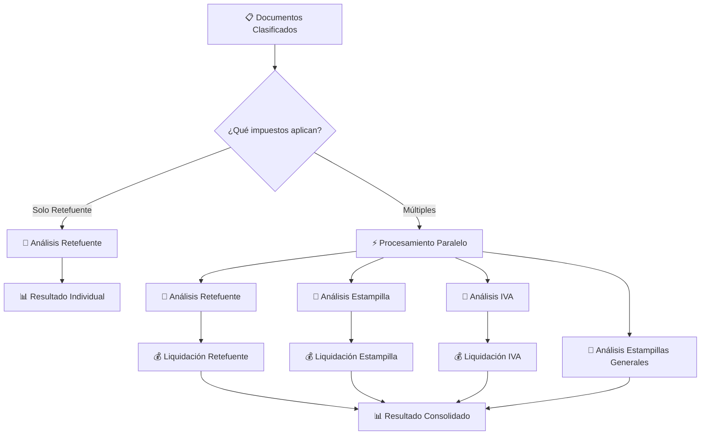

### ✅ **NUEVA VERSIÓN v2.5.0 (2025-08-21)**

**⚡ OCR Paralelo para PDFs Multi-Página - Optimización Mayor:**
- 🚀 **Procesamiento paralelo real**: ThreadPoolExecutor con 2 workers fijos para hilos CPU
- 📄 **Sin límite de páginas**: OCR paralelo activado para TODOS los PDFs (desde 1 página)
- 🔄 **Orden preservado**: Secuencia correcta de páginas mantenida en resultado final
- 📋 **Logging profesional**: Métricas de performance sin emojis para monitoreo técnico
- 📏 **Metadatos extendidos**: Información detallada sobre workers paralelos y tiempos

**📈 Mejoras de Performance Significativas:**
```
📄 PDF de 4 páginas:  ~12 segundos → ~6 segundos   (50% mejora)
📄 PDF de 8 páginas:  ~24 segundos → ~12 segundos  (50% mejora)
📄 PDF de 10+ páginas: ~30 segundos → ~15 segundos  (50% mejora)
```

**📊 Métricas de Logging (Sin Emojis):**
```
Iniciando OCR paralelo: 8 paginas con 2 workers
OCR paralelo completado: 7/8 paginas exitosas
Tiempo total de OCR paralelo: 12.45 segundos
Promedio por pagina: 1.56 segundos
Caracteres extraidos: 15420
```

**🔧 Cambios Técnicos:**
- ⚡ **Método modificado**: `extraer_texto_pdf_con_ocr()` reemplazado loop secuencial con paralelismo
- 📏 **Guardado diferenciado**: Archivos identificados como "PDF_OCR_PARALELO" 
- 🔄 **ThreadPoolExecutor**: Uso de hilos reales en lugar de async/await para Google Vision API
- 📊 **CPU utilization**: Aprovechamiento eficiente de múltiples hilos para tareas intensivas

---

### ✅ **Versión Anterior v2.4.0 (2025-08-21)**

**🆕 Estructura JSON Reorganizada - Mejora Mayor:**
- 📊 **Nueva organización**: Todos los impuestos agrupados bajo la clave `"impuestos"`
- 🏗️ **Escalabilidad mejorada**: Estructura más limpia para agregar nuevos impuestos
- 🔧 **API más organizada**: Separación clara entre metadatos de procesamiento e información fiscal
- ✅ **Compatibilidad preservada**: Información completa de cada impuesto se mantiene exactamente igual
- 🔄 **Cálculos actualizados**: `resumen_total` usa las nuevas rutas para totales precisos

**🔍 Cambio de Estructura:**
```json
// ANTES (v2.3.x):
{
  "procesamiento_paralelo": true,
  "retefuente": {...},
  "iva_reteiva": {...}
}

// AHORA (v2.4.0+):
{
  "procesamiento_paralelo": true,
  "impuestos": {
    "retefuente": {...},
    "iva_reteiva": {...}
  }
}
```

### ✅ **Últimas Optimizaciones v2.3.1 (2025-08-20)**

**Corrección Crítica: Fallback de OCR Inteligente:**
- 🎆 **Detección inteligente**: Nueva lógica que detecta contenido útil real vs mensajes de "página vacía"
- 📄 **Activación automática**: OCR se ejecuta inmediatamente cuando PDF Plumber detecta poco contenido útil
- 🔢 **Criterios múltiples**: Sistema activa OCR si 80%+ páginas vacías O <100 caracteres útiles O 50%+ vacías + <500 caracteres
- 📊 **Comparación inteligente**: Compara caracteres útiles reales entre PDF Plumber y OCR
- 📈 **Logging detallado**: Mensajes específicos con razón exacta de activación de OCR
- ⚡ **Problema resuelto**: PDFs escaneados (46 páginas vacías) ahora activan OCR automáticamente

### ✅ **Optimizaciones Anteriores v2.3.0 (2025-08-20)**

**Mejora en Extracción de PDF:**
- 📄 **PDF Plumber como método principal**: Cambio de PyPDF2 a PDF Plumber para mejor extracción de estructuras complejas
- 🌊 **Extracción natural**: PDF Plumber extrae texto como fluye naturalmente en el documento
- ⚡ **Mayor precisión**: Mejor manejo de tablas, formularios y documentos con estructuras complejas
- 🔄 **Fallback inteligente**: PyPDF2 se mantiene como método de respaldo automático
- 📊 **Logging mejorado**: Mensajes específicos para cada método de extracción usado
- 👐 **Compatibilidad total**: Mantiene exactamente el mismo formato de salida
- 📦 **Nueva dependencia**: `pdfplumber` agregado a requirements.txt

### ✅ **Optimizaciones Anteriores v2.2.0 (2025-08-18)**

**Nueva Funcionalidad: 6 Estampillas Generales:**
- 🆕 **Implementación completa**: Análisis e identificación de 6 estampillas generales para TODOS los NITs
- 🎨 **Procultura**, 🏥 **Bienestar**, 👴 **Adulto Mayor**, 🎓 **Universidad Pedagógica**, 🔬 **Francisco José de Caldas**, ⚽ **Prodeporte**
- ⚙️ **Procesamiento universal**: Aplica para todos los NITs administrativos sin configuración adicional
- 🔄 **Análisis acumulativo**: Revisa TODOS los documentos y consolida información encontrada
- 📊 **Estados específicos**: `preliquidacion_completa`, `preliquidacion_sin_finalizar`, `no_aplica_impuesto`
- 🆕 **Solo identificación**: Módulo NO realiza cálculos, presenta información identificada por Gemini
- ⚙️ **Integración completa**: Agregado en procesamiento paralelo e individual

### ✅ **Últimas Optimizaciones v2.1.1 (2025-08-17)**

**Corrección de Facturación Extranjera:**
- 🐛 **Bug crítico corregido**: Sistema ahora procesa correctamente facturas extranjeras
- 🔄 **Redirección inteligente**: `calcular_retencion()` redirige a función especializada para facturas internacionales
- 🌍 **Funcionalidad completa**: Confirmado soporte para tarifas de pagos al exterior
- 🔧 **Parámetro opcional**: Función `liquidar_factura_extranjera()` ya no requiere NIT obligatorio
- 📚 **Documentación actualizada**: README y CHANGELOG reflejan funcionalidad de facturación internacional

### ✅ **Optimizaciones Anteriores v2.1.0 (2025-08-16)**

**Arquitectura Simplificada - Eliminación de Código Obsoleto:**
- 🗑️ **Archivo obsoleto eliminado**: Removido `Clasificador/clasificacion_IVA.py` (clase `ClasificadorIVA` no utilizada)
- 🔧 **Arquitectura IVA simplificada**: Solo función `analizar_iva()` en `clasificador.py` para análisis IVA/ReteIVA
- 🧹 **Código más limpio**: Eliminada duplicación de lógica entre clase especializada e implementación integrada
- ✅ **Funcionalidad preservada**: Análisis completo de IVA/ReteIVA se mantiene intacto desde el flujo principal
- 📋 **Sin impacto**: Confirmado que eliminación no afecta funcionalidad del sistema

### ✅ **Optimizaciones Anteriores v2.0.5 (2025-08-16)**

**Soporte de Emails - Nueva Funcionalidad:**
- 📧 **Archivos de email**: Soporte para extensiones .msg (Outlook) y .eml (estándar)
- 📝 **Extracción completa**: ASUNTO, REMITENTE, DESTINATARIOS, FECHA, CUERPO del email
- 📁 **Detección de adjuntos**: Lista archivos adjuntos sin procesarlos (metadata solamente)
- 🔄 **Decodificación inteligente**: Manejo automático de diferentes codificaciones
- 🆕 **Nueva dependencia**: extract-msg para procesamiento robusto de archivos .msg
- 💾 **Guardado integrado**: Texto extraído guardado automáticamente en Results/

### ✅ **Optimizaciones Anteriores v2.0.4 (2025-08-14)**

**Frontend Eliminado - API REST Pura:**
- 🗑️ **Frontend web**: Eliminada interfaz gráfica completa (carpeta `Static/`)
- 🔧 **API REST pura**: Sistema enfocado 100% en endpoints de backend
- ⚡ **Performance**: Startup más rápido sin archivos estáticos
- 🔍 **Testing optimizado**: Diseñado para Postman, cURL y uso programático
- 📊 **Arquitectura simplificada**: Backend puro sin responsabilidades de frontend

**Endpoints Optimizados (v2.0.3):**
- 🗑️ **Endpoints eliminados**: Removidos `/procesar-documentos`, `/api/procesar-facturas-test` y `/api/estructura`
- 📍 **Archivo obsoleto**: Eliminado `extraer_conceptos.py` del módulo Extraccion
- 🧹 **Código limpio**: Eliminadas duplicaciones de funcionalidad
- 🎯 **Arquitectura simplificada**: Solo endpoints esenciales activos
- 🔧 **Diagnóstico centralizado**: `/api/diagnostico` mantiene toda la información del sistema

**Mejoras de Mantenimiento:**
- ⚡ **Menos complejidad**: Arquitectura de endpoints más limpia
- 📚 **Módulo simplificado**: Extraccion sin scripts no utilizados en producción
- 🛠️ **Menos mantenimiento**: Reducción de código innecesario
- 📊 **Mejor organización**: Cada endpoint y archivo tiene propósito único y claro
- 🔍 **Debug simplificado**: Menos rutas y archivos que monitorear y mantener

# 🚀 PRELIQUIDADOR DE IMPUESTOS COLOMBIANOS - Sistema Integrado v2.4.0

> **Sistema automatizado de liquidación tributaria con Inteligencia Artificial**  
> API REST pura para procesar facturas y calcular múltiples impuestos colombianos usando Google Gemini AI
> Diseñado para uso con Postman, cURL y herramientas de desarrollo

[](https://python.org)
[](https://fastapi.tiangolo.com)
[](https://ai.google.dev)
[](#arquitectura)

---

## 📋 **ÍNDICE**

1. [🎯 Características Principales](#-características-principales)
2. [⚡ Funcionalidades Integradas](#-funcionalidades-integradas)
3. [🏗️ Arquitectura del Sistema](#-arquitectura-del-sistema)
4. [🔧 Instalación y Configuración](#-instalación-y-configuración)
5. [🚀 Guía de Uso](#-guía-de-uso)
6. [📊 Ejemplos de Respuesta JSON v2.4.0](#-ejemplos-de-respuesta-json-v240)
7. [🧪 Testing y Validación](#-testing-y-validación)
8. [📁 Estructura de Archivos](#-estructura-de-archivos)
9. [🛠️ API Reference](#-api-reference)
10. [🔧 Herramientas de Desarrollo](#-herramientas-de-desarrollo-tools)
11. [📚 Documentación Interna](#-documentación-interna-docs)
12. [❓ FAQ](#-faq)
13. [🤝 Contribución](#-contribución)

---

## 🎯 **CARACTERÍSTICAS PRINCIPALES**

### ✅ **Impuestos Soportados**
- 🏛️ **Retención en la Fuente** - 43 conceptos con normativa exacta
- 🎓 **Estampilla Pro Universidad Nacional** - Cálculo según tabla UVT
- 🏢 **Contribución a Obra Pública 5%** - Tarifa fija para contratos de obra
- 💰 **IVA y ReteIVA** - Identificación de IVA y cálculo de retención
- 🆕 **6 Estampillas Generales** - Identificación de estampillas (Procultura, Bienestar, Adulto Mayor, Universidad Pedagógica, Francisco José de Caldas, Prodeporte)
- ⚡ **Procesamiento Paralelo** - Múltiples impuestos simultáneamente

### 🧠 **Inteligencia Artificial**
- **Google Gemini AI** para análisis de documentos
- **Identificación automática** de conceptos tributarios
- **Análisis de contratos** para estampilla universidad
- **Detección de consorcios** y facturación extranjera
- 🌍 **Facturación Internacional** - Soporte completo para facturas extranjeras con tarifas especiales

### 🏗️ **Arquitectura Moderna**
- **Modular y escalable** - Fácil agregar nuevos impuestos
- **Async/Await** - Procesamiento no bloqueante
- **API REST pura** - Sin frontend, optimizada para integraciones
- **Diseñada para desarrolladores** - Postman, cURL, Python requests
- **Guardado inteligente** - JSONs organizados por fecha
- 🆕 **Estructura JSON reorganizada** - Todos los impuestos en clave `"impuestos"`

### 📊 **Precisión Garantizada**
- **Datos exactos** extraídos de Excel oficial DIAN
- **Validaciones normativas** automáticas
- **Cálculos matemáticos** precisos
- **Trazabilidad completa** de decisiones

---

## ⚡ **FUNCIONALIDADES INTEGRADAS**

### 🔍 **1. Procesamiento Inteligente de Documentos**


**Formatos Soportados:**
- 📄 PDF (texto y escaneos)
- 📊 Excel (.xlsx, .xls) con preprocesamiento
- 📝 Word (.docx, .doc)
- 📧 **Emails (.msg, .eml)** - ✨ NUEVO v2.0.5
- 🖼️ Imágenes (PNG, JPG) con OCR

### 💰 **2. Liquidación Tributaria Paralela**



### 🌍 **3. Facturación Internacional - CORREGIDO v2.1.1**

**✅ Soporte Completo para Facturas Extranjeras:**
- **🔄 Redirección inteligente**: Sistema detecta facturas extranjeras y usa función especializada
- **📊 Tarifas internacionales**: Aplicación automática de tarifas para pagos al exterior
- **🇳🇴 Normativa colombiana**: Cálculo exacto según convenios de doble tributación
- **🔍 Análisis especializado**: Gemini identifica servicios, tecnología, regalías y otros conceptos extranjeros
- **⚡ Procesamiento optimizado**: Flujo independiente sin conflictos con retención nacional

### 📁 **4. Guardado Automático Organizado - ACTUALIZADO v2.4.0**

```
Results/
└── 2025-08-21/
    ├── 📋 clasificacion_documentos_14-30-25.json
    ├── 🆕 analisis_retefuente_14-30-26.json           # NUEVO - Análisis individual
    ├── 🆕 analisis_impuestos_especiales_14-30-27.json # NUEVO - Análisis individual
    ├── 🆕 analisis_iva_reteiva_14-30-28.json         # NUEVO - Análisis individual
    ├── ⚡ analisis_paralelo_14-30-29.json             # MANTIENE - Análisis conjunto
    ├── 📊 resultado_final_14-30-30.json               # 🆕 ESTRUCTURA REORGANIZADA
    └── ❌ error_procesamiento_14-30-31.json (si aplica)
```

#### **🔄 Doble Guardado para Mejor Debugging**
- **📁 Individual**: Cada impuesto genera su JSON para debugging granular
- **🔗 Conjunto**: Análisis paralelo se mantiene para visión completa
- **🐛 Debug Optimizado**: Fácil identificar problemas por impuesto específico
- **🆕 Estructura Nueva**: `resultado_final.json` con impuestos en clave `"impuestos"`

---

## 🏗️ **ARQUITECTURA DEL SISTEMA**

### 📁 **Estructura Modular**

```
PRELIQUIDADOR/
│
├── 🚀 main.py                    # Orquestador principal
├── ⚙️ config.py                  # Configuración global
├── 🔐 .env                       # Variables de entorno
├── 📊 RETEFUENTE_CONCEPTOS.xlsx  # Fuente de verdad DIAN
│
├── 🧠 Clasificador/              # Módulo IA
│   ├── procesador_gemini.py      # Análisis documentos
│   └── prompts/                  # Prompts especializados
│
├── 💰 Liquidador/                # Módulo cálculos
│   ├── liquidador_retencion.py   # Retefuente
│   ├── liquidador_estampilla.py  # Estampilla universidad
│   ├── liquidador_iva.py         # IVA y ReteIVA
│   └── validadores/              # Validaciones normativa
│
├── 📄 Extraccion/                # Módulo extracción
│   ├── procesador_archivos.py    # Extracción texto
│   └── preprocesadores/          # Optimización Excel
│
├── 💾 Results/                   # 🆕 Almacenamiento con estructura nueva
│   └── YYYY-MM-DD/              # Organización por fecha
│       └── resultado_final_*.json # Con nueva estructura "impuestos"
│
├── 📊 extracciones/             # Archivos preprocesados
│
├── 🔧 tools/                     # ✨ Herramientas desarrollo
│   ├── revisar_extracciones.py   # Script auditoría extracciones
│   ├── instalar_dependencias.py  # Setup dependencias OCR
│   └── README.md                 # Documentación herramientas
│
└── 📚 docs/                      # ✨ Documentación interna
    ├── INSTRUCCIONES_CLAUDE_v2.md # Guía desarrollo
    └── README.md                 # Índice documentación
```

### ⚡ **Flujo de Procesamiento**

1. **🔍 Validación**: NIT administrativo y configuración impuestos
2. **📄 Extracción**: Texto híbrido + preprocesamiento Excel
3. **🏷️ Clasificación**: Gemini identifica tipo documentos
4. **🧠 Análisis**: Paralelo o individual según configuración
5. **💰 Liquidación**: Cálculos exactos según normativa
6. **📊 Consolidación**: Resultados unificados en nueva estructura
7. **💾 Guardado**: JSONs organizados automáticamente

---

## 🔧 **INSTALACIÓN Y CONFIGURACIÓN**

### **📋 Prerrequisitos**

```bash
# Python 3.9+
python --version

# Git para clonar el repositorio
git --version
```

### **🔽 Instalación**

```bash
# 1. Clonar el repositorio
git clone https://github.com/usuario/preliquidador-integrado.git
cd preliquidador-integrado

# 2. Crear entorno virtual
python -m venv venv

# 3. Activar entorno virtual
# Windows:
venv\Scripts\activate
# Linux/Mac:
source venv/bin/activate

# 4. Instalar dependencias
pip install -r requirements.txt
```

### **⚙️ Configuración**

#### **1. Variables de Entorno (.env)**
```env
# APIs de Google
GEMINI_API_KEY=tu_api_key_de_gemini
GOOGLE_APPLICATION_CREDENTIALS=ruta/a/credenciales.json

# Configuración del servidor
HOST=127.0.0.1
PORT=8080
DEBUG=True

# Configuración de logs
LOG_LEVEL=INFO
LOG_FILE=logs/preliquidador.log
```

#### **2. Configuración de NITs (config.py)**
```python
# Configurar NITs administrativos con impuestos aplicables
NITS_ADMINISTRATIVOS = {
    "900123456": {
        "nombre": "Universidad Nacional de Colombia",
        "impuestos_aplicables": ["RETENCION_FUENTE", "ESTAMPILLA_UNIVERSIDAD"]
    },
    "800456789": {
        "nombre": "Empresa Ejemplo SAS",
        "impuestos_aplicables": ["RETENCION_FUENTE"]
    }
}
```

#### **3. Archivo de Conceptos**
- Los **43 conceptos oficiales** están hardcodeados en `config.py` con base mínima y tarifas exactas
- **Fuente**: Extracción directa de `RETEFUENTE_CONCEPTOS.xlsx` oficial de la DIAN
- **Mantenimiento**: Actualización manual cuando cambien normativas (infrecuente)

---

## 🚀 **GUÍA DE USO**

### **1. Iniciar el Servidor**

```bash
# Desarrollo
python main.py

# Producción
uvicorn main:app --host 0.0.0.0 --port 8080
```

**Salida esperada:**
```
🚀 Iniciando Preliquidador de Retefuente v2.4.0 - Sistema Integrado
✅ Funcionalidades: Retención en la fuente + Estampilla + IVA + Estampillas Generales
🔑 Gemini configurado: True
🆕 Estructura JSON reorganizada v2.4.0
✅ Función nit_aplica_estampilla_universidad importada correctamente
```

### **2. Verificar Estado del Sistema**

```bash
# Endpoint de diagnóstico
GET http://localhost:8080/api/diagnostico
```

**Respuesta esperada:**
```json
{
  "estado_general": "OK",
  "sistema": "integrado_retefuente_estampilla_iva_estampillas_generales",
  "version": "2.4.0",
  "nueva_estructura": "impuestos_reorganizados",
  "componentes": {
    "modulos": {
      "Extraccion": "✅ OK",
      "Clasificador": "✅ OK", 
      "Liquidador": "✅ OK"
    }
  }
}
```

### **3. Procesar Facturas**

```bash
# cURL ejemplo
curl -X POST "http://localhost:8080/api/procesar-facturas" \
  -H "Content-Type: multipart/form-data" \
  -F "archivos=@factura.pdf" \
  -F "archivos=@contrato.pdf" \
  -F "nit_administrativo=830.054.060-5"
```

**Python ejemplo:**
```python
import requests

url = "http://localhost:8080/api/procesar-facturas"
files = [
    ('archivos', open('factura.pdf', 'rb')),
    ('archivos', open('contrato.pdf', 'rb'))
]
data = {'nit_administrativo': '830.054.060-5'}

response = requests.post(url, files=files, data=data)
result = response.json()

# Acceso con nueva estructura v2.4.0
retefuente = result['impuestos']['retefuente']
iva_reteiva = result['impuestos']['iva_reteiva']
total_impuestos = result['resumen_total']['valor_total_impuestos']
```

---

## 📊 **EJEMPLOS DE RESPUESTA JSON v2.4.0**

### 🆕 **NUEVA ESTRUCTURA REORGANIZADA**

A partir de la versión **v2.4.0**, todos los impuestos están organizados bajo la clave `"impuestos"` para mejor estructura y escalabilidad:

### **✅ Ejemplo 1: Procesamiento Paralelo Completo (Consorcio)**

```json
{
  "procesamiento_paralelo": true,
  "impuestos_procesados": [
    "RETENCION_FUENTE",
    "ESTAMPILLA_UNIVERSIDAD",
    "CONTRIBUCION_OBRA_PUBLICA",
    "IVA_RETEIVA"
  ],
  "nit_administrativo": "830.054.060-5",
  "nombre_entidad": "FIDEICOMISOS SOCIEDAD FIDUCIARIA FIDUCOLDEX",
  "timestamp": "2025-08-19T18:55:14.262929",
  "version": "2.4.0",
  "impuestos": {
    "retefuente": {
      "aplica_retencion": true,
      "es_consorcio": true,
      "valor_total_factura": 935102653.0,
      "valor_retencion": 76420391.25,
      "concepto": "Servicios generales (declarantes)",
      "tarifa_retencion": 4.0,
      "consorcio_info": {
        "nombre_consorcio": "CONSORCIO CGT PREDIOS",
        "nit_consorcio": "901734159",
        "total_consorciados": 2
      },
      "consorciados": [
        {
          "nombre": "CONSTRUCTORA GT INGENIEROS S.A.S.",
          "nit": "901540083-6",
          "porcentaje_participacion": 75.0,
          "valor_proporcional": 701326989.75,
          "aplica_retencion": true,
          "valor_retencion": 28053079.59,
          "tarifa_aplicada": 4.0,
          "tipo_calculo": "CONVENCIONAL"
        },
        {
          "nombre": "GUSTAVO ADOLFO TORRES DUARTE",
          "nit": "19321988-8",
          "porcentaje_participacion": 25.0,
          "valor_proporcional": 233775663.25,
          "articulo_383": {
            "aplica": true,
            "valor_retencion_art383": 48367311.66
          },
          "aplica_retencion": true,
          "valor_retencion": 48367311.66,
          "tipo_calculo": "ARTICULO_383"
        }
      ],
      "tipo_procesamiento": "CONSORCIO"
    },
    "iva_reteiva": {
      "aplica": false,
      "valor_iva_identificado": 0.0,
      "valor_reteiva": 0.0,
      "porcentaje_iva": 0.0,
      "tarifa_reteiva": 0.0,
      "es_fuente_nacional": true,
      "estado_liquidacion": "No aplica",
      "observaciones": [
        "Razón: Estado no permite liquidación: NO APLICA IVA, EL VALOR DEL IVA = 0"
      ]
    },
    "estampillas_generales": {
      "procesamiento_exitoso": true,
      "total_estampillas_analizadas": 6,
      "estampillas": {
        "procultura": {
          "aplica": true,
          "estado": "preliquidacion_completa",
          "informacion_identificada": {
            "porcentaje": 1.1,
            "valor_pesos": 10286129.0,
            "fuente_informacion": "ORDEN DE PAGO - Línea 'ESTAMPILLA PROCULTURA'"
          }
        },
        "adulto_mayor": {
          "aplica": true,
          "estado": "preliquidacion_completa",
          "informacion_identificada": {
            "porcentaje": 2.0,
            "valor_pesos": 18702053.0
          }
        },
        "pro_universidad_pedagogica": {
          "aplica": true,
          "estado": "preliquidacion_completa",
          "informacion_identificada": {
            "porcentaje": 0.5,
            "valor_pesos": 4675513.0
          }
        },
        "francisco_jose_de_caldas": {
          "aplica": true,
          "estado": "preliquidacion_completa",
          "informacion_identificada": {
            "porcentaje": 0.5,
            "valor_pesos": 4675513.0
          }
        }
      },
      "resumen": {
        "identificadas": 4,
        "completas": 4,
        "incompletas": 0,
        "no_aplican": 2
      }
    }
  },
  "resumen_total": {
    "valor_total_impuestos": 76420391.25,
    "impuestos_liquidados": [
      "RETENCION_FUENTE",
      "ESTAMPILLAS_GENERALES"
    ],
    "procesamiento_exitoso": true
  },
  "es_consorcio": true,
  "es_facturacion_extranjera": false,
  "documentos_procesados": 5,
  "version_sistema": "2.4.0"
}
```

### **✅ Ejemplo 2: Procesamiento Individual (Solo Retefuente)**

```json
{
  "procesamiento_paralelo": false,
  "impuestos_procesados": ["RETENCION_FUENTE"],
  "nit_administrativo": "800178148-8",
  "nombre_entidad": "Fiduciaria Colombiana de Comercio Exterior S.A.",
  "timestamp": "2025-08-21T14:30:25.123456",
  "version": "2.4.0",
  "impuestos": {
    "retefuente": {
      "aplica_retencion": true,
      "valor_retencion": 2000000,
      "concepto": "Servicios generales (declarantes)",
      "tarifa_retencion": 4.0,
      "valor_base_retencion": 50000000,
      "fecha_calculo": "2025-08-21T14:30:25.123456"
    },
    "estampilla_universidad": {
      "aplica": false,
      "razon": "NIT no configurado para estampilla"
    },
    "contribucion_obra_publica": {
      "aplica": false,
      "razon": "NIT no configurado para obra pública"
    },
    "iva_reteiva": {
      "aplica": false,
      "razon": "NIT no configurado para IVA/ReteIVA"
    },
    "estampillas_generales": {
      "procesamiento_exitoso": true,
      "total_estampillas_analizadas": 6,
      "estampillas": {
        "procultura": {
          "aplica": false,
          "estado": "no_aplica_impuesto"
        },
        "bienestar": {
          "aplica": false,
          "estado": "no_aplica_impuesto"
        }
      },
      "resumen": {
        "identificadas": 0,
        "completas": 0,
        "no_aplican": 6
      }
    }
  },
  "resumen_total": {
    "valor_total_impuestos": 2000000,
    "impuestos_liquidados": ["RETENCION_FUENTE"],
    "procesamiento_exitoso": true
  },
  "es_consorcio": false,
  "es_facturacion_extranjera": false
}
```

### **✅ Ejemplo 3: Procesamiento con IVA y ReteIVA**

```json
{
  "procesamiento_paralelo": true,
  "impuestos_procesados": ["RETENCION_FUENTE", "IVA_RETEIVA"],
  "nit_administrativo": "900649119-9",
  "nombre_entidad": "PATRIMONIO AUTÓNOMO FONTUR",
  "timestamp": "2025-08-21T14:30:25.123456",
  "version": "2.4.0",
  "impuestos": {
    "retefuente": {
      "aplica_retencion": true,
      "valor_retencion": 800000,
      "concepto": "Servicios técnicos (no declarantes)",
      "tarifa_retencion": 6.0,
      "valor_base_retencion": 13333333
    },
    "iva_reteiva": {
      "aplica": true,
      "valor_iva_identificado": 2533333,
      "valor_reteiva": 380000,
      "porcentaje_iva": 19.0,
      "tarifa_reteiva": 15.0,
      "porcentaje_reteiva_texto": "15%",
      "es_fuente_nacional": true,
      "metodo_calculo": "fuente_nacional",
      "estado_liquidacion": "Preliquidado",
      "observaciones": [
        "IVA identificado: $2,533,333.00",
        "Fuente: Nacional",
        "Cálculo: $2,533,333.00 x 15% = $380,000.00"
      ]
    },
    "estampilla_universidad": {
      "aplica": false,
      "razon": "NIT no configurado para estampilla"
    },
    "contribucion_obra_publica": {
      "aplica": false,
      "razon": "NIT no configurado para obra pública"
    },
    "estampillas_generales": {
      "procesamiento_exitoso": true,
      "total_estampillas_analizadas": 6,
      "resumen": {
        "identificadas": 0,
        "completas": 0,
        "no_aplican": 6
      }
    }
  },
  "resumen_total": {
    "valor_total_impuestos": 1180000,
    "impuestos_liquidados": ["RETENCION_FUENTE", "IVA_RETEIVA"],
    "procesamiento_exitoso": true
  },
  "es_consorcio": false,
  "es_facturacion_extranjera": false
}
```

### **🔍 Diferencias con Estructura Anterior**

#### **ANTES (v2.3.x y anteriores):**
```json
{
  "procesamiento_paralelo": true,
  "retefuente": {...},
  "iva_reteiva": {...},
  "estampilla_universidad": {...},
  "resumen_total": {...}
}
```

#### **AHORA (v2.4.0+):**
```json
{
  "procesamiento_paralelo": true,
  "impuestos": {
    "retefuente": {...},
    "iva_reteiva": {...},
    "estampilla_universidad": {...}
  },
  "resumen_total": {...}
}
```

### **📊 Beneficios de la Nueva Estructura**

1. **🏗️ Organización mejorada**: Todos los impuestos en una sección específica
2. **🔧 Escalabilidad**: Fácil agregar nuevos impuestos sin modificar estructura raíz
3. **📋 Claridad**: Separación lógica entre metadatos de procesamiento e información fiscal
4. **🛠️ Mantenimiento**: Cálculos centralizados usando rutas consistentes

### **⚙️ Acceso a los Datos**

```javascript
// JavaScript - Acceso a impuestos con nueva estructura
const retefuente = response.impuestos.retefuente;
const valorRetencion = response.impuestos.retefuente.valor_retencion;
const totalImpuestos = response.resumen_total.valor_total_impuestos;
```

```python
# Python - Acceso a impuestos con nueva estructura
retefuente = response['impuestos']['retefuente']
valor_retencion = response['impuestos']['retefuente']['valor_retencion']
total_impuestos = response['resumen_total']['valor_total_impuestos']
```

### **🔄 Migración desde Versiones Anteriores**

Si tienes código que consume la API desde versiones anteriores:

```python
# Actualizar código existente
# ANTES:
valor_retencion = response['retefuente']['valor_retencion']

# AHORA:
valor_retencion = response['impuestos']['retefuente']['valor_retencion']
```

---

## 🧪 **TESTING Y VALIDACIÓN**

### **📋 NITs de Prueba Configurados**

```python
# NITs disponibles para testing
NITS_PRUEBA = {
    "800.178.148-8": "Fiduciaria Colombiana - Solo Retefuente",
    "830.054.060-5": "FIDUCOLDEX - Todos los impuestos",
    "900.649.119-9": "FONTUR - Retefuente + IVA"
}
```

### **🔧 Pruebas con Postman**

1. **Importar colección**: `postman/Preliquidador_v2.4.0.json`
2. **Configurar variables**:
   - `base_url`: `http://localhost:8080`
   - `nit_administrativo`: `830.054.060-5`
3. **Ejecutar casos de prueba**:
   - ✅ Procesamiento individual
   - ✅ Procesamiento paralelo
   - ✅ Consorcios
   - ✅ Facturación extranjera
   - ✅ Casos sin retención

### **🐛 Debugging**

```bash
# Ver logs en tiempo real
tail -f logs/preliquidador.log

# Verificar archivos generados
ls -la Results/$(date +%Y-%m-%d)/

# Validar estructura JSON
python -m json.tool Results/2025-08-21/resultado_final_*.json
```

---

## 🛠️ **API REFERENCE**

### **Endpoints Disponibles**

| Endpoint | Método | Descripción |
|----------|--------|-------------|
| `/api/procesar-facturas` | POST | **Principal** - Procesa facturas y calcula impuestos |
| `/api/diagnostico` | GET | Diagnóstico completo del sistema |

### **POST /api/procesar-facturas**

**Parámetros:**
```
- archivos: List[UploadFile] (requerido)
- nit_administrativo: str (requerido)
```

**Formatos soportados:**
- PDF, Excel, Word, Imágenes, Emails

**Respuesta v2.4.0:**
```json
{
  "procesamiento_paralelo": boolean,
  "impuestos_procesados": [string],
  "impuestos": {
    "retefuente": {...},
    "iva_reteiva": {...},
    "estampilla_universidad": {...},
    "contribucion_obra_publica": {...},
    "estampillas_generales": {...}
  },
  "resumen_total": {
    "valor_total_impuestos": number,
    "impuestos_liquidados": [string],
    "procesamiento_exitoso": boolean
  },
  "version_sistema": "2.4.0"
}
```

### **GET /api/diagnostico**

**Respuesta:**
```json
{
  "estado_general": "OK",
  "sistema": "integrado_v2.4.0",
  "nueva_estructura": "impuestos_reorganizados",
  "componentes": {
    "modulos": {...},
    "configuracion": {...}
  }
}
```

---

## 💰 **ROADMAP FUTURO**

### 📄 **Próximas Integraciones v2.5.0+**
- **ReteICA** - Retención de Industria y Comercio  
- **Autorretencion IVA** - Cálculos para autorretenedores
- **Múltiples Tarifas de IVA** - Soporte para 5% y otros porcentajes
- **Soporte Completo Consorcios** - IVA en estructuras de consorcio

### ⚡ **Mejoras Planificadas v3.0.0**
- **Cache Inteligente** de respuestas Gemini para optimización
- **Base de Datos** PostgreSQL para histórico de liquidaciones
- **API Webhooks** para integraciones externas en tiempo real
- **Dashboard Web** avanzado para monitoreo en tiempo real
- **Tests Automatizados** completos para todos los módulos

---

## 📝 **CONTACTO Y SOPORTE**

### **👥 Equipo de Desarrollo**
- **Autor Principal**: Sistema Preliquidador
- **Versión Actual**: v2.4.0 con estructura JSON reorganizada
- **Última Actualización**: 2025-08-21

### **🐛 Reportar Issues**
- **GitHub Issues**: Usar templates predefinidos
- **Template de Bug**: Incluir logs y archivos JSON generados
- **Template de Feature**: Describir nueva funcionalidad detalladamente

### **🙏 Agradecimientos**
- **Google Gemini AI** - Por la potencia de análisis de documentos
- **FastAPI** - Por el framework web moderno y eficiente
- **Comunidad Python** - Por las herramientas y librerías excepcionales
- **DIAN Colombia** - Por la documentación oficial tributaria

---

<div align="center">

**🚀 Preliquidador Integrado v2.4.0 - API REST Pura**

*Sistema automatizado de liquidación tributaria colombiana*

*🆕 Con estructura JSON reorganizada para mejor escalabilidad*

*Desarrollado con ❤️ en Colombia*

---

[](https://github.com/usuario/preliquidador-integrado)
[](https://github.com/usuario/preliquidador-integrado/fork)
[](https://github.com/usuario/preliquidador-integrado/issues)

</div>