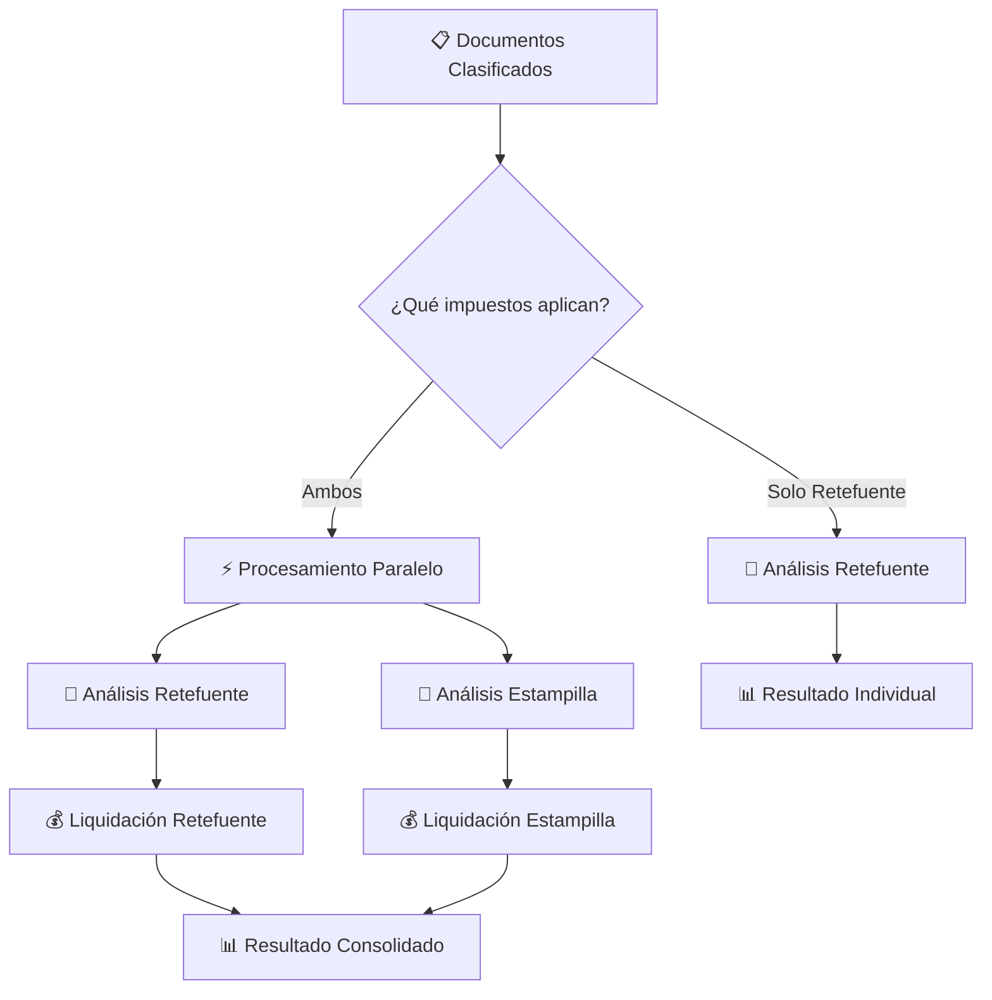

### ✅ **Últimas Optimizaciones v2.0.4 (2025-08-14)**

**Frontend Eliminado - API REST Pura:**
- 🗑️ **Frontend web**: Eliminada interfaz gráfica completa (carpeta `Static/`)
- 🔧 **API REST pura**: Sistema enfocado 100% en endpoints de backend
- ⚡ **Performance**: Startup más rápido sin archivos estáticos
- 🔍 **Testing optimizado**: Diseñado para Postman, cURL y uso programático
- 📊 **Arquitectura simplificada**: Backend puro sin responsabilidades de frontend

**Endpoints Optimizados (v2.0.3):**
- 🗑️ **Endpoints eliminados**: Removidos `/procesar-documentos`, `/api/procesar-facturas-test` y `/api/estructura`
- 📍 **Archivo obsoleto**: Eliminado `extraer_conceptos.py` del módulo Extraccion
- 🧹 **Código limpio**: Eliminadas duplicaciones de funcionalidad
- 🎯 **Arquitectura simplificada**: Solo endpoints esenciales activos
- 🔧 **Diagnóstico centralizado**: `/api/diagnostico` mantiene toda la información del sistema

**Mejoras de Mantenimiento:**
- ⚡ **Menos complejidad**: Arquitectura de endpoints más limpia
- 📚 **Módulo simplificado**: Extraccion sin scripts no utilizados en producción
- 🛠️ **Menos mantenimiento**: Reducción de código innecesario
- 📊 **Mejor organización**: Cada endpoint y archivo tiene propósito único y claro
- 🔍 **Debug simplificado**: Menos rutas y archivos que monitorear y mantener

# 🚀 PRELIQUIDADOR DE IMPUESTOS COLOMBIANOS - Sistema Integrado v2.0

> **Sistema automatizado de liquidación tributaria con Inteligencia Artificial**  
> API REST pura para procesar facturas y calcular múltiples impuestos colombianos usando Google Gemini AI
> Diseñado para uso con Postman, cURL y herramientas de desarrollo

[](https://python.org)
[](https://fastapi.tiangolo.com)
[](https://ai.google.dev)
[](#arquitectura)

---

## 📋 **ÍNDICE**

1. [🎯 Características Principales](#-características-principales)
2. [⚡ Funcionalidades Integradas](#-funcionalidades-integradas)
3. [🏗️ Arquitectura del Sistema](#-arquitectura-del-sistema)
4. [🔧 Instalación y Configuración](#-instalación-y-configuración)
5. [🚀 Guía de Uso](#-guía-de-uso)
6. [📊 Ejemplos de Uso](#-ejemplos-de-uso)
7. [🧪 Testing y Validación](#-testing-y-validación)
8. [📁 Estructura de Archivos](#-estructura-de-archivos)
9. [🛠️ API Reference](#-api-reference)
10. [🔧 Herramientas de Desarrollo](#-herramientas-de-desarrollo-tools)
11. [📚 Documentación Interna](#-documentación-interna-docs)
12. [❓ FAQ](#-faq)
13. [🤝 Contribución](#-contribución)

---

## 🎯 **CARACTERÍSTICAS PRINCIPALES**

### ✅ **Impuestos Soportados**
- 🏛️ **Retención en la Fuente** - 43 conceptos con normativa exacta
- 🎓 **Estampilla Pro Universidad Nacional** - Cálculo según tabla UVT
- ⚡ **Procesamiento Paralelo** - Ambos impuestos simultáneamente

### 🧠 **Inteligencia Artificial**
- **Google Gemini AI** para análisis de documentos
- **Identificación automática** de conceptos tributarios
- **Análisis de contratos** para estampilla universidad
- **Detección de consorcios** y facturación extranjera

### 🏗️ **Arquitectura Moderna**
- **Modular y escalable** - Fácil agregar nuevos impuestos
- **Async/Await** - Procesamiento no bloqueante
- **API REST pura** - Sin frontend, optimizada para integraciones
- **Diseñada para desarrolladores** - Postman, cURL, Python requests
- **Guardado inteligente** - JSONs organizados por fecha

### 📊 **Precisión Garantizada**
- **Datos exactos** extraídos de Excel oficial DIAN
- **Validaciones normativas** automáticas
- **Cálculos matemáticos** precisos
- **Trazabilidad completa** de decisiones

---

## ⚡ **FUNCIONALIDADES INTEGRADAS**

### 🔍 **1. Procesamiento Inteligente de Documentos**


**Formatos Soportados:**
- 📄 PDF (texto y escaneos)
- 📊 Excel (.xlsx, .xls) con preprocesamiento
- 📝 Word (.docx, .doc)
- 🖼️ Imágenes (PNG, JPG) con OCR

### 💰 **2. Liquidación Tributaria Paralela**



### 📁 **3. Guardado Automático Organizado - ACTUALIZADO v2.3.2**

```
Results/
└── 2025-01-15/
    ├── 📋 clasificacion_documentos_14-30-25.json
    ├── 🆕 analisis_retefuente_14-30-26.json           # NUEVO - Análisis individual
    ├── 🆕 analisis_impuestos_especiales_14-30-27.json # NUEVO - Análisis individual
    ├── 🆕 analisis_iva_reteiva_14-30-28.json         # NUEVO - Análisis individual
    ├── ⚡ analisis_paralelo_14-30-29.json             # MANTIENE - Análisis conjunto
    ├── 📊 resultado_final_14-30-30.json
    └── ❌ error_procesamiento_14-30-31.json (si aplica)
```

#### **🔄 Doble Guardado para Mejor Debugging**
- **📁 Individual**: Cada impuesto genera su JSON para debugging granular
- **🔗 Conjunto**: Análisis paralelo se mantiene para visión completa
- **🐛 Debug Optimizado**: Fácil identificar problemas por impuesto específico

---

## 🏗️ **ARQUITECTURA DEL SISTEMA**

### 📁 **Estructura Modular**

```
PRELIQUIDADOR/
│
├── 🚀 main.py                    # Orquestador principal
├── ⚙️ config.py                  # Configuración global
├── 🔐 .env                       # Variables de entorno
├── 📊 RETEFUENTE_CONCEPTOS.xlsx  # Fuente de verdad DIAN
│
├── 🧠 Clasificador/              # Módulo IA
│   ├── procesador_gemini.py      # Análisis documentos
│   └── prompts/                  # Prompts especializados
│
├── 💰 Liquidador/                # Módulo cálculos
│   ├── liquidador_retencion.py   # Retefuente
│   ├── liquidador_estampilla.py  # Estampilla universidad
│   └── validadores/              # Validaciones normativa
│
├── 📄 Extraccion/                # Módulo extracción
│   ├── procesador_archivos.py    # Extracción texto
│   └── preprocesadores/          # Optimización Excel
│
├── 💾 Results/                   # Almacenamiento
│   └── YYYY-MM-DD/              # Organización por fecha
│
├── 📊 extracciones/             # Archivos preprocesados
│
├── 🔧 tools/                     # ✨ NUEVO - Herramientas desarrollo
│   ├── revisar_extracciones.py   # Script auditoría extracciones
│   ├── instalar_dependencias.py  # Setup dependencias OCR
│   └── README.md                 # Documentación herramientas
│
└── 📚 docs/                      # ✨ NUEVO - Documentación interna
    ├── INSTRUCCIONES_CLAUDE_v2.md # Guía desarrollo
    └── README.md                 # Índice documentación
```

### 🔧 **Herramientas de Desarrollo (`/tools/`)**

**📊 `revisar_extracciones.py`**: Auditoría de extracciones
```bash
cd tools
python revisar_extracciones.py 2025-08-09  # Revisar fecha específica
python revisar_extracciones.py --todos     # Todas las fechas
```

**⚙️ `instalar_dependencias.py`**: Setup automático
```bash
cd tools  
python instalar_dependencias.py            # Instalar OCR dependencies
```

### 📚 **Documentación Interna (`/docs/`)**

**📋 `INSTRUCCIONES_CLAUDE_v2.md`**: Guía completa desarrollo
- Metodología de trabajo y normas críticas
- Arquitectura del sistema integrado  
- Checklist para desarrolladores
- Documentación obligatoria de cambios

**📁 `README.md`**: Índice documentación interna
- Principios de mantenimiento
- Templates para nueva documentación
- Roadmap de documentos futuros

### ⚡ **Flujo de Procesamiento**

1. **🔍 Validación**: NIT administrativo y configuración impuestos
2. **📄 Extracción**: Texto híbrido + preprocesamiento Excel
3. **🏷️ Clasificación**: Gemini identifica tipo documentos
4. **🧠 Análisis**: Paralelo o individual según configuración
5. **💰 Liquidación**: Cálculos exactos según normativa
6. **📊 Consolidación**: Resultados unificados
7. **💾 Guardado**: JSONs organizados automáticamente

---

## 🔧 **INSTALACIÓN Y CONFIGURACIÓN**

### **📋 Prerrequisitos**

```bash
# Python 3.9+
python --version

# Git para clonar el repositorio
git --version
```

### **🔽 Instalación**

```bash
# 1. Clonar el repositorio
git clone https://github.com/usuario/preliquidador-integrado.git
cd preliquidador-integrado

# 2. Crear entorno virtual
python -m venv venv

# 3. Activar entorno virtual
# Windows:
venv\Scripts\activate
# Linux/Mac:
source venv/bin/activate

# 4. Instalar dependencias
pip install -r requirements.txt
```


### **⚙️ Configuración**

#### **1. Variables de Entorno (.env)**
```env
# APIs de Google
GEMINI_API_KEY=tu_api_key_de_gemini
GOOGLE_APPLICATION_CREDENTIALS=ruta/a/credenciales.json

# Configuración del servidor
HOST=127.0.0.1
PORT=8080
DEBUG=True

# Configuración de logs
LOG_LEVEL=INFO
LOG_FILE=logs/preliquidador.log
```

#### **2. Configuración de NITs (config.py)**
```python
# Configurar NITs administrativos con impuestos aplicables
NITS_ADMINISTRATIVOS = {
    "900123456": {
        "nombre": "Universidad Nacional de Colombia",
        "impuestos_aplicables": ["RETENCION_FUENTE", "ESTAMPILLA_UNIVERSIDAD"]
    },
    "800456789": {
        "nombre": "Empresa Ejemplo SAS",
        "impuestos_aplicables": ["RETENCION_FUENTE"]
    }
}
```

#### **3. Archivo de Conceptos**
- Los **43 conceptos oficiales** están hardcodeados en `main.py` con base mínima y tarifas exactas
- **Fuente**: Extracción directa de `RETEFUENTE_CONCEPTOS.xlsx` oficial de la DIAN
- **Mantenimiento**: Actualización manual cuando cambien normativas (infrecuente)

---

## 🚀 **GUÍA DE USO**

### **1. Iniciar el Servidor**

```bash
# Desarrollo
python main.py

# Producción
uvicorn main:app --host 0.0.0.0 --port 8080
```

**Salida esperada:**
```
🚀 Iniciando Preliquidador de Retefuente v2.0 - Sistema Integrado
✅ Funcionalidades: Retención en la fuente + Estampilla pro universidad nacional
🔑 Gemini configurado: True
✅ Función nit_aplica_estampilla_universidad importada correctamente
```

### **2. Verificar Estado del Sistema**

```bash
# Diagnóstico completo
curl http://127.0.0.1:8080/api/diagnostico
```

**Respuesta esperada:**
```json
{
  "estado_general": "OK",
  "sistema": "integrado_retefuente_estampilla",
  "mensaje": "Sistema integrado funcionando correctamente"
}
```

### **3. Procesar Documentos**

#### **Via Web Interface**
1. Abrir navegador en `http://127.0.0.1:8080`
2. Seleccionar archivos (facturas, contratos)
3. Ingresar NIT administrativo
4. Hacer clic en "Procesar"

#### **Via API (cURL)**
```bash
curl -X POST "http://127.0.0.1:8080/api/procesar-facturas" \
  -F "archivos=@factura.pdf" \
  -F "archivos=@contrato.pdf" \
  -F "nit_administrativo=900123456"
```

#### **Via API (Python)**
```python
import requests

url = "http://127.0.0.1:8080/api/procesar-facturas"

files = [
    ("archivos", open("factura.pdf", "rb")),
    ("archivos", open("contrato.pdf", "rb"))
]

data = {"nit_administrativo": "900123456"}

response = requests.post(url, files=files, data=data)
resultado = response.json()

print(f"Procesamiento paralelo: {resultado['procesamiento_paralelo']}")
print(f"Valor retefuente: ${resultado['retefuente']['valor_retencion']:,}")
print(f"Valor estampilla: ${resultado['estampilla_universidad']['valor_estampilla']:,}")
```

---

## 📊 **EJEMPLOS DE USO**

### **🔍 Ejemplo 1: Solo Retención en la Fuente**

**Input:**
- NIT: `800456789` (solo retefuente)
- Archivo: `servicios_mantenimiento.pdf`

**Response:**
```json
{
  "procesamiento_paralelo": false,
  "impuestos_procesados": ["RETENCION_FUENTE"],
  "aplica_retencion": true,
  "valor_total_factura": 5000000,
  "valor_retencion": 200000,
  "concepto": "Servicios generales (declarantes)",
  "tarifa_retencion": 4.0,
  "estampilla_universidad": {
    "aplica": false,
    "razon": "NIT no configurado para estampilla"
  }
}
```

### **⚡ Ejemplo 2: Procesamiento Paralelo**

**Input:**
- NIT: `900123456` (ambos impuestos)
- Archivos: `factura_servicios.pdf`, `contrato_obra.pdf`

**Response:**
```json
{
  "procesamiento_paralelo": true,
  "impuestos_procesados": ["RETENCION_FUENTE", "ESTAMPILLA_UNIVERSIDAD"],
  "retefuente": {
    "aplica": true,
    "valor_retencion": 2000000,
    "concepto": "Servicios generales (declarantes)",
    "tarifa_retencion": 4.0
  },
  "estampilla_universidad": {
    "aplica": true,
    "valor_estampilla": 750000,
    "tarifa_aplicada": 1.5,
    "rango_uvt": "Más de 1000 UVT",
    "valor_contrato_pesos": 50000000,
    "valor_contrato_uvt": 1157.41
  },
  "resumen_total": {
    "valor_total_impuestos": 2750000,
    "impuestos_aplicables": {
      "retefuente": true,
      "estampilla": true
    }
  }
}
```

### **🏢 Ejemplo 3: Consorcio**

**Input:**
- Archivos: `factura1.pdf`, `factura2.pdf`, `matriz_consorcio.xlsx`

**Response:**
```json
{
  "es_consorcio": true,
  "participaciones_consorcio": [
    {"empresa": "Empresa A", "participacion": 60, "valor_retencion": 120000},
    {"empresa": "Empresa B", "participacion": 40, "valor_retencion": 80000}
  ],
  "total_retencion_consorcio": 200000
}
```

---

## 🧪 **TESTING Y VALIDACIÓN**

### **🔬 Test Suite Integrado**

```bash
# Ejecutar todos los tests
python -m pytest tests/ -v

# Tests específicos
python -m pytest tests/test_retefuente.py -v
python -m pytest tests/test_estampilla.py -v
python -m pytest tests/test_procesamiento_paralelo.py -v
```

### **📋 Casos de Test Incluidos**

#### **✅ Tests de Retención en la Fuente**
- Identificación correcta de 43 conceptos
- Cálculo de tarifas exactas
- Validación de base mínima
- Facturación extranjera

#### **🎓 Tests de Estampilla Universidad**
- Análisis de contratos
- Cálculo según tabla UVT
- Validaciones normativas
- Casos especiales

#### **⚡ Tests de Procesamiento Paralelo**
- Ejecución simultánea
- Consolidación de resultados
- Manejo de errores
- Performance

### **🎯 Validación Manual**

#### **1. Verificar Configuración**
```bash
# Test de configuración completa (ENDPOINT ÚNICO desde v2.0.3)
curl http://127.0.0.1:8080/api/diagnostico | jq '.estado_general'
# Esperado: "OK"

# Verificar estructura del sistema
curl http://127.0.0.1:8080/api/diagnostico | jq '.componentes.estructura_archivos'

# Verificar errores críticos (si los hay)
curl http://127.0.0.1:8080/api/diagnostico | jq '.errores_criticos'
# Esperado: null (sin errores)
```

#### **2. Test de NITs**
```bash
# Listar NITs disponibles
curl http://127.0.0.1:8080/api/nits-disponibles | jq '.nits[] | {nit, nombre, aplica_estampilla_universidad}'
```

#### **3. Test de Conceptos**
```bash
# Verificar conceptos cargados
curl http://127.0.0.1:8080/api/conceptos | jq '.total_conceptos'
# Esperado: 43
```

---

## 📁 **ESTRUCTURA DE ARCHIVOS GENERADOS**

### **💾 Carpeta Results/**
```
Results/
├── 2025-01-15/
│   ├── 📋 clasificacion_documentos_14-30-25.json
│   │   └── Clasificación inicial de documentos
│   ├── ⚡ analisis_paralelo_14-30-26.json  
│   │   └── Análisis detallado de ambos impuestos
│   ├── 📊 resultado_final_14-30-28.json
│   │   └── Consolidación y respuesta final
│   └── ❌ error_procesamiento_14-30-30.json
│       └── Errores detallados (si los hay)
└── 2025-01-16/
    └── ... (archivos del día siguiente)
```

### **📊 Carpeta extracciones/**
```
extracciones/
├── factura_servicios_preprocesado.txt
├── contrato_obra_preprocesado.txt
└── matriz_consorcio_preprocesado.txt
```

### **📝 Logs del Sistema**
```
logs/
├── preliquidador.log          # Log principal
├── gemini_requests.log        # Logs de IA
└── performance.log            # Métricas de rendimiento
```

---

## 🛠️ **API REFERENCE**

### **🚀 Endpoints Principales**

#### **POST /api/procesar-facturas**
Endpoint principal para procesamiento integrado.

**Parámetros:**
- `archivos`: Lista de archivos (multipart/form-data)
- `nit_administrativo`: NIT de la entidad (string)

**Response:**
```typescript
{
  procesamiento_paralelo: boolean,
  impuestos_procesados: string[],
  aplica_retencion: boolean,
  valor_retencion: number,
  retefuente?: {
    aplica: boolean,
    valor_retencion: number,
    concepto: string,
    tarifa_retencion: number
  },
  estampilla_universidad?: {
    aplica: boolean,
    valor_estampilla: number,
    tarifa_aplicada: number,
    rango_uvt: string
  },
  resumen_total?: {
    valor_total_impuestos: number
  }
}
```

#### **GET /api/diagnostico**
Diagnóstico completo del sistema y único endpoint de verificación.

**NOTA**: Este endpoint reemplaza al anterior `/health` eliminado en v2.0.3

**Funcionalidades:**
- ✅ Estado general del sistema
- ✅ Verificación de módulos y configuración
- ✅ Validación de estructura de archivos
- ✅ Diagnóstico de APIs (Gemini, Vision)
- ✅ Conteo de conceptos cargados
- ✅ Análisis de errores críticos

**Response:**
```typescript
{
  estado_general: "OK" | "ERROR",
  sistema: "integrado_retefuente_estampilla",
  componentes: {
    variables_entorno: object,
    modulos: object,
    configuracion: object,
    estructura_archivos: object,
    conceptos: object
  },
  errores_criticos?: string[],
  mensaje: string
}
```

#### **GET /api/nits-disponibles**
Lista de NITs configurados.

**Response:**
```typescript
{
  success: boolean,
  nits: Array<{
    nit: string,
    nombre: string,
    aplica_retencion_fuente: boolean,
    aplica_estampilla_universidad: boolean
  }>
}
```

### **🔧 Endpoints Utilitarios**

- `GET /api/conceptos` - Lista de conceptos de retefuente
- `GET /api/extracciones` - Estadísticas de extracciones
- `GET /api/nits-disponibles` - NITs administrativos configurados
- `GET /api/diagnostico` - **ÚNICO endpoint de diagnóstico** (v2.0.3+)
- `POST /api/prueba-simple` - Test básico sin archivos

---

## ❓ **FAQ**

### **🤔 Preguntas Frecuentes**

#### **Q: ¿Qué formatos de archivo son compatibles?**
A: PDF (texto y escaneados), Excel (.xlsx, .xls), Word (.docx, .doc), e imágenes (PNG, JPG) con OCR.

#### **Q: ¿Cómo agrego un nuevo NIT administrativo?**
A: Edita el archivo `config.py` y agrega el NIT con sus impuestos aplicables en `NITS_ADMINISTRATIVOS`.

#### **Q: ¿El sistema funciona offline?**
A: No, requiere conexión a internet para Google Gemini AI.

#### **Q: ¿Cómo se garantiza la precisión de los cálculos?**
A: Los conceptos y tarifas se extraen directamente del Excel oficial de la DIAN con validaciones automáticas.

#### **Q: ¿Puedo procesar múltiples facturas simultáneamente?**
A: Sí, el endpoint acepta múltiples archivos y los procesa en batch.

#### **Q: ¿Dónde se guardan los resultados?**
A: En la carpeta `Results/` organizados por fecha con timestamps únicos.

### **🛠️ Troubleshooting**

#### **Error: "GEMINI_API_KEY no configurada"**
```bash
# Verificar archivo .env
cat .env | grep GEMINI_API_KEY

# Si no existe, agregarlo
echo "GEMINI_API_KEY=tu_api_key_aqui" >> .env
```

#### **Error: "Módulo no encontrado"**
```bash
# Reinstalar dependencias
pip install -r requirements.txt --force-reinstall
```

#### **Error: "NIT no válido"**
- Verificar que el NIT esté configurado en `config.py`
- Comprobar que tenga al menos `RETENCION_FUENTE` en impuestos aplicables

---

## 🤝 **CONTRIBUCIÓN**

### **🔧 Para Desarrolladores**

#### **Setup de Desarrollo**
```bash
# 1. Fork del repositorio
git clone https://github.com/tu-usuario/preliquidador-integrado.git

# 2. Crear rama de feature
git checkout -b feature/nueva-funcionalidad

# 3. Instalar dependencias de desarrollo
pip install -r requirements-dev.txt

# 4. Configurar pre-commit hooks
pre-commit install
```

#### **🧪 Desarrollo de Tests**
```python
# Estructura de test
def test_nueva_funcionalidad():
    """Test para nueva funcionalidad"""
    # Arrange
    input_data = {...}
    
    # Act
    resultado = nueva_funcion(input_data)
    
    # Assert
    assert resultado["campo_esperado"] == valor_esperado
```

#### **📋 Proceso de Contribución**
1. **Issue**: Crear issue describiendo la mejora/bug
2. **Branch**: Crear rama con nombre descriptivo
3. **Development**: Desarrollar con tests incluidos
4. **Testing**: Ejecutar suite completo de tests
5. **PR**: Crear Pull Request con descripción detallada
6. **Review**: Revisión de código por mantenedores
7. **Merge**: Integración a main branch

### **📝 Roadmap de Contribuciones**

#### **🚀 Alta Prioridad**
- [ ] **ReteIVA** - Retención de IVA
- [ ] **ReteICA** - Retención de Industria y Comercio
- [ ] **Dashboard web** - Interface de administración
- [ ] **Cache inteligente** - Optimización performance

#### **📋 Media Prioridad**
- [ ] **Base de datos** - PostgreSQL para históricos
- [ ] **API webhooks** - Integraciones externas
- [ ] **Dockerización** - Containerización completa
- [ ] **Tests E2E** - Pruebas de extremo a extremo

#### **💡 Baja Prioridad**
- [ ] **ML personalizado** - Modelos propios para análisis
- [ ] **Multi-idioma** - Soporte internacional
- [ ] **Mobile app** - Aplicación móvil
- [ ] **Blockchain** - Trazabilidad inmutable

---

## 📄 **LICENCIA**

```
MIT License

Copyright (c) 2025 Preliquidador Integrado

Permission is hereby granted, free of charge, to any person obtaining a copy
of this software and associated documentation files (the "Software"), to deal
in the Software without restriction, including without limitation the rights
to use, copy, modify, merge, publish, distribute, sublicense, and/or sell
copies of the Software, and to permit persons to whom the Software is
furnished to do so, subject to the following conditions:

The above copyright notice and this permission notice shall be included in all
copies or substantial portions of the Software.

THE SOFTWARE IS PROVIDED "AS IS", WITHOUT WARRANTY OF ANY KIND, EXPRESS OR
IMPLIED, INCLUDING BUT NOT LIMITED TO THE WARRANTIES OF MERCHANTABILITY,
FITNESS FOR A PARTICULAR PURPOSE AND NONINFRINGEMENT. IN NO EVENT SHALL THE
AUTHORS OR COPYRIGHT HOLDERS BE LIABLE FOR ANY CLAIM, DAMAGES OR OTHER
LIABILITY, WHETHER IN AN ACTION OF CONTRACT, TORT OR OTHERWISE, ARISING FROM,
OUT OF OR IN CONNECTION WITH THE SOFTWARE OR THE USE OR OTHER DEALINGS IN THE
SOFTWARE.
```

---

## 💰 **NUEVA FUNCIONALIDAD: IVA Y RETEIVA v2.3.0**

### 🎆 **Características Principales de IVA/ReteIVA**
- **Análisis Especializado**: Identificación y extracción de IVA de facturas usando Gemini AI
- **Validación Automática de RUT**: Verificación de responsabilidad de IVA según códigos oficiales
- **Fuente de Ingreso**: Determinación automática de fuente nacional (15%) vs extranjera (100%)
- **Bienes Exentos/Excluidos**: Validación contra listas configurables de conceptos
- **Cálculos Precisos**: Uso de Decimal para evitar errores de redondeo
- **Procesamiento Paralelo**: Integración completa con otros impuestos del sistema

### 🏷️ **NITs Configurados para IVA/ReteIVA**
```
800.178.148-8  # Fiduciaria Colombiana de Comercio Exterior S.A.
830.054.060-5  # FIDEICOMISOS SOCIEDAD FIDUCIARIA FIDUCOLDEX
900.649.119-9  # PATRIMONIO AUTÓNOMO FONTUR
```

### 🔍 **Estrategia de Análisis de IVA**

#### **1. Escenarios de Identificación**
- **Escenario 1**: Factura menciona IVA total → Extraer porcentaje y valor
- **Escenario 2**: Factura menciona IVA por conceptos → Sumar todos los IVAs
- **Escenario 3**: IVA 0% o ausente → Validar exención/exclusión

#### **2. Validaciones Normativas**
- **Código 48**: "Impuesto sobre las ventas – IVA" → ES RESPONSABLE
- **Código 49**: "No responsable de IVA" → NO ES RESPONSABLE
- **Código 53**: "Persona Jurídica No Responsable de IVA" → NO ES RESPONSABLE

#### **3. Determinación de Fuente**
**Preguntas de Validación (si CUALQUIERA es SÍ → Fuente Nacional)**:
- ¿El servicio tiene uso o beneficio económico en Colombia?
- ¿La actividad se ejecutó total o parcialmente en Colombia?
- ¿El servicio corresponde a asistencia técnica usado en Colombia?
- ¿El bien vendido o utilizado está ubicado en Colombia?

#### **4. Cálculo de ReteIVA**
- **Fuente Nacional**: ReteIVA = Valor IVA x 15%
- **Fuente Extranjera**: ReteIVA = Valor IVA x 100%

### 📊 **Ejemplo de Respuesta con IVA**

```json
{
  "procesamiento_paralelo": true,
  "impuestos_procesados": ["RETENCION_FUENTE", "IVA_RETEIVA"],
  "retefuente": {
    "aplica": true,
    "valor_retencion": 2000000,
    "concepto": "Servicios generales (declarantes)",
    "tarifa_retencion": 4.0
  },
  "iva_reteiva": {
    "aplica": true,
    "valor_iva_identificado": 1900000,
    "valor_reteiva": 285000,
    "porcentaje_iva": 19.0,
    "porcentaje_reteiva_texto": "15%",
    "es_fuente_nacional": true,
    "estado_liquidacion": "Preliquidado",
    "observaciones": [
      "IVA identificado: $1,900,000.00",
      "Fuente: Nacional",
      "Cálculo: $1,900,000.00 x 15% = $285,000.00"
    ]
  },
  "resumen_total": {
    "valor_total_impuestos": 2285000
  }
}
```

### 🛠️ **Estados Posibles del Sistema IVA**
1. **"Preliquidado"** → Todos los requisitos se cumplen
2. **"NO APLICA IVA, EL VALOR DEL IVA = 0"** → Tercero no responsable o concepto exento
3. **"Preliquidación Sin Finalizar"** → Inconsistencias o falta información

### 📁 **Archivos Nuevos Creados**
```
Clasificador/
└── clasificacion_IVA.py      # Módulo especializado IVA con ClasificadorIVA

Liquidador/
└── liquidador_iva.py         # Liquidador especializado con LiquidadorIVA

Results/YYYY-MM-DD/
└── analisis_iva_reteiva_HH-MM-SS.json  # Análisis completo de IVA
```

### 🎆 **Casos Especiales Manejados**
- **Inconsistencia RUT vs Factura**: Tercero no responsable pero factura muestra IVA
- **Facturación Extranjera**: Validación de IVA 19% obligatorio
- **Bienes Exentos**: Conceptos que no deben causar IVA pero aparecen en factura
- **RUT No Disponible**: Estado de preliquidación sin finalizar por falta de información

---

## 💰 **ROADMAP FUTURO**

### 📄 **Próximas Integraciones v2.4.0+**
- **ReteICA** - Retención de Industria y Comercio  
- **Autorretencion IVA** - Cálculos para autorretenedores
- **Múltiples Tarifas de IVA** - Soporte para 5% y otros porcentajes
- **Soporte Completo Consorcios** - IVA en estructuras de consorcio

### ⚡ **Mejoras Planificadas v3.0.0**
- **Cache Inteligente** de respuestas Gemini para optimización
- **Base de Datos** PostgreSQL para histórico de liquidaciones
- **API Webhooks** para integraciones externas en tiempo real
- **Dashboard Web** avanzado para monitoreo en tiempo real
- **Tests Automatizados** completos para todos los módulos

---

## 📝 **CONTACTO Y SOPORTE**

### **👥 Equipo de Desarrollo**
- **Autor Principal**: Miguel Angel Jaramillo Durango
- **Email**: [email@ejemplo.com](mailto:email@ejemplo.com)
- **GitHub**: [@usuario](https://github.com/usuario)

### **🐛 Reportar Issues**
- **GitHub Issues**: [https://github.com/usuario/preliquidador-integrado/issues](https://github.com/usuario/preliquidador-integrado/issues)
- **Template de Bug**: Usar plantilla predefinida
- **Template de Feature**: Usar plantilla de nueva funcionalidad

### **💬 Comunidad**
- **Discord**: [https://discord.gg/preliquidador](https://discord.gg/preliquidador)
- **Telegram**: [@preliquidador_soporte](https://t.me/preliquidador_soporte)
- **Documentation**: [https://docs.preliquidador.com](https://docs.preliquidador.com)

---

## 🏆 **RECONOCIMIENTOS**

### **🙏 Agradecimientos**
- **Google Gemini AI** - Por la potencia de análisis de documentos
- **FastAPI** - Por el framework web moderno y eficiente
- **Comunidad Python** - Por las herramientas y librerías excepcionales
- **DIAN Colombia** - Por la documentación oficial tributaria

### **⭐ Contribuidores**
<!-- Aquí se agregarían automáticamente los contribuidores -->

---

<div align="center">

**🚀 Preliquidador Integrado v2.0 - API REST Pura**

*Sistema automatizado de liquidación tributaria colombiana*

*Sin frontend - Optimizado para desarrolladores*

*Desarrollado con ❤️ en Colombia*

---

[](https://github.com/usuario/preliquidador-integrado)
[](https://github.com/usuario/preliquidador-integrado/fork)
[](https://github.com/usuario/preliquidador-integrado/issues)

</div>