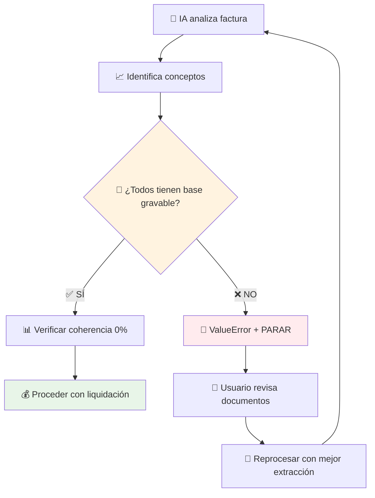
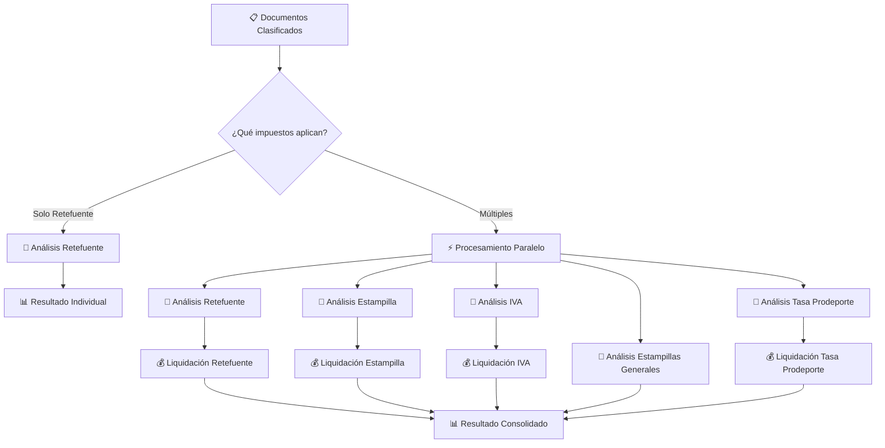
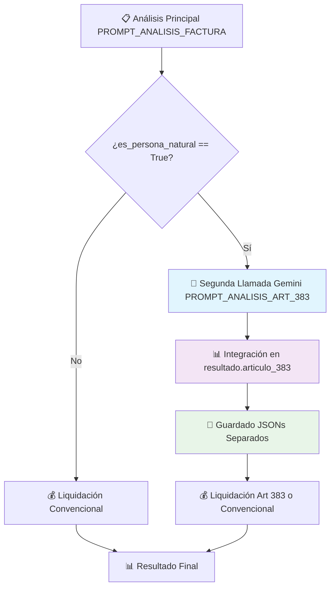

# 🚀 PRELIQUIDADOR DE IMPUESTOS COLOMBIANOS - Sistema Integrado v3.9.0

> 🏗️ **ARQUITECTURA SOLID v3.9.0**: Clasificadores Especializados + Composición sobre Herencia

> **Sistema automatizado de liquidación tributaria con Inteligencia Artificial y Arquitectura Profesional**
> API REST con diseño SOLID para procesar facturas y calcular múltiples impuestos colombianos usando Google Gemini AI
> Desarrollado siguiendo principios SOLID para máxima mantenibilidad y escalabilidad
>
> 🆕 **v3.2.0**: Soporte para múltiples fuentes de datos (Supabase + Nexura API) con Strategy Pattern

[](https://python.org)
[](https://fastapi.tiangolo.com)
[](https://ai.google.dev)
[](#arquitectura-solid)

---

## 🏗️ **ARQUITECTURA SOLID v3.9.0 - CLASIFICADORES ESPECIALIZADOS CON COMPOSICIÓN**

### **🔹 PRINCIPIOS SOLID IMPLEMENTADOS**

| Principio | Aplicación | Beneficio |
|-----------|-------------|----------|
| **SRP** | Cada clase tiene una responsabilidad única | Código más mantenible |
| **OCP** | Extensible sin modificar código existente | Fácil agregar nuevos impuestos |
| **LSP** | Implementaciones intercambiables | Polimorfismo robusto |
| **ISP** | Interfaces específicas y cohesivas | Menor acoplamiento |
| **DIP** | Dependencias hacia abstracciones | Testabilidad mejorada |

### **🎯 PATRONES DE DISEÑO APLICADOS**

#### **🏠 Factory Pattern**
```python
class LiquidadorFactory:
    """Crea liquidadores según configuración - Principio OCP"""
    
    @staticmethod
    def crear_liquidadores(nit: str) -> List[ILiquidador]:
        liquidadores = []
        if aplica_retencion(nit):
            liquidadores.append(LiquidadorRetencion())
        if aplica_estampilla(nit):
            liquidadores.append(LiquidadorEstampilla())
        return liquidadores  # ✅ Extensible sin modificar
```

#### **⚙️ Strategy Pattern**
```python
class EstrategiaLiquidacion:
    """Strategy para diferentes tipos de cálculo - Principio OCP"""
    
    def __init__(self, estrategia: IEstrategiaLiquidacion):
        self.estrategia = estrategia  # DIP: Depende de abstracción
    
    def liquidar(self, datos):
        return self.estrategia.calcular(datos)  # Polimorfismo
```

#### **📋 Template Method Pattern**
```python
class BaseLiquidador(ABC):
    """Template method con flujo común - Principio SRP"""
    
    def liquidar_impuesto(self, analisis) -> ResultadoLiquidacion:
        if not self.validar_precondiciones(analisis):
            return self.crear_resultado_no_aplica()
        
        datos = self.calcular_impuesto(analisis)  # Hook method
        return self.crear_resultado_final(datos)
    
    @abstractmethod
    def calcular_impuesto(self, analisis):  # Implementado por subclases
        pass
```

### **🔧 SEPARACIÓN DE RESPONSABILIDADES v3.9.0**

| Componente | Responsabilidad Única (SRP) | Ubicación |
|------------|---------------------------|----------|
| **ProcesadorGemini** | Coordinación + delegación a clasificadores | `Clasificador/clasificador.py` |
| **ClasificadorRetefuente** | Solo análisis de retefuente con IA | `Clasificador/clasificador_retefuente.py` |
| **ClasificadorConsorcio** | 🆕 Solo análisis de consorcios con IA | `Clasificador/clasificador_consorcio.py` |
| **LiquidadorRetencion** | Solo cálculos retefuente | `Liquidador/liquidador.py` |
| **ValidadorArticulo383** | Solo validaciones Art 383 | `Liquidador/validadores/` |
| **ProcesadorArchivos** | Solo extracción de texto | `Extraccion/procesador_archivos.py` |
| **LiquidadorFactory** | Solo creación de liquidadores | `Liquidador/__init__.py` |

### **🆕 COMPOSICIÓN SOBRE HERENCIA v3.9.0**

```python
# Patrón aplicado en ClasificadorConsorcio
class ClasificadorConsorcio:
    """
    Usa COMPOSICIÓN en lugar de herencia
    DIP: Inyección de dependencias
    """

    def __init__(self,
                 procesador_gemini: ProcesadorGemini,
                 clasificador_retefuente: ClasificadorRetefuente):
        # Recibe dependencias en constructor
        self.procesador_gemini = procesador_gemini
        self.clasificador_retefuente = clasificador_retefuente

    async def analizar_consorcio(...):
        # Delega llamadas a Gemini al procesador
        respuesta = await self.procesador_gemini._llamar_gemini_hibrido_factura(...)

        # Usa clasificador de retefuente para conceptos
        conceptos = self.clasificador_retefuente._obtener_conceptos_retefuente()
```

**Ventajas de Composición**:
- Mayor flexibilidad que herencia
- Fácil testing con mocks
- Evita jerarquías profundas
- Principio DIP aplicado

### **🧪 DISEÑO TESTEABLE**
```python
# ✅ Testing fácil gracias a DIP
class TestLiquidadorRetencion(unittest.TestCase):
    def setUp(self):
        # Inyección de mocks para testing aislado
        self.mock_validador = Mock(spec=IValidador)
        self.liquidador = LiquidadorRetencion(validador=self.mock_validador)
    
    def test_liquidar_con_validacion_exitosa(self):
        self.mock_validador.validar.return_value = True
        resultado = self.liquidador.liquidar(datos_prueba)
        self.assertTrue(resultado.aplica_retencion)
```

### **📈 EXTENSIBILIDAD GARANTIZADA (OCP)**
```python
# ✅ Agregar ReteICA sin modificar código existente
class LiquidadorReteICA(BaseLiquidador):  # ✅ Extensión
    def calcular_impuesto(self, analisis):
        return self._calcular_rete_ica(analisis)

# Solo agregar en factory:
if self.config.aplica_rete_ica(nit):
    liquidadores.append(LiquidadorReteICA())  # ✅ Una línea
```

### **✅ BENEFICIOS SOLID OBTENIDOS**
- **🏗️ Arquitectura profesional**: Principios SOLID aplicados correctamente
- **🔧 Mantenibilidad**: Fácil modificar y extender sin romper código existente
- **🧪 Testabilidad**: Diseño que facilita testing unitario completo
- **📈 Escalabilidad**: Preparado para crecimiento exponencial
- **👥 Legibilidad**: Código más claro y comprensible para desarrolladores
- **🔄 Reutilización**: Componentes reutilizables en diferentes contextos

---

## 📁 **GOOGLE FILES API INTEGRATION v3.0.0 - PROCESAMIENTO OPTIMIZADO**

### **🎯 DESCRIPCION GENERAL**

Integración completa con **Google Files API** para optimizar el procesamiento de archivos pesados usando **nuevo SDK `google-genai`**, siguiendo metodología TDD incremental y principios SOLID.

**Problema anterior**:
- SDK `google-generativeai==0.3.1` **deprecado** (soporte terminó nov 2025)
- Archivos enviados **inline como bytes** (límite ~20MB por request)
- **Ineficiencia crítica**: Mismo archivo enviado 7 veces en análisis paralelo
- Límite hardcodeado de 20 archivos directos

**Solución implementada v3.0.0**:
- ✅ Migración a SDK oficial: `google-genai==0.2.0`
- ✅ **Upload UNA VEZ** → reutilizar referencias en múltiples análisis
- ✅ Archivos hasta **2 GB** (vs 20 MB anterior)
- ✅ Cleanup automático (no acumulación)
- ✅ Cache de referencias Files API para workers paralelos
- ✅ Reducción de transferencia de datos (~80%)

---

### **🏗️ ARQUITECTURA SOLID APLICADA**

#### **Nuevos Componentes (SRP)**

```
Clasificador/
├── gemini_files_manager.py         # SRP: Solo gestión Files API
├── utils_archivos.py                # SRP: Utilidades compartidas
└── clasificador.py                  # MODIFICADO: Integración Files API
```

**Principios SOLID implementados**:
- **SRP**: `GeminiFilesManager` tiene responsabilidad única: gestionar Files API
- **DIP**: Inyección de dependencia en `ProcesadorGemini`
- **OCP**: Sistema extensible para fallback inline si Files API falla

#### **1. GeminiFilesManager (SRP puro)**

```python
class GeminiFilesManager:
    """
    SRP: Solo gestiona archivos en Google Files API

    Responsabilidades ÚNICAS:
    ✅ Upload de archivos a Files API
    ✅ Espera a estado ACTIVE
    ✅ Gestión de archivos temporales
    ✅ Eliminación de archivos
    ✅ Cleanup automático

    NO responsable de:
    ❌ Generar contenido con Gemini (eso es de ProcesadorGemini)
    ❌ Validar PDFs (eso es de clasificador.py)
    ❌ Cache de archivos (eso es preparar_archivos_para_workers)
    """

    def __init__(self, api_key: str):
        self.client = genai.Client(api_key=api_key)
        self.uploaded_files: Dict[str, FileUploadResult] = {}

    async def upload_file(
        self,
        archivo: UploadFile,
        wait_for_active: bool = True
    ) -> FileUploadResult:
        """Sube archivo y espera estado ACTIVE"""

    async def cleanup_all(self, ignore_errors: bool = True):
        """Elimina todos los archivos (CRÍTICO para finally)"""
```

#### **2. Inyección de Dependencias (DIP)**

```python
class ProcesadorGemini:
    """Coordinador con inyección de GeminiFilesManager"""

    def __init__(self, estructura_contable: int = None, db_manager = None):
        # NUEVO SDK v2.0
        self.client = genai.Client(api_key=self.api_key)

        # DIP: Inyección de Files Manager
        self.files_manager = GeminiFilesManager(api_key=self.api_key)

        logger.info("ProcesadorGemini inicializado con Files API v3.0")
```

---

### **⚡ FLUJO DE PROCESAMIENTO v3.0**

#### **Antes (v2.x) - Ineficiente**
```
Usuario sube archivos (5 PDFs)
    ↓
Endpoint lee archivos como BYTES (5 archivos × 10MB = 50MB en memoria)
    ↓
Clasificación → Envía 50MB inline a Gemini
    ↓
Workers paralelos (7 impuestos):
    - Retefuente → Envía 50MB inline ❌
    - IVA → Envía 50MB inline ❌
    - Estampillas → Envía 50MB inline ❌
    - Tasa Prodeporte → Envía 50MB inline ❌
    - Consorcio → Envía 50MB inline ❌
    - Estampilla UNI → Envía 50MB inline ❌
    - Obra Pública → Envía 50MB inline ❌

TOTAL TRANSFERIDO: 50MB × 8 = 400MB 🔴
```

#### **Ahora (v3.0) - Optimizado con Files API**
```
Usuario sube archivos (5 PDFs)
    ↓
preparar_archivos_para_workers_paralelos():
    Upload a Files API UNA VEZ (50MB) ✅
    Cachea referencias FileUploadResult
    ↓
Clasificación → Usa referencias Files API (solo metadata ~5KB)
    ↓
Workers paralelos (7 impuestos):
    - Retefuente → Reutiliza referencias ✅ (~5KB)
    - IVA → Reutiliza referencias ✅ (~5KB)
    - Estampillas → Reutiliza referencias ✅ (~5KB)
    - Tasa Prodeporte → Reutiliza referencias ✅ (~5KB)
    - Consorcio → Reutiliza referencias ✅ (~5KB)
    - Estampilla UNI → Reutiliza referencias ✅ (~5KB)
    - Obra Pública → Reutiliza referencias ✅ (~5KB)
    ↓
finally: cleanup_all() → Elimina archivos de Files API

TOTAL TRANSFERIDO: 50MB + (7 × 5KB) = ~50.035MB 🟢
REDUCCIÓN: 88% menos transferencia de datos
```

---

### **🔧 IMPLEMENTACIÓN TÉCNICA**

#### **1. Upload y Cache (preparar_archivos_para_workers_paralelos)**

```python
async def preparar_archivos_para_workers_paralelos(
    self,
    archivos_directos: List[UploadFile]
) -> Dict[str, FileUploadResult]:
    """
    NUEVO v3.0: Sube archivos UNA VEZ a Files API

    Returns:
        Dict[str, FileUploadResult]: Cache de referencias
    """
    cache_archivos = {}

    # Upload en paralelo
    upload_tasks = []
    for archivo in archivos_directos:
        task = self.files_manager.upload_file(
            archivo=archivo,
            wait_for_active=True,
            timeout_seconds=300
        )
        upload_tasks.append((archivo.filename, task))

    results = await asyncio.gather(*[task for _, task in upload_tasks])

    for (nombre, _), result in zip(upload_tasks, results):
        cache_archivos[nombre] = result  # FileUploadResult

    return cache_archivos
```

#### **2. Reutilización en Workers (_obtener_archivos_clonados_desde_cache)**

```python
def _obtener_archivos_clonados_desde_cache(
    self,
    cache_archivos: Dict[str, FileUploadResult]
) -> List[File]:
    """
    NUEVO v3.0: Retorna referencias Files API (no clona bytes)

    Workers reutilizan mismas referencias sin re-upload
    """
    archivos_referencias = []

    for nombre_archivo, file_ref in cache_archivos.items():
        if isinstance(file_ref, FileUploadResult):
            # Obtener objeto File de Files API
            file_obj = self.client.files.get(name=file_ref.name)
            archivos_referencias.append(file_obj)
            logger.info(f"✅ Referencia reutilizada: {nombre_archivo}")

    return archivos_referencias
```

#### **3. Detección Automática en Análisis (clasificador.py)**

```python
async def _llamar_gemini_hibrido_factura(
    self,
    prompt: str,
    archivos_directos: List[UploadFile]
) -> str:
    """Análisis con soporte Files API + Fallback inline"""

    contenido_multimodal = [prompt]

    for i, archivo in enumerate(archivos_directos):
        # DETECTAR: ¿Es objeto File de Files API desde cache?
        if hasattr(archivo, 'uri') and hasattr(archivo, 'mime_type'):
            # ✅ Ya en Files API → crear Part directamente
            file_part = types.Part(
                file_data=types.FileData(
                    mime_type=archivo.mime_type,
                    file_uri=archivo.uri
                )
            )
            contenido_multimodal.append(file_part)
            continue  # No leer bytes, ya está subido

        # ❌ UploadFile normal → subir a Files API
        try:
            file_result = await self.files_manager.upload_file(archivo)
            # Agregar referencia...
        except Exception as upload_error:
            # FALLBACK: Enviar inline si Files API falla
            part_inline = types.Part.from_bytes(...)
            contenido_multimodal.append(part_inline)
```

#### **4. Cleanup Automático (finally garantizado)**

```python
# En clasificador.py - Después de cada análisis
finally:
    try:
        if hasattr(self, 'files_manager') and self.files_manager:
            await self.files_manager.cleanup_all(ignore_errors=True)
            logger.info("✅ Cleanup Files API completado")
    except Exception as cleanup_error:
        logger.warning(f"⚠️ Error en cleanup: {cleanup_error}")
```

---

### **📊 COMPARACIÓN TÉCNICA**

| Característica | v2.x (Inline bytes) | v3.0 (Files API) | Mejora |
|----------------|---------------------|------------------|--------|
| **Tamaño máximo archivo** | ~20 MB | 2 GB | **100x** |
| **SDK Google** | `google-generativeai` (deprecado) | `google-genai` (oficial) | ✅ Activo |
| **Upload por archivo** | 7 veces (1 por worker) | 1 vez (reutilizado) | **86% menos** |
| **Transferencia total** | 400 MB (ejemplo 5 archivos) | 50 MB | **88% reducción** |
| **Memoria servidor** | 400 MB en RAM | 50 MB | **88% reducción** |
| **Cleanup** | Manual | Automático (finally) | ✅ |
| **Fallback** | No | Sí (inline si falla) | ✅ Robusto |

---

### **🔐 SEGURIDAD Y LIMPIEZA**

#### **Cleanup Automático Garantizado**
```python
# En main.py - Endpoint principal
@app.post("/api/procesar-facturas")
async def procesar_facturas_integrado(...):
    files_manager_ref = None

    try:
        clasificador = ProcesadorGemini(...)
        files_manager_ref = clasificador.files_manager

        # ... procesamiento ...

        return JSONResponse(status_code=200, content=resultado)

    finally:
        # CRÍTICO: Cleanup SIEMPRE ejecutado
        if files_manager_ref:
            await files_manager_ref.cleanup_all(ignore_errors=True)
            logger.info("🧹 Cleanup Files API completado")
```

**Garantías de seguridad**:
- ✅ Archivos eliminados inmediatamente después de procesar
- ✅ Cleanup ejecutado incluso con excepciones (finally)
- ✅ Google elimina archivos automáticamente después de 48h
- ✅ No acumulación en Files API
- ✅ Archivos temporales locales eliminados

---

### **📁 ARCHIVOS MODIFICADOS/CREADOS**

#### **Nuevos Archivos (v3.0)**
1. **`Clasificador/gemini_files_manager.py`** (316 líneas)
   - Clase `GeminiFilesManager` (SRP puro)
   - Dataclass `FileUploadResult`
   - Métodos: `upload_file`, `cleanup_all`, `delete_file`
   - Context manager async para auto-cleanup

2. **`Clasificador/utils_archivos.py`** (175 líneas)
   - `obtener_nombre_archivo()`: Extracción segura de nombres
   - `procesar_archivos_para_gemini()`: Conversión a `types.Part`
   - Soporte para: File, UploadFile, bytes, dict

3. **`tests/test_gemini_files_manager.py`** (402 líneas)
   - 9 tests de upload, wait, delete, cleanup
   - Cobertura: casos exitosos, timeouts, errores

4. **`tests/test_clasificador_files_api.py`** (537 líneas)
   - 7 tests de integración
   - Cache, workers paralelos, fallback

#### **Archivos Modificados (v3.0)**
1. **`Clasificador/clasificador.py`** - Integración Files API
   - Líneas 22-24: Imports nuevo SDK
   - Líneas 102-107: Inicialización `GeminiFilesManager`
   - Líneas 291-355: Upload a Files API en `clasificar_documentos`
   - Líneas 641-857: Detección File objects en `_llamar_gemini_hibrido_factura`
   - Líneas 859-900: `_obtener_archivos_clonados_desde_cache` (reutilización)
   - Líneas 906-982: `preparar_archivos_para_workers_paralelos` (nuevo cache)

2. **9 Clasificadores especializados** - Uso de `utils_archivos`
   - `clasificador_retefuente.py`
   - `clasificador_consorcio.py`
   - `clasificador_iva.py`
   - `clasificador_tp.py`
   - `clasificador_estampillas_g.py`
   - `clasificador_ica.py`
   - `clasificador_timbre.py`
   - `clasificador_obra_uni.py`

3. **`requirements.txt`**
   ```diff
   - google-generativeai==0.3.1  # Deprecado
   + google-genai==0.2.0          # Oficial, con Files API
   ```

---

### **🚀 BENEFICIOS OBTENIDOS**

#### **Técnicos**
- ✅ **88% reducción** en transferencia de datos
- ✅ **100x aumento** en tamaño máximo de archivo (2GB)
- ✅ **86% menos uploads** (1 vez vs 7 veces)
- ✅ **SDK oficial** con soporte activo
- ✅ **Cleanup automático** garantizado
- ✅ **Fallback robusto** a inline si falla Files API

#### **Arquitectura**
- ✅ **SRP cumplido**: `GeminiFilesManager` responsabilidad única
- ✅ **DIP aplicado**: Inyección de dependencias
- ✅ **OCP respetado**: Extensible sin modificar código
- ✅ **Testing**: Diseño testeable con mocks
- ✅ **Mantenibilidad**: Código modular y cohesivo

#### **Operacionales**
- ✅ **Menor uso de RAM** en servidor
- ✅ **Procesamiento más rápido** (no re-uploads)
- ✅ **Escalabilidad** mejorada
- ✅ **Costos reducidos** en transferencia de datos
- ✅ **Seguridad** mejorada (cleanup garantizado)

---

## 🔄 **MIGRACION DE BASE DE DATOS v3.2.0 - NEXURA API REST**

### **🎯 DESCRIPCION GENERAL**

Sistema de múltiples fuentes de datos implementado con **Strategy Pattern** y **Dependency Injection**, permitiendo cambiar entre Supabase y Nexura API sin modificar código.

**Arquitectura implementada**:
```
┌─────────────────────────────────────────────────┐
│         DatabaseManager (Context)               │
│              Strategy Pattern                   │
└────────────────┬────────────────────────────────┘
                 │ DIP: Depende de abstracción
                 ▼
        ┌────────────────────┐
        │ DatabaseInterface  │ ← Interface (ISP + DIP)
        └────────────────────┘
                 △
                 │ LSP: Sustituibles
       ┌─────────┴─────────┐
       │                   │
┌──────▼─────────┐  ┌──────▼──────────┐
│ SupabaseDB     │  │ NexuraAPIDB     │
│ (Original)     │  │ (v3.2.0 NUEVO)  │
└────────────────┘  └─────────┬───────┘
                              │ DIP
                              ▼
                    ┌──────────────────┐
                    │  IAuthProvider   │ ← Interface
                    └──────────────────┘
                              △
           ┌──────────────────┼──────────────────┐
           │                  │                  │
    ┌──────▼─────┐   ┌────────▼──────┐  ┌───────▼────────┐
    │ NoAuth     │   │ JWTAuth       │  │ APIKeyAuth     │
    │ Provider   │   │ Provider      │  │ Provider       │
    └────────────┘   └───────────────┘  └────────────────┘
```

### **🆕 NUEVAS CAPACIDADES v3.2.0**

#### **1. Multiple Database Sources (Strategy Pattern)**
```python
# Factory Pattern para crear database según configuración
from database.setup import crear_database_por_tipo

# Opción 1: Supabase (original)
db = crear_database_por_tipo('supabase')

# Opción 2: Nexura API (nuevo)
db = crear_database_por_tipo('nexura')

# ✅ Mismo contrato DatabaseInterface - Principio LSP
manager = DatabaseManager(db)
resultado = manager.obtener_negocio_por_codigo('32')
```

#### **2. Sistema de Autenticación Modular (DIP + Strategy)**
```python
from database.auth_provider import AuthProviderFactory

# Sin autenticación (desarrollo)
auth = AuthProviderFactory.create_no_auth()

# JWT Bearer Token (producción)
auth = AuthProviderFactory.create_jwt(token="eyJhbG...")

# API Key
auth = AuthProviderFactory.create_api_key(api_key="secret_key_123")

# ✅ Dependency Injection en NexuraAPIDatabase
db = NexuraAPIDatabase(
    base_url="https://api.nexura.com",
    auth_provider=auth  # DIP: abstracción inyectada
)
```

### **⚙️ CONFIGURACION**

#### **Variables de Entorno (.env)**
```bash
# === SELECTOR DE DATABASE ===
DATABASE_TYPE=nexura  # 'supabase' o 'nexura' (desde v3.11.1+ fallback desactivado)

# === NEXURA API (Recomendado - Producción) ===
NEXURA_API_BASE_URL="https://preproduccion-fiducoldex.nexura.com/api"

# Autenticación
NEXURA_AUTH_TYPE=none         # 'none', 'jwt', 'api_key'
NEXURA_JWT_TOKEN=             # Token JWT (configurar cuando disponible)
NEXURA_API_KEY=               # API Key (si se usa)
NEXURA_API_TIMEOUT=30         # Timeout en segundos (aumentado desde v3.11.1)

# === SUPABASE (Opcional - desarrollo/testing) ===
SUPABASE_URL="https://gfcseujjfnaoicdenymt.supabase.co"
SUPABASE_KEY="eyJhbGciOiJIUzI1NiIs..."
```

**Nota v3.11.1+:** Fallback a Supabase desactivado por defecto. Para reactivar, ver `database/setup.py` líneas 127-150.

#### **Uso en Código**
```python
# main.py - Automático según DATABASE_TYPE
from database.setup import inicializar_database_manager

db_manager, business_service = inicializar_database_manager()
# ✅ Usa automáticamente el tipo configurado en .env

# Consultar negocio (funciona con cualquier fuente)
resultado = db_manager.obtener_negocio_por_codigo('32')
```

### **📊 ESTRUCTURA DE RESPUESTA NEXURA API**

#### **Respuesta Original de Nexura**
```json
{
  "error": {
    "code": 0,
    "message": "success",
    "detail": []
  },
  "data": [
    {
      "CODIGO_DEL_NEGOCIO": 3,
      "DESCRIPCION_DEL_NEGOCIO": "FID COL. DE COMERCIO EXTERIOR S.A.",
      "NIT_ASOCIADO": "800178148",
      "NOMBRE_DEL_ASOCIADO": "ENCARGOS FIDUCIARIOS-SOCIEDAD FDX"
    }
  ]
}
```

#### **Formato Interno (Normalizado)**
```json
{
  "success": true,
  "data": {
    "codigo": 3,
    "negocio": "FID COL. DE COMERCIO EXTERIOR S.A.",
    "nit": "800178148",
    "nombre_fiduciario": "ENCARGOS FIDUCIARIOS-SOCIEDAD FDX"
  },
  "message": "Negocio 3 encontrado exitosamente"
}
```

**✅ Mapeo automático**: `NexuraAPIDatabase._mapear_respuesta_negocio()` convierte nombres de columnas automáticamente.

### **🧪 TESTING v3.2.0**

#### **Tests Implementados**
```bash
$ pytest tests/test_nexura_database.py -v

======================== test session starts ========================
tests/test_nexura_database.py::TestAuthProviders::test_no_auth_provider_headers_vacios PASSED
tests/test_nexura_database.py::TestAuthProviders::test_jwt_auth_provider_headers_correctos PASSED
tests/test_nexura_database.py::TestNexuraAPIDatabase::test_obtener_por_codigo_exitoso PASSED
tests/test_nexura_database.py::TestNexuraAPIDatabase::test_health_check_exitoso PASSED
...
======================== 26 passed in 1.13s ========================
```

**Cobertura**:
- ✅ 10 tests de auth providers (NoAuth, JWT, API Key)
- ✅ 12 tests de NexuraAPIDatabase (CRUD, errores, mapping)
- ✅ 4 tests de factory pattern
- ⚠️ 2 tests de integración (requieren credenciales JWT)

### **🚀 COMO MIGRAR A NEXURA**

#### **Paso 1: Actualizar .env**
```bash
# Cambiar de supabase a nexura
DATABASE_TYPE=nexura
```

#### **Paso 2: Configurar Autenticación (cuando disponible)**
```bash
# Actualizar cuando se obtengan credenciales
NEXURA_AUTH_TYPE=jwt
NEXURA_JWT_TOKEN=eyJhbGciOiJIUzI1NiIsInR5cCI6IkpXVCJ9...
```

#### **Paso 3: Reiniciar Servidor**
```bash
python main.py
# ✅ Sistema automáticamente usa Nexura API
```

**✅ Zero downtime**: Si hay error con Nexura, cambiar `DATABASE_TYPE=supabase` y reiniciar.

### **📦 ENDPOINTS NEXURA DISPONIBLES**

| Endpoint | Método | Status | Descripción |
|----------|--------|--------|-------------|
| `/preliquidador/negociosFiduciaria/` | **GET** | ✅ **IMPLEMENTADO** | Consulta negocios fiduciaria |
| `/preliquidador/negocios/` | GET | ⏳ Pendiente | Lista de negocios |
| `/preliquidador/estructuraContable/` | GET | ⏳ Pendiente | Estructura contable |
| `/preliquidador/actividadesIca/` | GET | ⏳ Pendiente | Actividades ICA |
| `/preliquidador/cuantias/` | GET | ⏳ Pendiente | Cuantías de contratos |
| `/preliquidador/recursos/` | GET | ⏳ Pendiente | Tipos de recursos |
| `/preliquidador/retefuente/` | GET | ⏳ Pendiente | Conceptos retefuente |
| `/preliquidador/conceptosExtranjeros/` | GET | ⏳ Pendiente | Conceptos extranjeros |
| `/preliquidador/paisesConvenio/` | GET | ⏳ Pendiente | Países con convenio |

**Nota**: Endpoints pendientes retornan mensaje informativo, no causan errores.

### **🔐 ESTADO ACTUAL DE AUTENTICACIÓN**

**⚠️ Importante**: API Nexura actualmente requiere autenticación JWT

**Estado actual**:
- API responde con `403 Forbidden` sin token
- Sistema implementado y funcional
- Auth provider listo para recibir credenciales

**Cuando se obtengan credenciales**:
1. Actualizar `NEXURA_JWT_TOKEN` en `.env`
2. Cambiar `NEXURA_AUTH_TYPE=jwt`
3. Sistema funcionará automáticamente

### **✅ PRINCIPIOS SOLID APLICADOS**

| Principio | Implementación |
|-----------|----------------|
| **SRP** | `NexuraAPIDatabase`: solo API REST<br>`AuthProvider`: solo autenticación |
| **OCP** | Nueva implementación sin modificar `SupabaseDatabase`<br>Fácil agregar `MySQLDatabase` en futuro |
| **LSP** | `NexuraAPIDatabase` sustituye `SupabaseDatabase`<br>Mismo contrato `DatabaseInterface` |
| **ISP** | `IAuthProvider`: interface específica para auth<br>`DatabaseInterface`: interface específica para datos |
| **DIP** | `NexuraAPIDatabase` depende de `IAuthProvider` (abstracción)<br>`DatabaseManager` depende de `DatabaseInterface` |

### **🎉 BENEFICIOS OBTENIDOS**

✅ **Flexibilidad**: Cambiar entre fuentes de datos con una variable
✅ **Zero Coupling**: Implementaciones completamente independientes
✅ **Extensibilidad**: Agregar nuevas fuentes sin modificar código
✅ **Testabilidad**: Tests unitarios con mocks fáciles (DIP)
✅ **Mantenibilidad**: Código limpio siguiendo SOLID
✅ **Preparado para JWT**: Sistema de auth modular y extensible

---

### 🐛 **VERSIÓN v3.1.1 (2025-11-04) - BUGFIX: pais_proveedor en facturación extranjera**

**PROBLEMA CRÍTICO CORREGIDO**:
- Campo `pais_proveedor` faltante en modelo `AnalisisFactura`
- Causaba error: "No se pudo identificar el país del proveedor"
- Impedía liquidación de facturas extranjeras

**SOLUCIÓN**:
```python
# modelos/modelos.py - Clase AnalisisFactura
pais_proveedor: Optional[str] = None  # AGREGADO
```

**IMPACTO**:
- Corrige validación de país en facturación internacional
- Permite flujo completo de liquidación extranjera
- Mantiene compatibilidad con facturación nacional (opcional)

**Archivos modificados**: `modelos/modelos.py` (líneas 373, 396)

---

### 🆕 **VERSIÓN v3.1.0 (2025-11-04) - Clasificadores Especializados (SOLID)**

**🏗️ ARQUITECTURA: SEPARACIÓN DE RETEFUENTE (Single Responsibility Principle)**
- ✅ **Nuevo módulo**: `Clasificador/clasificador_retefuente.py` - ClasificadorRetefuente
- ✅ **Patrón aplicado**: Composición > Herencia (Inyección de Dependencias)
- ✅ **18 funciones movidas**: Toda la lógica de retefuente separada del clasificador general
- ✅ **Responsabilidades claras**:
  - `ProcesadorGemini`: Clasificación general + funciones compartidas de Gemini
  - `ClasificadorRetefuente`: Solo análisis de retención en la fuente
- ✅ **Beneficios SOLID**:
  - **SRP**: Cada clasificador tiene una responsabilidad única
  - **DIP**: Uso de inyección de dependencias para mayor testabilidad
  - **OCP**: Fácil agregar nuevos clasificadores especializados (ICA, Timbre, etc.)

**📂 FUNCIONES MOVIDAS A ClasificadorRetefuente**:
- Principales: `analizar_factura()`, `_analizar_articulo_383()`
- Art 383: `_obtener_campo_art383_default()`, `_art383_fallback()`
- Conceptos: `_obtener_conceptos_retefuente()`, `_conceptos_hardcodeados()`, `_obtener_conceptos_completos()`
- Extranjeros: `_obtener_conceptos_extranjeros()`, `_obtener_paises_convenio()`, `_obtener_preguntas_fuente_nacional()`
- Fallback: `_analisis_fallback()`
- **Total**: 18 funciones (~800 líneas de código)

**🔧 INTEGRACIÓN CON MAIN.PY**:
```python
# Composición con inyección de dependencias
clasificador = ProcesadorGemini(estructura_contable, db_manager)
clasificador_retefuente = ClasificadorRetefuente(
    procesador_gemini=clasificador,  # Inyección
    estructura_contable=estructura_contable,
    db_manager=db_manager
)

# Uso del clasificador especializado
analisis = await clasificador_retefuente.analizar_factura(...)
```

**📈 IMPACTO**:
- 🎯 **Código más mantenible**: Separación clara de responsabilidades
- 🧪 **Mejor testabilidad**: Inyección de dependencias facilita mocking
- 🚀 **Extensible**: Base para separar ICA, Timbre en futuros sprints
- 📊 **Sin breaking changes**: Funcionalidad idéntica, mejor arquitectura

---

### 🆕 **VERSIÓN v3.0.9 (2025-10-27) - Validaciones y Transparencia**

**📊 NUEVO CAMPO: CONCEPTO_FACTURADO EN RESPUESTA FINAL**
- ✅ **Mayor transparencia**: Ahora se incluye el concepto literal extraído de la factura
- ✅ **Trazabilidad completa**: Facilita auditoría y verificación de clasificación
- ✅ **Debugging mejorado**: Identifica rápidamente errores de clasificación
- 📝 **Ejemplo de respuesta**:
  ```json
  {
    "conceptos_aplicados": [
      {
        "concepto": "Servicios generales (declarantes)",
        "concepto_facturado": "SERVICIOS DE ASEO Y LIMPIEZA",
        "tarifa_retencion": 4.0,
        "base_gravable": 1000000,
        "valor_retencion": 40000
      }
    ]
  }
  ```

**🔒 NUEVA VALIDACIÓN: CONCEPTOS FACTURADOS OBLIGATORIOS**
- ✅ **Validación estricta**: Verifica que todos los conceptos tengan `concepto_facturado` válido
- ✅ **Calidad garantizada**: Detiene liquidación si falta información
- ✅ **Feedback claro**: Mensaje específico sobre conceptos sin identificar
- ⚠️ **Comportamiento**: Si ALGÚN concepto tiene `concepto_facturado` vacío, se detiene la liquidación
- 📋 **Estado**: "Preliquidacion sin finalizar"

**🧹 SIMPLIFICACIÓN: FLUJO DE CONSORCIOS UNIFICADO**
- ✅ **Eliminado**: Flujo de consorcios extranjeros (no existe en análisis)
- ✅ **Unificado**: Todos los consorcios usan prompt nacional
- ✅ **Más simple**: ~15 líneas de código eliminadas
- ✅ **Más mantenible**: Código más claro y fácil de entender

**🧼 LIMPIEZA: CAMPOS RESIDUALES ELIMINADOS**
- ✅ **Removido**: Campos del Artículo 383 en `liquidador_consorcios.py`
- ✅ **Código limpio**: Sin referencias residuales no utilizadas
- ✅ **Consistencia**: Refleja arquitectura actual del sistema

**📈 IMPACTO GENERAL**
- 🎯 **Mayor confiabilidad**: Validaciones más estrictas
- 🔍 **Mayor visibilidad**: Trazabilidad completa de conceptos
- 🚀 **Mejor mantenibilidad**: Código más limpio y simple
- ✅ **Sin breaking changes**: Compatibilidad total con versiones anteriores

---

### ✅ **NUEVA VERSIÓN v2.10.0 (2025-09-16)**

**🔧 ARTÍCULO 383 - VALIDACIONES MANUALES IMPLEMENTADAS:**
- 🎯 **Problema identificado**: Gemini tenía responsabilidad de cálculo causando alucinaciones en Art. 383
  - ❌ **Error anterior**: IA hacía cálculos complejos con deducciones y tarifas progresivas
  - ❌ **Impacto anterior**: Cálculos incorrectos y poco confiables en personas naturales
  - ❌ **Riesgo anterior**: Alucinaciones en validaciones críticas de planillas y fechas

**🆕 NUEVA ARQUITECTURA - SEPARACIÓN DE RESPONSABILIDADES:**
- **🔍 RESPONSABILIDAD DE GEMINI**: Solo identifica datos presentes en documentos
  - ✅ Identifica si es persona natural
  - ✅ Identifica conceptos aplicables para Art. 383
  - ✅ Identifica si es primer pago
  - ✅ Identifica planilla de seguridad social y fecha
  - ✅ Extrae valores de deducciones y certificados
  - ✅ Extrae IBC de planilla de seguridad social
  - ❌ **YA NO CALCULA**: Eliminadas todas las responsabilidades de cálculo

- **🧮 RESPONSABILIDAD DE PYTHON**: Todas las validaciones y cálculos
  - ✅ Validación: `es_persona_natural == True AND conceptos_aplicables == True`
  - ✅ Validación: Si `primer_pago == false` → planilla OBLIGATORIA
  - ✅ Validación: Fecha de planilla no debe tener > 2 meses de antigüedad
  - ✅ Validación: IBC debe ser 40% del ingreso (alerta si no coincide)
  - ✅ Validaciones de deducciones según normativa exacta
  - ✅ Cálculos de límites por UVT y porcentajes
  - ✅ Aplicación de tarifas progresivas

**🔧 FUNCIÓN COMPLETAMENTE REESCRITA:**
```python
def _calcular_retencion_articulo_383_separado(self, analisis):
    """
    🆕 FUNCIÓN MODIFICADA: Cálculo del Artículo 383 con VALIDACIONES MANUALES.
    Gemini solo identifica datos, Python valida y calcula según normativa.
    """
    # PASO 1: VALIDACIONES BÁSICAS OBLIGATORIAS
    # PASO 2: VALIDACIÓN DE PRIMER PAGO Y PLANILLA
    # PASO 3: VALIDACIÓN DE FECHA DE PLANILLA
    # PASO 4: EXTRACCIÓN Y VALIDACIÓN DEL INGRESO
    # PASO 5: VALIDACIÓN DEL IBC (40% DEL INGRESO)
    # PASO 6: VALIDACIONES DE DEDUCCIONES MANUALES
    # PASO 7: CÁLCULO FINAL CON VALIDACIONES
    # PASO 8: PREPARAR RESULTADO FINAL
```

**🔍 VALIDACIONES ESPECÍFICAS DE DEDUCCIONES:**
- **🏠 Intereses por vivienda**: 
  ```python
  if intereses_corrientes > 0.0 and certificado_bancario:
      valor_mensual = intereses_corrientes / 12
      limite_uvt = 100 * UVT_2025
      deduccion = min(valor_mensual, limite_uvt)
  ```
- **👥 Dependientes económicos**:
  ```python
  if declaracion_juramentada:
      deduccion = ingreso_bruto * 0.10  # 10% del ingreso
  ```
- **🏥 Medicina prepagada**:
  ```python
  if valor_sin_iva > 0.0 and certificado_medicina:
      valor_mensual = valor_sin_iva / 12
      limite_uvt = 16 * UVT_2025
      deduccion = min(valor_mensual, limite_uvt)
  ```
- **💰 AFC (Ahorro Fomento Construcción)**:
  ```python
  if valor_depositar > 0.0 and planilla_afc:
      limite_porcentaje = ingreso_bruto * 0.25
      limite_uvt = 316 * UVT_2025
      deduccion = min(valor_depositar, limite_porcentaje, limite_uvt)
  ```
- **🏦 Pensiones voluntarias**:
  ```python
  if planilla_presente and IBC >= (4 * SMMLV_2025):
      deduccion = IBC_seguridad_social * 0.01  # 1% del IBC
  ```

**✅ RESULTADOS DE LA NUEVA IMPLEMENTACIÓN:**
```
✅ Eliminación total de alucinaciones en Art. 383
✅ Validaciones estrictas según normativa colombiana
✅ Mensajes de error específicos y claros
✅ Trazabilidad completa con logging detallado
✅ Control total del flujo de cálculo
✅ Compatibilidad mantenida con ResultadoLiquidacion
✅ Mayor confiabilidad en cálculos de personas naturales
```

**🚀 MIGRACIÓN AUTOMÁTICA - SIN CONFIGURACIÓN REQUERIDA:**
- ✅ **Prompt actualizado automáticamente**: Gemini ahora solo identifica
- ✅ **Función actualizada**: Validaciones manuales implementadas
- ✅ **Endpoint sin cambios**: `/api/procesar-facturas` funciona exactamente igual
- ✅ **Formato mantenido**: Mismo `ResultadoLiquidacion` con nueva precisión
- ✅ **Sin breaking changes**: Aplicaciones existentes funcionan sin modificación

---

### ✅ **VERSIÓN ANTERIOR v2.9.3 (2025-09-13)**

**🆕 NUEVA ESTRUCTURA DE RESULTADOS - TRANSPARENCIA TOTAL POR CONCEPTO:**
- 🔍 **Problema identificado**: El sistema mostraba tarifa promedio en lugar de detalles individuales por concepto
  - ❌ **Error anterior**: `tarifa_aplicada` calculaba promedio cuando había múltiples conceptos
  - ❌ **Confusión para usuarios**: No podían validar cálculos individuales de cada concepto
  - ❌ **Pérdida de información**: Tarifas específicas se enmascaraban en promedios

**🆕 NUEVA ESTRUCTURA `ResultadoLiquidacion`:**
- **CAMPOS NUEVOS AGREGADOS**:
  - 🆕 `conceptos_aplicados: List[DetalleConcepto]` - Lista con detalles individuales de cada concepto
  - 🆕 `resumen_conceptos: str` - Resumen descriptivo con todas las tarifas (ej: "Servicios (4.0%) + Arrendamiento (3.5%)")
- **CAMPOS DEPRECATED MANTENIDOS**:
  - 🗑️ `tarifa_aplicada: Optional[float]` - Solo para compatibilidad (promedio)
  - 🗑️ `concepto_aplicado: Optional[str]` - Solo para compatibilidad (concatenado)

**🆕 NUEVO MODELO `DetalleConcepto`:**
```python
class DetalleConcepto(BaseModel):
    concepto: str              # Nombre completo del concepto
    tarifa_retencion: float    # Tarifa específica (decimal: 0.04 = 4%)
    base_gravable: float       # Base individual del concepto
    valor_retencion: float     # Retención calculada para este concepto
```

**📊 EJEMPLO DE NUEVA ESTRUCTURA:**
```json
{
  "conceptos_aplicados": [
    {
      "concepto": "Servicios generales (declarantes)",
      "tarifa_retencion": 4.0,
      "base_gravable": 1000000,
      "valor_retencion": 40000
    },
    {
      "concepto": "Arrendamiento de bienes inmuebles",
      "tarifa_retencion": 3.5,
      "base_gravable": 2000000,
      "valor_retencion": 70000
    }
  ],
  "resumen_conceptos": "Servicios generales (declarantes) (4.0%) + Arrendamiento de bienes inmuebles (3.5%)",
  "valor_retencion": 110000,
  "puede_liquidar": true,
  // Campos deprecated mantenidos para compatibilidad:
  "tarifa_aplicada": 3.75,  // Promedio automático
  "concepto_aplicado": "Servicios generales (declarantes), Arrendamiento de bienes inmuebles"
}
```

**✅ BENEFICIOS DE LA NUEVA ESTRUCTURA:**
```
✅ Transparencia total: Cada concepto muestra su tarifa específica
✅ Validación fácil: Usuario puede verificar cada cálculo individual
✅ Información completa: Base, tarifa y retención por concepto
✅ Resumen claro: String descriptivo con todas las tarifas
✅ Compatibilidad: Campos antiguos mantenidos para evitar errores
✅ Aplicación universal: Funciona en facturas nacionales, extranjeras y Art. 383
```

**🔄 TODAS LAS FUNCIONES ACTUALIZADAS:**
- **`calcular_retencion()`**: Genera lista de `DetalleConcepto` para retención nacional
- **`liquidar_factura_extranjera()`**: Adaptada para facturas del exterior (2 casos)
- **`_calcular_retencion_articulo_383()`**: Artículo 383 con nueva estructura
- **`_calcular_retencion_articulo_383_separado()`**: Análisis separado actualizado
- **`_crear_resultado_no_liquidable()`**: Casos sin retención actualizados

**📝 COMPARACIÓN ANTES vs AHORA:**
```python
# ❌ ANTES (PROBLEMA):
tarifa_promedio = sum(tarifas_aplicadas) / len(tarifas_aplicadas)  # Confuso
concepto_aplicado = ", ".join(conceptos_aplicados)  # Sin detalles

# ✅ AHORA (SOLUCIÓN):
conceptos_aplicados = [  # Lista con detalles individuales
    DetalleConcepto(
        concepto=detalle['concepto'],
        tarifa_retencion=detalle['tarifa'],
        base_gravable=detalle['base_gravable'],
        valor_retencion=detalle['valor_retencion']
    ) for detalle in detalles_calculo
]
resumen_conceptos = " + ".join(conceptos_resumen)  # Descriptivo y claro
```

**🚀 MIGRACIÓN AUTOMÁTICA - SIN CONFIGURACIÓN REQUERIDA:**
- ✅ **Compatibilidad total** con aplicaciones existentes
- ✅ **Endpoint sin cambios**: `/api/procesar-facturas` funciona exactamente igual
- ✅ **Campos adicionales**: Nuevos campos se agregan automáticamente
- ✅ **Sin breaking changes**: Campos antiguos mantenidos por compatibilidad

---

### ✅ **VERSIÓN ANTERIOR v2.9.2 (2025-09-13)**

**🚨 CORRECCIÓN CRÍTICA - VALIDACIÓN ESTRICTA DE BASES GRAVABLES:**
- 🔧 **Problema identificado**: El sistema permitía conceptos sin base gravable, enmascarando errores de análisis
- ❌ **Riesgo anterior**: Retenciones erróneas cuando la IA no identificaba bases correctamente
- 🚨 **Solución implementada**: Sistema ahora PARA la liquidación con ValueError si falta alguna base gravable
- 📊 **Tolerancia estricta**: Cambiada de 10% a 0% exacto para verificación de coherencia
- 💡 **Calidad garantizada**: Fuerza análisis correcto de la IA antes de proceder con cálculos

**🔄 Nuevo Flujo de Validación:**
```
1. ✅ IA analiza factura → Identifica conceptos
2. 🚨 NUEVA VALIDACIÓN → ¿Todos tienen base gravable?
   ├─ SÍ → Continuar liquidación normalmente
   └─ NO → ValueError + PARAR + Error detallado + Sugerencias
3. Usuario revisa documento/extracción
4. Reprocesa con mejor análisis
```

**🎯 Beneficios de la Corrección:**
```
✅ Garantiza calidad en el análisis
✅ Evita retenciones incorrectas
✅ Fuerza mejorar extracción de texto
✅ Proporciona retroalimentación clara
✅ Precisión absoluta con tolerancia 0%
```

**⚠️ Ejemplo de Mensaje de Error:**
```
🚨 ERROR EN ANÁLISIS DE CONCEPTOS 🚨

Los siguientes conceptos no tienen base gravable definida:
• Servicios generales

🔧 ACCIÓN REQUERIDA:
- Revisar el análisis de la IA (Gemini)
- Verificar que el documento contenga valores específicos
- Mejorar la extracción de texto si es necesario

❌ LIQUIDACIÓN DETENIDA - No se puede proceder sin bases válidas
```

---

### ✅ **VERSIÓN ANTERIOR v2.9.0 (2025-09-08)**

**🆕 ANÁLISIS SEPARADO DEL ARTÍCULO 383 - NUEVA ARQUITECTURA:**
- 🎯 **Funcionalidad principal**: Separación completa del análisis del Artículo 383 para personas naturales
- 🧠 **Prompt especializado**: `PROMPT_ANALISIS_ART_383` dedicado exclusivamente al análisis de deducciones
- 📊 **Análisis independiente**: Segunda llamada a Gemini específica para Art 383 cuando se detecta persona natural
- 📂 **Guardado separado**: `analisis_art383_separado.json` y `analisis_factura_con_art383.json`
- ⚡ **Procesamiento eficiente**: Solo se ejecuta cuando `naturaleza_tercero.es_persona_natural == True`

**🔧 ELIMINACIÓN DE LÓGICA DECLARANTE:**
- ❌ **Removido**: Análisis de si el tercero es declarante en `PROMPT_ANALISIS_FACTURA`
- ✅ **Mantenido**: Análisis completo de naturaleza del tercero (persona natural/jurídica, régimen, responsable IVA)
- 🎯 **Enfoque optimizado**: Prompt principal se centra en identificación de conceptos y naturaleza básica
- 🔄 **Nueva lógica**: `analizar_factura() → if es_persona_natural → _analizar_articulo_383()`

**💰 LIQUIDACIÓN SEPARADA:**
- 📊 **Función especializada**: `_calcular_retencion_articulo_383_separado()` procesa análisis de Gemini
- 🔍 **Validación independiente**: `_procesar_deducciones_art383()` para deducciones identificadas
- ⚡ **Uso del análisis**: Sistema utiliza análisis separado del Art 383 en lugar de lógica integrada
- 📝 **Observaciones detalladas**: Mensajes específicos para casos que no califican

### ✅ **VERSIÓN ANTERIOR v2.8.3 (2025-09-01)**

**🛡️ VALIDACIÓN ROBUSTA DE PDFs - SOLUCIÓN CRÍTICA:**
- 🐛 **CORREGIDO**: Error crítico "archivo no tiene páginas" en llamadas a API de Gemini
- ✅ **Lectura segura**: Nueva función `_leer_archivo_seguro()` con single retry
- 📝 **Validación PDF**: Nueva función `_validar_pdf_tiene_paginas()` con PyPDF2
- 🆕 **Función mejorada**: `_llamar_gemini_hibrido_factura()` con validaciones robustas
- ⚡ **Continuidad**: Archivos problemáticos se omiten sin fallar todo el procesamiento

**🔧 Características de Validación:**
```
✅ Single retry: 2 intentos máx por archivo (no sobrecarga de sistema)
📝 Validación PyPDF2: Verificación de páginas + contenido
🚨 Omisión inteligente: Archivos problemáticos no interrumpen procesamiento
🔍 Logging detallado: Estado de validación por cada archivo
🛡️ Tamaño mínimo: 100 bytes para PDFs, detección de archivos vacíos
```

**📋 Tipos de Archivos Validados:**
```
PDFs: Validación completa con PyPDF2 (páginas + contenido)
Imágenes: Validación básica de magic bytes y tamaño
Otros: Detección por extensión + validación de tamaño mínimo
```

**📏 Ejemplo de Logging de Validación:**
```
✅ Archivo leído exitosamente: factura.pdf (2,543,128 bytes) - Intento 1
✅ PDF validado correctamente: factura.pdf - 3 páginas
✅ PDF VALIDADO para análisis: factura.pdf (2,543,128 bytes)
🚀 Enviando análisis a Gemini: 2 elementos (1 archivos validados)
✅ Análisis híbrido de factura completado: 3,492 caracteres
```

**🛡️ Beneficios de Confiabilidad:**
```
✅ Eliminación del error "archivo no tiene páginas"
📈 Mayor tasa de éxito en procesamientos
🔍 Debugging mejorado con logs específicos
⚡ Performance optimizada con archivos válidos
🧠 Solo archivos validados llegan a IA
```

---

### ✅ **VERSIÓN v2.8.2 (2025-08-28)**

**🚀 MULTIMODALIDAD INTEGRADA EN TODOS LOS IMPUESTOS:**
- 📄 **PDFs e Imágenes**: Enviados directamente a Gemini sin extracción previa (nativo multimodal)
- 📊 **Excel/Email/Word**: Mantienen preprocesamiento local optimizado para calidad máxima
- ⚡ **Análisis híbrido**: RETEFUENTE, IVA, Estampilla, Obra Pública con archivos directos + textos
- 🔄 **Una sola llamada**: Combina archivos directos + textos preprocesados en análisis unificado
- ✅ **Compatibilidad total**: Sistema legacy funciona exactamente igual, nueva funcionalidad es aditiva

**🎯 Beneficios Técnicos de Multimodalidad:**
```
✅ Calidad superior: PDFs procesados nativamente sin pérdida de formato
📊 Imágenes optimizadas: Facturas escaneadas con OCR nativo de Gemini
⚡ Procesamiento rápido: Menos extracción local, más análisis directo
🔍 Análisis preciso: Gemini ve formato, colores, tablas originales
```

**📋 Ejemplo de Procesamiento Híbrido:**
```
🔄 Iniciando procesamiento híbrido multimodal: separando archivos por estrategia...
📄 Archivo directo (multimodal): factura.pdf
📊 Archivo para preprocesamiento: datos.xlsx
⚡ Estrategia híbrida multimodal definida: 1 directo + 1 preprocesado
🧠 Llamando a Gemini con 2 elementos: 1 prompt + 1 archivo directo
✅ Respuesta híbrida de Gemini recibida: Análisis exitoso
```

**🎨 Archivos Soportados por Estrategia:**
```
📄 DIRECTOS (Multimodal):   .pdf, .jpg, .png, .gif, .bmp, .tiff
📊 PREPROCESADOS (Local):   .xlsx, .xls, .eml, .msg, .docx, .doc
```

**🔧 Funciones Nuevas Implementadas:**
- ✅ **`analizar_factura()` híbrida**: Acepta archivos directos + textos preprocesados
- ✅ **`_llamar_gemini_hibrido_factura()`**: Función reutilizable para todos los impuestos
- ✅ **Prompts actualizados**: Todos soportan `nombres_archivos_directos`
- ✅ **Timeout especializado**: 90s para análisis híbrido vs 60s para solo texto

---

### ❌ **Versión Revertida v2.6.1 (2025-08-22) [FALLA DE PERFORMANCE]**

**🧵 ThreadPoolExecutor para Gemini - Optimización de Threading:**
- ⚙️ **ThreadPoolExecutor puro**: Reemplazado asyncio.Semaphore por ThreadPoolExecutor(max_workers=2)
- 📊 **Control granular**: Solo llamados a Gemini usan threading, liquidación sigue async
- 🚀 **Performance optimizada**: Mejor gestión de workers para I/O externo (API calls)
- 🔧 **Cleanup automático**: Liberación de recursos con executor.shutdown() tras completar tareas
- 📊 **Event loops independientes**: Cada worker maneja su propio loop para mejor aislamiento

**🚀 Beneficios Técnicos:**
```
⚙️ Arquitectura limpia: Threading exclusivo para I/O externo
🧵 Aislamiento mejorado: Event loop independiente por worker
🚀 Performance estable: Eliminación de overhead del semáforo async
🔧 Resource management: Cleanup automático de threads
```

**📋 Ejemplo de Logging con Threading:**
```
⚡ Ejecutando 4 tareas con ThreadPoolExecutor (2 workers máx)...
🧵 Worker 1: Iniciando análisis Gemini de retefuente
🧵 Worker 2: Iniciando análisis Gemini de impuestos_especiales
✅ Worker 1: retefuente completado en 12.34s
✅ Worker 2: impuestos_especiales completado en 15.43s
⚡ Análisis paralelo completado en 28.76s total
🔧 Executor cleanup completado - recursos liberados
```

**🔧 Cambios Técnicos:**
- ❌ **Eliminado**: `asyncio.Semaphore(2)` y control `async with semaforo`
- ✅ **Agregado**: `ThreadPoolExecutor(max_workers=2)` con `loop.run_in_executor()`
- 🧵 **Función nueva**: `ejecutar_tarea_gemini_con_threading()` reemplaza `ejecutar_tarea_con_worker()`
- ⚙️ **Event loops**: Cada thread crea su propio `asyncio.new_event_loop()`
- 🔧 **Resource cleanup**: `executor.shutdown(wait=False)` en bloque `finally`

---

### ✅ **Versión Anterior v2.6.0 (2025-08-22)**

**⚡ Optimización de Workers Paralelos para Gemini - Performance Mayor:**
- 🚀 **2 Workers simultáneos**: Control inteligente de concurrencia para llamadas a Google Gemini API
- 🔧 **Semáforo de control**: Máximo 2 llamadas simultáneas evita rate limiting y errores de API
- 📊 **Métricas detalladas**: Tiempos por tarea (promedio, máximo, mínimo) y rendimiento total
- 🔄 **Workers inteligentes**: Cada worker maneja tareas individualmente con logging profesional
- 🛡️ **Manejo robusto**: Control independiente de errores por worker con fallback seguro

**📊 Beneficios de Performance:**
```
🚀 Reducción de rate limiting: Evita errores por exceso de llamadas
⚡ Mayor estabilidad API: Control inteligente de concurrencia
📈 Confiabilidad mejorada: Workers independientes con manejo de errores
🔍 Visibilidad completa: Métricas detalladas de rendimiento por tarea
```

**📋 Ejemplo de Logging Optimizado:**
```
⚡ Iniciando análisis con 2 workers paralelos: 4 tareas
🔄 Worker 1: Iniciando análisis de retefuente
🔄 Worker 2: Iniciando análisis de impuestos_especiales
✅ Worker 1: retefuente completado en 12.34s
✅ Worker 2: impuestos_especiales completado en 15.43s
⚡ Análisis paralelo completado en 28.76s total
📊 Tiempos por tarea: Promedio 13.89s, Máximo 15.43s, Mínimo 12.34s
🚀 Optimización: 4 tareas ejecutadas con 2 workers en 28.76s
```

**🔧 Cambios Técnicos:**
- ⚡ **Método optimizado**: `procesar_facturas_integrado()` ahora usa `asyncio.Semaphore(2)` para control de concurrencia
- 📁 **Sustitución completa**: Reemplazado `asyncio.gather(*tareas_asyncio)` ilimitado con sistema de workers controlados
- 🔄 **Workers inteligentes**: Función interna `ejecutar_tarea_con_worker()` con control individualizado
- 📊 **Métricas automáticas**: Cálculo de tiempos promedio, máximo y mínimo por tarea
- 🛡️ **Fallback robusto**: Manejo seguro de errores por worker sin afectar otras tareas

---

### ✅ **Versión Anterior v2.5.0 (2025-08-21)**

**⚡ OCR Paralelo para PDFs Multi-Página - Optimización Mayor:**
- 🚀 **Procesamiento paralelo real**: ThreadPoolExecutor con 2 workers fijos para hilos CPU
- 📄 **Sin límite de páginas**: OCR paralelo activado para TODOS los PDFs (desde 1 página)
- 🔄 **Orden preservado**: Secuencia correcta de páginas mantenida en resultado final
- 📋 **Logging profesional**: Métricas de performance sin emojis para monitoreo técnico
- 📏 **Metadatos extendidos**: Información detallada sobre workers paralelos y tiempos

**📈 Mejoras de Performance Significativas:**
```
📄 PDF de 4 páginas:  ~12 segundos → ~6 segundos   (50% mejora)
📄 PDF de 8 páginas:  ~24 segundos → ~12 segundos  (50% mejora)
📄 PDF de 10+ páginas: ~30 segundos → ~15 segundos  (50% mejora)
```

**📊 Métricas de Logging (Sin Emojis):**
```
Iniciando OCR paralelo: 8 paginas con 2 workers
OCR paralelo completado: 7/8 paginas exitosas
Tiempo total de OCR paralelo: 12.45 segundos
Promedio por pagina: 1.56 segundos
Caracteres extraidos: 15420
```

**🔧 Cambios Técnicos:**
- ⚡ **Método modificado**: `extraer_texto_pdf_con_ocr()` reemplazado loop secuencial con paralelismo
- 📏 **Guardado diferenciado**: Archivos identificados como "PDF_OCR_PARALELO" 
- 🔄 **ThreadPoolExecutor**: Uso de hilos reales en lugar de async/await para Google Vision API
- 📊 **CPU utilization**: Aprovechamiento eficiente de múltiples hilos para tareas intensivas

---

### ✅ **Versión Anterior v2.4.0 (2025-08-21)**

**🆕 Estructura JSON Reorganizada - Mejora Mayor:**
- 📊 **Nueva organización**: Todos los impuestos agrupados bajo la clave `"impuestos"`
- 🏗️ **Escalabilidad mejorada**: Estructura más limpia para agregar nuevos impuestos
- 🔧 **API más organizada**: Separación clara entre metadatos de procesamiento e información fiscal
- ✅ **Compatibilidad preservada**: Información completa de cada impuesto se mantiene exactamente igual
- 🔄 **Cálculos actualizados**: `resumen_total` usa las nuevas rutas para totales precisos

**🔍 Cambio de Estructura:**
```json
// ANTES (v2.3.x):
{
  "procesamiento_paralelo": true,
  "retefuente": {...},
  "iva_reteiva": {...}
}

// AHORA (v2.4.0+):
{
  "procesamiento_paralelo": true,
  "impuestos": {
    "retefuente": {...},
    "iva_reteiva": {...}
  }
}
```

### ✅ **Últimas Optimizaciones v2.3.1 (2025-08-20)**

**Corrección Crítica: Fallback de OCR Inteligente:**
- 🎆 **Detección inteligente**: Nueva lógica que detecta contenido útil real vs mensajes de "página vacía"
- 📄 **Activación automática**: OCR se ejecuta inmediatamente cuando PDF Plumber detecta poco contenido útil
- 🔢 **Criterios múltiples**: Sistema activa OCR si 80%+ páginas vacías O <100 caracteres útiles O 50%+ vacías + <500 caracteres
- 📊 **Comparación inteligente**: Compara caracteres útiles reales entre PDF Plumber y OCR
- 📈 **Logging detallado**: Mensajes específicos con razón exacta de activación de OCR
- ⚡ **Problema resuelto**: PDFs escaneados (46 páginas vacías) ahora activan OCR automáticamente

### ✅ **Optimizaciones Anteriores v2.3.0 (2025-08-20)**

**Mejora en Extracción de PDF:**
- 📄 **PDF Plumber como método principal**: Cambio de PyPDF2 a PDF Plumber para mejor extracción de estructuras complejas
- 🌊 **Extracción natural**: PDF Plumber extrae texto como fluye naturalmente en el documento
- ⚡ **Mayor precisión**: Mejor manejo de tablas, formularios y documentos con estructuras complejas
- 🔄 **Fallback inteligente**: PyPDF2 se mantiene como método de respaldo automático
- 📊 **Logging mejorado**: Mensajes específicos para cada método de extracción usado
- 👐 **Compatibilidad total**: Mantiene exactamente el mismo formato de salida
- 📦 **Nueva dependencia**: `pdfplumber` agregado a requirements.txt

### ✅ **Optimizaciones Anteriores v2.2.0 (2025-08-18)**

**Nueva Funcionalidad: 6 Estampillas Generales:**
- 🆕 **Implementación completa**: Análisis e identificación de 6 estampillas generales para TODOS los NITs
- 🎨 **Procultura**, 🏥 **Bienestar**, 👴 **Adulto Mayor**, 🎓 **Universidad Pedagógica**, 🔬 **Francisco José de Caldas**, ⚽ **Prodeporte**
- ⚙️ **Procesamiento universal**: Aplica para todos los NITs administrativos sin configuración adicional
- 🔄 **Análisis acumulativo**: Revisa TODOS los documentos y consolida información encontrada
- 📊 **Estados específicos**: `preliquidacion_completa`, `preliquidacion_sin_finalizar`, `no_aplica_impuesto`
- 🆕 **Solo identificación**: Módulo NO realiza cálculos, presenta información identificada por Gemini
- ⚙️ **Integración completa**: Agregado en procesamiento paralelo e individual

### ✅ **Últimas Optimizaciones v2.1.1 (2025-08-17)**

**Corrección de Facturación Extranjera:**
- 🐛 **Bug crítico corregido**: Sistema ahora procesa correctamente facturas extranjeras
- 🔄 **Redirección inteligente**: `calcular_retencion()` redirige a función especializada para facturas internacionales
- 🌍 **Funcionalidad completa**: Confirmado soporte para tarifas de pagos al exterior
- 🔧 **Parámetro opcional**: Función `liquidar_factura_extranjera()` ya no requiere NIT obligatorio
- 📚 **Documentación actualizada**: README y CHANGELOG reflejan funcionalidad de facturación internacional

### ✅ **Optimizaciones Anteriores v2.1.0 (2025-08-16)**

**Arquitectura Simplificada - Eliminación de Código Obsoleto:**
- 🗑️ **Archivo obsoleto eliminado**: Removido `Clasificador/clasificacion_IVA.py` (clase `ClasificadorIVA` no utilizada)
- 🔧 **Arquitectura IVA simplificada**: Solo función `analizar_iva()` en `clasificador.py` para análisis IVA/ReteIVA
- 🧹 **Código más limpio**: Eliminada duplicación de lógica entre clase especializada e implementación integrada
- ✅ **Funcionalidad preservada**: Análisis completo de IVA/ReteIVA se mantiene intacto desde el flujo principal
- 📋 **Sin impacto**: Confirmado que eliminación no afecta funcionalidad del sistema

### ✅ **Optimizaciones Anteriores v2.0.5 (2025-08-16)**

**Soporte de Emails - Nueva Funcionalidad:**
- 📧 **Archivos de email**: Soporte para extensiones .msg (Outlook) y .eml (estándar)
- 📝 **Extracción completa**: ASUNTO, REMITENTE, DESTINATARIOS, FECHA, CUERPO del email
- 📁 **Detección de adjuntos**: Lista archivos adjuntos sin procesarlos (metadata solamente)
- 🔄 **Decodificación inteligente**: Manejo automático de diferentes codificaciones
- 🆕 **Nueva dependencia**: extract-msg para procesamiento robusto de archivos .msg
- 💾 **Guardado integrado**: Texto extraído guardado automáticamente en Results/

### ✅ **Optimizaciones Anteriores v2.0.4 (2025-08-14)**

**Frontend Eliminado - API REST Pura:**
- 🗑️ **Frontend web**: Eliminada interfaz gráfica completa (carpeta `Static/`)
- 🔧 **API REST pura**: Sistema enfocado 100% en endpoints de backend
- ⚡ **Performance**: Startup más rápido sin archivos estáticos
- 🔍 **Testing optimizado**: Diseñado para Postman, cURL y uso programático
- 📊 **Arquitectura simplificada**: Backend puro sin responsabilidades de frontend

**Endpoints Optimizados (v2.0.3):**
- 🗑️ **Endpoints eliminados**: Removidos `/procesar-documentos`, `/api/procesar-facturas-test` y `/api/estructura`
- 📍 **Archivo obsoleto**: Eliminado `extraer_conceptos.py` del módulo Extraccion
- 🧹 **Código limpio**: Eliminadas duplicaciones de funcionalidad
- 🎯 **Arquitectura simplificada**: Solo endpoints esenciales activos
- 🔧 **Diagnóstico centralizado**: `/api/diagnostico` mantiene toda la información del sistema

**Mejoras de Mantenimiento:**
- ⚡ **Menos complejidad**: Arquitectura de endpoints más limpia
- 📚 **Módulo simplificado**: Extraccion sin scripts no utilizados en producción
- 🛠️ **Menos mantenimiento**: Reducción de código innecesario
- 📊 **Mejor organización**: Cada endpoint y archivo tiene propósito único y claro
- 🔍 **Debug simplificado**: Menos rutas y archivos que monitorear y mantener

# 🚀 PRELIQUIDADOR DE IMPUESTOS COLOMBIANOS - Sistema Integrado v2.9.2

> 🆕 **NUEVA FUNCIONALIDAD v2.9.2**: Validación estricta de bases gravables - Calidad garantizada en análisis

> **Sistema automatizado de liquidación tributaria con Inteligencia Artificial**  
> API REST pura para procesar facturas y calcular múltiples impuestos colombianos usando Google Gemini AI
> Diseñado para uso con Postman, cURL y herramientas de desarrollo

[](https://python.org)
[](https://fastapi.tiangolo.com)
[](https://ai.google.dev)
[](#arquitectura)

---

## 🚨 **CORRECCIÓN CRÍTICA v2.9.2: VALIDACIÓN ESTRICTA DE BASES GRAVABLES**

### **🐛 Problema Identificado y Corregido**

El sistema **anterior** permitía conceptos sin base gravable definida, lo que causaba:
- ❌ **Retenciones erróneas** cuando la IA no identificaba bases correctamente
- ❌ **Enmascaramiento de errores** de análisis por asignación automática de proporciones
- ❌ **Falsa sensación de éxito** en liquidaciones con datos incompletos

### **🔧 Solución Implementada**

**🚨 VALIDACIÓN ESTRICTA OBLIGATORIA:**
- El sistema ahora **PARA inmediatamente** la liquidación si algún concepto no tiene base gravable
- **ValueError** con mensaje detallado y sugerencias de corrección
- **Tolerancia 0%** exacta entre suma de bases vs total de factura
- **Calidad garantizada** antes de proceder con cualquier cálculo

### **🔄 Nuevo Flujo de Validación**



### **⚠️ Ejemplo de Error Detallado**

```bash
🚨 ERROR EN ANÁLISIS DE CONCEPTOS 🚨

Los siguientes conceptos no tienen base gravable definida:
• Servicios generales
• Honorarios profesionales

🔧 ACCIÓN REQUERIDA:
- Revisar el análisis de la IA (Gemini)
- Verificar que el documento contenga valores específicos para cada concepto
- Mejorar la extracción de texto si es necesario
- Verificar que los conceptos identificados tengan valores asociados

❌ LIQUIDACIÓN DETENIDA - No se puede proceder sin bases gravables válidas
```

### **🎯 Beneficios de la Corrección**

| Antes (v2.9.1) | Ahora (v2.9.2) |
|------------------|------------------|
| ❌ Permitía conceptos sin base | ✅ **Para** liquidación si falta base |
| ❌ Asignaba proporciones automáticamente | ✅ **Exige** bases válidas de la IA |
| ❌ Tolerancia 10% en verificación | ✅ **Tolerancia 0%** exacta |
| ❌ Errores enmascarados | ✅ **Errores detectados** inmediatamente |
| ❌ Falsa sensación de éxito | ✅ **Calidad garantizada** siempre |

### **🔍 Cómo Afecta a los Usuarios**

**🟢 USUARIOS EXISTENTES:**
- **Sin cambios** si los documentos ya se procesaban correctamente
- **Mayor precisión** en casos que antes daban resultados erróneos
- **Errores claros** en lugar de cálculos incorrectos silenciosos

**🟡 CASOS QUE AHORA FALLARÁN:**
- Documentos con información incompleta o ilegible
- PDFs escaneados con extracción de texto deficiente
- Facturas con conceptos identificados pero sin valores asociados

**🟢 SOLUCIÓN RECOMENDADA:**
1. 📄 **Mejorar calidad de documentos**: PDFs con texto extraíble, imágenes nítidas
2. 🔍 **Verificar contenido**: Asegurar que conceptos y valores estén claramente visibles
3. 🔄 **Reprocesar con OCR**: Usar OCR para documentos escaneados
4. 🧠 **Revisar prompts**: Mejorar análisis de Gemini si es necesario

### **🔧 Cambios Técnicos**

**Archivo modificado**: `Liquidador/liquidador.py`
**Función**: `_calcular_bases_individuales_conceptos()`

```python
# Lógica anterior (INCORRECTA):
if conceptos_sin_base:
    # Asignar proporciones automáticamente ❌
    proporcion = valor_disponible / len(conceptos_sin_base)
    concepto.base_gravable = proporcion

# Lógica nueva (CORRECTA):
if conceptos_sin_base:
    # PARAR liquidación inmediatamente ✅
    raise ValueError(f"Conceptos sin base gravable: {conceptos_sin_base}")
```

**📊 Validaciones implementadas**:
- ✅ **Verificación de bases**: Todos los conceptos DEBEN tener `base_gravable > 0`
- ✅ **Coherencia exacta**: Tolerancia 0% entre suma de bases vs total
- ✅ **Mensajes detallados**: Errores con sugerencias específicas
- ✅ **Logging profesional**: Errores con emojis y razón clara

---

## 📋 **ÍNDICE**

1. [🎯 Características Principales](#-características-principales)
2. [⚡ Funcionalidades Integradas](#-funcionalidades-integradas)
3. [🏗️ Arquitectura del Sistema](#-arquitectura-del-sistema)
4. [🗄️ Módulo Database - Arquitectura SOLID v3.1.0](#-módulo-database---arquitectura-solid-v310)
5. [🔧 Instalación y Configuración](#-instalación-y-configuración)
6. [🚀 Guía de Uso](#-guía-de-uso)
7. [📊 Ejemplos de Respuesta JSON v2.4.0](#-ejemplos-de-respuesta-json-v240)
8. [🧪 Testing y Validación](#-testing-y-validación)
9. [📁 Estructura de Archivos](#-estructura-de-archivos)
10. [🛠️ API Reference](#-api-reference)
11. [🔧 Herramientas de Desarrollo](#-herramientas-de-desarrollo-tools)
12. [📚 Documentación Interna](#-documentación-interna-docs)
13. [❓ FAQ](#-faq)
14. [🤝 Contribución](#-contribución)

## ⚡ **MÓDULO EJECUCIÓN PARALELA - ARQUITECTURA SOLID v3.2.0**

> **🆕 NUEVO v3.2.0**: Módulo de ejecución paralela de tareas implementando principios SOLID y Facade Pattern

### **🎯 Propósito**

Módulo responsable de ejecutar tareas de análisis de impuestos en paralelo con control de concurrencia, medición de tiempo y manejo robusto de errores.

### **📁 Ubicación**

`app/ejecucion_tareas_paralelo.py`

### **🏗️ Arquitectura SOLID Aplicada**

#### **4 Clases con Responsabilidad Única**

| Clase | Responsabilidad (SRP) | Tipo |
|-------|----------------------|------|
| **EjecutorTareaIndividual** | Solo ejecuta tareas individuales con timing | Worker |
| **ControladorConcurrencia** | Solo gestiona semáforo y límite de workers | Controlador |
| **ProcesadorResultados** | Solo procesa y agrega resultados | Procesador |
| **CoordinadorEjecucionParalela** | Coordina las 3 clases (Facade) | Coordinador |

#### **Dataclasses Type-Safe**

```python
@dataclass
class ResultadoEjecucion:
    """Resultado de ejecución de una tarea individual."""
    nombre_impuesto: str
    resultado: Any
    tiempo_ejecucion: float
    exitoso: bool
    error: Optional[str] = None

@dataclass
class ResultadoEjecucionParalela:
    """Resultado agregado de ejecución paralela."""
    resultados_analisis: Dict[str, Any]
    total_tareas: int
    tareas_exitosas: int
    tareas_fallidas: int
    tiempo_total: float
    impuestos_procesados: List[str]
```

### **🔧 API Pública**

```python
from app.ejecucion_tareas_paralelo import ejecutar_tareas_paralelo

# Ejecutar tareas en paralelo con control de concurrencia
resultado = await ejecutar_tareas_paralelo(
    tareas_analisis=tareas,  # Lista de TareaAnalisis
    max_workers=4            # Máximo 4 workers simultáneos
)

# Acceder a resultados y métricas
print(f"Completadas: {resultado.tareas_exitosas}/{resultado.total_tareas}")
print(f"Tiempo total: {resultado.tiempo_total:.2f}s")
print(f"Resultados: {resultado.resultados_analisis}")
```

### **✅ Características**

- ✅ **Control de concurrencia**: Semáforo configurable (default: 4 workers)
- ✅ **Medición de tiempo**: Individual y total
- ✅ **Manejo robusto de errores**: Tareas continúan aunque otras fallen
- ✅ **Logging estructurado**: Info de inicio/fin + errors con traceback
- ✅ **Type-safe**: Dataclasses con typing completo
- ✅ **Testeable 100%**: Inyección de dependencias facilita mocking

### **📊 Métricas Generadas**

El módulo calcula automáticamente:
- Número total de tareas ejecutadas
- Tareas exitosas vs fallidas
- Tiempo de ejecución individual por tarea
- Tiempo total de ejecución paralela

### **🧪 Tests Unitarios**

`tests/test_ejecucion_tareas_paralelo.py` incluye:
- Tests de dataclasses
- Tests de ejecución exitosa y con errores
- Tests de control de concurrencia
- Tests de procesamiento de resultados (dict, Pydantic, excepciones)
- Tests de integración del coordinador

### **💡 Ejemplo de Uso en main.py**

```python
# ANTES (85 líneas con función anidada)
async def ejecutar_tarea_con_worker(...):
    async with semaforo:
        # ... lógica mezclada

# DESPUÉS (25 líneas con módulo SOLID)
resultado_ejecucion = await ejecutar_tareas_paralelo(
    tareas_analisis=resultado_preparacion.tareas_analisis,
    max_workers=4
)

# Reducción: 71% menos código en main.py
```

### **🎓 Principios Aplicados**

- **SRP**: Cada clase tiene una responsabilidad única
- **DIP**: Inyección de dependencias (logger, max_workers)
- **OCP**: Extensible sin modificar código existente
- **Facade Pattern**: CoordinadorEjecucionParalela simplifica API
- **Separation of Concerns**: Ejecución ≠ Concurrencia ≠ Procesamiento

---

## 🗄️ **MÓDULO DATABASE - ARQUITECTURA SOLID v3.1.0**

> **🆕 NUEVO**: Módulo de base de datos implementando Clean Architecture y principios SOLID

### **📚 Documentación Detallada**

Para información completa sobre la arquitectura del módulo de base de datos, consulte:
**[📖 Database Module Documentation](./database/README.md)**

### **🏗️ Características Arquitectónicas**

- **🔹 Data Access Layer**: `database.py` con Strategy Pattern para múltiples bases de datos
- **🔹 Business Logic Layer**: `database_service.py` con Service Pattern para lógica de negocio
- **🔹 Clean Imports**: Exports organizados siguiendo principios SOLID
- **🔹 Factory Pattern**: Creación simplificada de servicios con dependency injection
- **🔹 Testing Support**: Mock implementations para testing unitario
- **🔹 Migration Ready**: Cambio de base de datos sin modificar código de negocio

### **⚡ Uso Rápido**

```python
# Importación limpia desde módulo
from database import (
    DatabaseManager,
    SupabaseDatabase,
    BusinessDataService,
    crear_business_service
)

# Inicialización con factory pattern
db_manager, business_service = crear_database_stack_completo()

# Uso en endpoint (SOLID: SRP + DIP)
resultado = business_service.obtener_datos_negocio(codigo_negocio)
datos_negocio = resultado.get('data') if resultado.get('success') else None
```

### **🎯 Principios SOLID Aplicados**

| Principio | Implementación | Archivo |
|-----------|----------------|---------|
| **SRP** | `BusinessDataService` solo maneja lógica de negocio | `database_service.py` |
| **OCP** | Extensible para nuevas bases de datos sin modificar código | `database.py` |
| **LSP** | `MockBusinessDataService` sustituye al real en tests | `database_service.py` |
| **ISP** | `IBusinessDataService` interface específica | `database_service.py` |
| **DIP** | Servicio depende de `DatabaseManager` (abstracción) | Todo el módulo |

### **🔧 Migration Benefits**

- **Database Agnostic**: Supabase → PostgreSQL → MySQL sin cambios de código
- **Zero Downtime**: Implementación de múltiples databases simultáneas
- **Graceful Degradation**: Sistema funciona aunque DB no esté disponible

---

## 🎯 **CARACTERÍSTICAS PRINCIPALES**

### ✅ **Impuestos Soportados**
- 🏛️ **Retención en la Fuente** - 43 conceptos nacionales + 8 conceptos para pagos al exterior ✨ **v3.0**
- 🎓 **Estampilla Pro Universidad Nacional** - Cálculo según tabla UVT
- 🏢 **Contribución a Obra Pública 5%** - Tarifa fija para contratos de obra
- 💰 **IVA y ReteIVA** - Identificación de IVA y cálculo de retención
- 🆕 **6 Estampillas Generales** - Identificación de estampillas (Procultura, Bienestar, Adulto Mayor, Universidad Pedagógica, Francisco José de Caldas, Prodeporte)
- ⚡ **Procesamiento Paralelo Obligatorio** - Todos los NITs aplican múltiples impuestos simultáneamente (v3.2.2+)
- 🌍 **Pagos al Exterior** - Retención en la fuente con tarifas convenio y normales ✨ **NUEVO v3.0**

### 🧠 **Inteligencia Artificial**
- **Google Gemini AI** para análisis de documentos
- **Identificación automática** de conceptos tributarios
- **Análisis de contratos** para estampilla universidad
- **Detección de consorcios** y facturación extranjera
- 🌍 **Facturación Internacional** - Soporte completo para facturas extranjeras con tarifas especiales

### 🏗️ **Arquitectura Moderna**
- **Modular y escalable** - Fácil agregar nuevos impuestos
- **Async/Await** - Procesamiento no bloqueante
- **API REST pura** - Sin frontend, optimizada para integraciones
- **Diseñada para desarrolladores** - Postman, cURL, Python requests
- **Guardado inteligente** - JSONs organizados por fecha
- 🆕 **Estructura JSON reorganizada** - Todos los impuestos en clave `"impuestos"`

### 📊 **Precisión Garantizada**
- **Datos exactos** extraídos de Excel oficial DIAN
- **Validaciones normativas** automáticas
- **Cálculos matemáticos** precisos
- **Trazabilidad completa** de decisiones

---

## ⚡ **FUNCIONALIDADES INTEGRADAS**

### 🔍 **1. Procesamiento Inteligente de Documentos**


**Formatos Soportados:**
- 📄 PDF (texto y escaneos)
- 📊 Excel (.xlsx, .xls) con preprocesamiento
- 📝 Word (.docx, .doc)
- 📧 **Emails (.msg, .eml)** - ✨ NUEVO v2.0.5
- 🖼️ Imágenes (PNG, JPG) con OCR

### 💰 **2. Liquidación Tributaria Paralela**



**Impuestos Implementados:**
1. 💼 **Retención en la Fuente**: 43 conceptos nacionales + 8 conceptos para pagos al exterior ✨ **v3.0**
2. 🎓 **Estampilla Pro Universidad Nacional**: Cálculo según tabla UVT
3. 🏗️ **Contribución a Obra Pública 5%**: Tarifa fija para contratos
4. 📋 **IVA y ReteIVA**: Análisis especializado con validaciones manuales
5. 📌 **6 Estampillas Generales**: Identificación automática (Procultura, Bienestar, etc.)
6. ⚽ **Tasa Prodeporte**: Validación por rubro presupuestal con 11 pasos de validación ✨ **NUEVO v2.11.0**
7. 🌍 **Pagos al Exterior**: Retención en la fuente con tarifas convenio y normales ✨ **NUEVO v3.0**

#### **⚽ Tasa Prodeporte - NUEVO v2.11.0**

**⚠️ RESTRICCIÓN DE NIT**: Este impuesto SOLO aplica para NIT **900649119** (PATRIMONIO AUTÓNOMO FONTUR). Para otros NITs, el análisis no se ejecuta.

**Arquitectura: Separación IA-Validación**
- **Gemini AI**: Extrae valores de factura, IVA, menciones de "tasa prodeporte" en observaciones, municipio
- **Python**: Realiza 11 validaciones secuenciales y cálculos según normativa

**Parámetros Adicionales del Endpoint:**
```python
observaciones_tp: str          # Observaciones del usuario (debe mencionar "tasa prodeporte")
genera_presupuesto: str       # "si" o "no" (normalizado)
rubro: str                    # Código rubro presupuestal (debe iniciar con "28")
centro_costos: int            # Centro de costos del contrato
numero_contrato: str          # Número del contrato
valor_contrato_municipio: float  # Valor del contrato con municipio
```

**Flujo de Validación (11 pasos):**
1. ✅ Validar todos los parámetros estén presentes
2. ✅ Normalizar texto (lowercase, sin acentos)
3. ✅ Verificar mención de "tasa prodeporte" en observaciones (Gemini)
4. ✅ Validar factura_sin_iva > 0 (calcular si es necesario)
5. ✅ Verificar genera_presupuesto == "si"
6. ✅ Validar rubro inicie con "28"
7. ✅ Verificar rubro existe en diccionario RUBRO_PRESUPUESTAL
8. ✅ Extraer tarifa (1.5%-2.5%), centro_costo, municipio del diccionario
9. ✅ Advertir si centro_costos no coincide con esperado
10. ✅ Calcular porcentaje_convenio y valor_convenio_sin_iva
11. ✅ Calcular valor_tasa_prodeporte = valor_convenio_sin_iva * tarifa

**Configuración en config.py:**
```python
RUBRO_PRESUPUESTAL = {
    "280101010185": {"tarifa": 0.025, "centro_costo": 11758, "municipio_departamento": "Risaralda"},
    "280101010187": {"tarifa": 0.015, "centro_costo": 11758, "municipio_departamento": "Pereira"},
    # ... 4 rubros más
}
```

**Estados Posibles:**
- ✅ **"Preliquidado"**: Todas las validaciones pasaron, impuesto calculado
- ⚠️ **"Preliquidacion sin finalizar"**: Falta información o datos inconsistentes
- ❌ **"No aplica el impuesto"**: Condiciones no cumplen para aplicar tasa

#### **🌍 Retención en la Fuente - Pagos al Exterior - NUEVO v3.0**

**🏗️ ARQUITECTURA v3.0: Separación Total IA-Validación**

El sistema de pagos al exterior implementa una arquitectura revolucionaria donde **Gemini AI SOLO identifica datos** y **Python realiza TODAS las validaciones y cálculos**.

**Principio fundamental**:
- ❌ Gemini NO calcula tarifas, NO aplica convenios, NO decide si aplica retención
- ✅ Gemini SOLO extrae: país proveedor, conceptos facturados, valores
- ✅ Python valida, consulta BD, aplica tarifas, calcula retenciones

---

**🗄️ Integración con Base de Datos Supabase:**

Dos tablas especializadas en Supabase:

1. **`conceptos_extranjeros`** - 8 conceptos para pagos al exterior
   - Campos: `index`, `nombre_concepto`, `base_pesos`, `tarifa_normal`, `tarifa_convenio`
   - Ejemplos:
     - Dividendos y participaciones (tarifa_normal: 20%, tarifa_convenio: 0-15%)
     - Intereses (tarifa_normal: 15%, tarifa_convenio: 10%)
     - Regalías (tarifa_normal: 15%, tarifa_convenio: 10%)
     - Servicios técnicos y consultoría (tarifa_normal: 15%, tarifa_convenio: 10%)
     - Honorarios (tarifa_normal: 10%, tarifa_convenio: 10%)

2. **`paises_convenio_tributacion`** - Países con convenio de doble tributación
   - Determina si aplica `tarifa_convenio` o `tarifa_normal`
   - Ejemplos: España, Chile, México, Suiza, Corea del Sur, etc.

---

**🔄 Flujo de Procesamiento:**

```
1️⃣ Clasificación Inicial
   └─> Sistema detecta es_facturacion_extranjera = True

2️⃣ Gemini AI - SOLO IDENTIFICACIÓN
   ├─> Identifica país proveedor (ej: "Estados Unidos")
   ├─> Extrae conceptos facturados (texto literal)
   ├─> Mapea conceptos con diccionario simplificado {index: nombre}
   ├─> Extrae base_gravable por concepto
   └─> Extrae valor_total de la factura

3️⃣ Python - VALIDACIONES SECUENCIALES (9 pasos)
   ├─> ✅ 1. Validar país_proveedor no vacío
   ├─> ✅ 2. Validar concepto_facturado extraído
   ├─> ✅ 3. Validar concepto mapeado a BD
   ├─> ✅ 4. Validar base_gravable > 0
   ├─> ✅ 5. Validar valor_total > 0
   ├─> 🔍 6. Consultar BD: ¿país tiene convenio?
   │         ├─> SÍ → usar tarifa_convenio
   │         └─> NO → usar tarifa_normal
   ├─> ✅ 7. Validar base_gravable >= base_minima (BD)
   ├─> 🧮 8. Calcular: retención = base_gravable × tarifa
   └─> 📦 9. Crear resultado con todos los conceptos

4️⃣ Respuesta Transparente
   └─> Incluye: país, convenio (sí/no), conceptos procesados, observaciones
```

---

**🎯 Validaciones Manuales Implementadas:**

| Validación | Descripción | Error si falla |
|------------|-------------|----------------|
| `_validar_pais_proveedor_extranjera()` | País no vacío | "No se pudo identificar el país del proveedor" |
| `_validar_concepto_facturado_extranjera()` | Concepto extraído | "No se pudo extraer un concepto facturado" |
| `_validar_concepto_mapeado_extranjera()` | Concepto en BD | "Los conceptos facturados no aplican para retención" |
| `_validar_base_gravable_extranjera()` | Base > 0 | "No se pudo extraer la base gravable del concepto" |
| `_validar_valor_total_extranjera()` | Total > 0 | "No se pudo extraer el valor total de la factura" |
| `_obtener_tarifa_aplicable_extranjera()` | Consulta BD + convenio | "Error consultando tarifas" |
| `_validar_base_minima_extranjera()` | Base >= base_minima | "La base gravable no supera la base mínima" |
| `_calcular_retencion_extranjera()` | Cálculo matemático | - |

---

**📊 Estructura de Respuesta:**

```json
{
  "impuestos": {
    "retefuente": {
      "aplica": true,
      "estado": "Preliquidado",
      "pais_proveedor": "Estados Unidos",
      "valor_factura_sin_iva": 10000.0,
      "valor_retencion": 1500.0,
      "valor_base": 10000.0,
      "conceptos_aplicados": [
        {
          "concepto": "Servicios técnicos y de consultoría",
          "concepto_facturado": "Technical consulting services",
          "tarifa_retencion": 15.0,
          "base_gravable": 10000.0,
          "valor_retencion": 1500.0,
          "codigo_concepto": null
        }
      ],
      "observaciones": [
        "País proveedor: Estados Unidos",
        "Convenio de doble tributación: No",
        "Total conceptos procesados: 1",
        "Facturación extranjera"
      ]
    }
  }
}
```

**✨ Campo nuevo**: `pais_proveedor` - Siempre presente en respuesta de pagos al exterior

---

**🔧 Manejo de Múltiples Conceptos:**

El sistema procesa **TODOS** los conceptos en una factura:
- ✅ Valida cada concepto individualmente
- ✅ Acumula retenciones de todos los conceptos válidos
- ⚠️ Advierte sobre conceptos que no cumplen validaciones
- ✅ Devuelve lista completa en `conceptos_aplicados[]`

**Ejemplo - Factura con 3 conceptos:**
- Concepto 1: Servicios técnicos → ✅ Procesado ($1,500)
- Concepto 2: Regalías → ✅ Procesado ($2,000)
- Concepto 3: Otros ingresos → ⚠️ Base no supera mínimo (advertencia)
- **Retención total**: $3,500 (suma de conceptos válidos)

---

**Estados Posibles:**
- ✅ **"Preliquidado"**: Al menos un concepto procesado exitosamente
- ⚠️ **"Preliquidacion sin finalizar"**: Validaciones no superadas
  - País no identificado
  - Conceptos no mapeados
  - Base gravable faltante
  - Valor total faltante

**🎯 Observación obligatoria**: Siempre incluye `"Facturación extranjera"` al final

---

### 🌍 **3. Facturación Internacional - Integración Completa**

**✅ Detección Automática:**
- Sistema detecta automáticamente facturas extranjeras
- Campo `es_facturacion_extranjera: true` activa flujo especializado
- No requiere configuración manual del usuario

**📊 Tarifas Diferenciadas:**
- **Con convenio**: Tarifas reducidas según tratados internacionales
- **Sin convenio**: Tarifas normales según normativa colombiana
- Consulta automática a base de datos de convenios

**🔍 Transparencia Total:**
- Respuesta incluye si país tiene convenio o no
- Muestra tarifa aplicada (convenio/normal)
- Lista conceptos procesados con detalles individuales

### 📁 **4. Guardado Automático Organizado - ACTUALIZADO v2.4.0**

```
Results/
└── 2025-08-21/
    ├── 📋 clasificacion_documentos_14-30-25.json
    ├── 🆕 analisis_retefuente_14-30-26.json           # NUEVO - Análisis individual
    ├── 🆕 analisis_impuestos_especiales_14-30-27.json # NUEVO - Análisis individual
    ├── 🆕 analisis_iva_reteiva_14-30-28.json         # NUEVO - Análisis individual
    ├── ⚡ analisis_paralelo_14-30-29.json             # MANTIENE - Análisis conjunto
    ├── 📊 resultado_final_14-30-30.json               # 🆕 ESTRUCTURA REORGANIZADA
    └── ❌ error_procesamiento_14-30-31.json (si aplica)
```

#### **🔄 Doble Guardado para Mejor Debugging**
- **📁 Individual**: Cada impuesto genera su JSON para debugging granular
- **🔗 Conjunto**: Análisis paralelo se mantiene para visión completa
- **🐛 Debug Optimizado**: Fácil identificar problemas por impuesto específico
- **🆕 Estructura Nueva**: `resultado_final.json` con impuestos en clave `"impuestos"`

---

## 🏗️ **ARQUITECTURA DEL SISTEMA**

### 📁 **Estructura Modular**

```
PRELIQUIDADOR/
│
├── 🚀 main.py                    # Orquestador principal
├── ⚙️ config.py                  # Configuración global
├── 🔐 .env                       # Variables de entorno
├── 📊 RETEFUENTE_CONCEPTOS.xlsx  # Fuente de verdad DIAN
│
├── 🗄️ database/                  # 🆕 Módulo Base de Datos (SOLID)
│   ├── database.py               # Data Access Layer (Strategy Pattern)
│   ├── database_service.py       # Business Logic Layer (Service Pattern)
│   ├── __init__.py              # Clean exports y factory functions
│   └── README.md                # 📚 Documentación arquitectura SOLID
│
├── 🧠 Clasificador/              # Módulo IA (SOLID v3.1)
│   ├── clasificador.py           # ProcesadorGemini - Clasificador general
│   ├── clasificador_retefuente.py # 🆕 ClasificadorRetefuente - Especializado (SRP)
│   ├── clasificador_ica.py       # ClasificadorICA - Especializado
│   ├── clasificador_timbre.py    # ClasificadorTimbre - Especializado
│   └── __init__.py               # Exports con composición
│
├── 💰 Liquidador/                # Módulo cálculos
│   ├── liquidador_retencion.py   # Retefuente
│   ├── liquidador_estampilla.py  # Estampilla universidad
│   ├── liquidador_iva.py         # IVA y ReteIVA
│   └── validadores/              # Validaciones normativa
│
├── 📄 Extraccion/                # Módulo extracción
│   ├── procesador_archivos.py    # Extracción texto
│   └── preprocesadores/          # Optimización Excel
│
├── 💾 Results/                   # 🆕 Almacenamiento con estructura nueva
│   └── YYYY-MM-DD/              # Organización por fecha
│       └── resultado_final_*.json # Con nueva estructura "impuestos"
│
├── 📊 extracciones/             # Archivos preprocesados
│
├── 🔧 tools/                     # ✨ Herramientas desarrollo
│   ├── revisar_extracciones.py   # Script auditoría extracciones
│   ├── instalar_dependencias.py  # Setup dependencias OCR
│   └── README.md                 # Documentación herramientas
│
└── 📚 docs/                      # ✨ Documentación interna
    ├── INSTRUCCIONES_CLAUDE_v2.md # Guía desarrollo
    └── README.md                 # Índice documentación
```

### ⚡ **Flujo de Procesamiento**

1. **🔍 Validación**: NIT administrativo y configuración impuestos
2. **📄 Extracción**: Texto híbrido + preprocesamiento Excel
3. **🏷️ Clasificación**: Gemini identifica tipo documentos
4. **🧠 Análisis**: Paralelo o individual según configuración
5. **💰 Liquidación**: Cálculos exactos según normativa
6. **📊 Consolidación**: Resultados unificados en nueva estructura
7. **💾 Guardado**: JSONs organizados automáticamente

---

## 🔧 **INSTALACIÓN Y CONFIGURACIÓN**

### **📋 Prerrequisitos**

```bash
# Python 3.9+
python --version

# Git para clonar el repositorio
git --version
```

### **🔽 Instalación**

```bash
# 1. Clonar el repositorio
git clone https://github.com/usuario/preliquidador-integrado.git
cd preliquidador-integrado

# 2. Crear entorno virtual
python -m venv venv

# 3. Activar entorno virtual
# Windows:
venv\Scripts\activate
# Linux/Mac:
source venv/bin/activate

# 4. Instalar dependencias
pip install -r requirements.txt
```

### **⚙️ Configuración**

#### **1. Variables de Entorno (.env)**
```env
# APIs de Google
GEMINI_API_KEY=tu_api_key_de_gemini
GOOGLE_APPLICATION_CREDENTIALS=ruta/a/credenciales.json

# Configuración del servidor
HOST=127.0.0.1
PORT=8080
DEBUG=True

# Configuración de logs
LOG_LEVEL=INFO
LOG_FILE=logs/preliquidador.log
```

#### **2. Configuración de NITs (config.py)**
```python
# Configurar NITs administrativos con impuestos aplicables
NITS_ADMINISTRATIVOS = {
    "900123456": {
        "nombre": "Universidad Nacional de Colombia",
        "impuestos_aplicables": ["RETENCION_FUENTE", "ESTAMPILLA_UNIVERSIDAD"]
    },
    "800456789": {
        "nombre": "Empresa Ejemplo SAS",
        "impuestos_aplicables": ["RETENCION_FUENTE"]
    }
}
```

#### **3. Archivo de Conceptos**
- Los **43 conceptos oficiales** están hardcodeados en `config.py` con base mínima y tarifas exactas
- **Fuente**: Extracción directa de `RETEFUENTE_CONCEPTOS.xlsx` oficial de la DIAN
- **Mantenimiento**: Actualización manual cuando cambien normativas (infrecuente)

---

## 🚀 **GUÍA DE USO**

### **1. Iniciar el Servidor**

```bash
# Desarrollo
python main.py

# Producción
uvicorn main:app --host 0.0.0.0 --port 8080
```

**Salida esperada:**
```
🚀 Iniciando Preliquidador de Retefuente v2.4.0 - Sistema Integrado
✅ Funcionalidades: Retención en la fuente + Estampilla + IVA + Estampillas Generales
🔑 Gemini configurado: True
🆕 Estructura JSON reorganizada v2.4.0
✅ Función nit_aplica_estampilla_universidad importada correctamente
```

### **2. Verificar Estado del Sistema**

```bash
# Endpoint de diagnóstico
GET http://localhost:8080/api/diagnostico
```

**Respuesta esperada:**
```json
{
  "estado_general": "OK",
  "sistema": "integrado_retefuente_estampilla_iva_estampillas_generales",
  "version": "2.4.0",
  "nueva_estructura": "impuestos_reorganizados",
  "componentes": {
    "modulos": {
      "Extraccion": "✅ OK",
      "Clasificador": "✅ OK", 
      "Liquidador": "✅ OK"
    }
  }
}
```

### **3. Procesar Facturas**

```bash
# cURL ejemplo
curl -X POST "http://localhost:8080/api/procesar-facturas" \
  -H "Content-Type: multipart/form-data" \
  -F "archivos=@factura.pdf" \
  -F "archivos=@contrato.pdf" \
  -F "nit_administrativo=830.054.060-5"
```

**Python ejemplo:**
```python
import requests

url = "http://localhost:8080/api/procesar-facturas"
files = [
    ('archivos', open('factura.pdf', 'rb')),
    ('archivos', open('contrato.pdf', 'rb'))
]
data = {'nit_administrativo': '830.054.060-5'}

response = requests.post(url, files=files, data=data)
result = response.json()

# Acceso con nueva estructura v2.4.0
retefuente = result['impuestos']['retefuente']
iva_reteiva = result['impuestos']['iva_reteiva']
total_impuestos = result['resumen_total']['valor_total_impuestos']
```

---

## 📊 **EJEMPLOS DE RESPUESTA JSON v2.4.0**

### 🆕 **NUEVA ESTRUCTURA REORGANIZADA**

A partir de la versión **v2.4.0**, todos los impuestos están organizados bajo la clave `"impuestos"` para mejor estructura y escalabilidad:

### **✅ Ejemplo 1: Procesamiento Paralelo Completo (Consorcio)**

```json
{
  "procesamiento_paralelo": true,
  "impuestos_procesados": [
    "RETENCION_FUENTE",
    "ESTAMPILLA_UNIVERSIDAD",
    "CONTRIBUCION_OBRA_PUBLICA",
    "IVA_RETEIVA"
  ],
  "nit_administrativo": "830.054.060-5",
  "nombre_entidad": "FIDEICOMISOS SOCIEDAD FIDUCIARIA FIDUCOLDEX",
  "timestamp": "2025-08-19T18:55:14.262929",
  "version": "2.4.0",
  "impuestos": {
    "retefuente": {
      "aplica_retencion": true,
      "es_consorcio": true,
      "valor_total_factura": 935102653.0,
      "valor_retencion": 76420391.25,
      "concepto": "Servicios generales (declarantes)",
      "tarifa_retencion": 4.0,
      "consorcio_info": {
        "nombre_consorcio": "CONSORCIO CGT PREDIOS",
        "nit_consorcio": "901734159",
        "total_consorciados": 2
      },
      "consorciados": [
        {
          "nombre": "CONSTRUCTORA GT INGENIEROS S.A.S.",
          "nit": "901540083-6",
          "porcentaje_participacion": 75.0,
          "valor_proporcional": 701326989.75,
          "aplica_retencion": true,
          "valor_retencion": 28053079.59,
          "tarifa_aplicada": 4.0,
          "tipo_calculo": "CONVENCIONAL"
        },
        {
          "nombre": "GUSTAVO ADOLFO TORRES DUARTE",
          "nit": "19321988-8",
          "porcentaje_participacion": 25.0,
          "valor_proporcional": 233775663.25,
          "articulo_383": {
            "aplica": true,
            "valor_retencion_art383": 48367311.66
          },
          "aplica_retencion": true,
          "valor_retencion": 48367311.66,
          "tipo_calculo": "ARTICULO_383"
        }
      ],
      "tipo_procesamiento": "CONSORCIO"
    },
    "iva_reteiva": {
      "aplica": false,
      "valor_iva_identificado": 0.0,
      "valor_reteiva": 0.0,
      "porcentaje_iva": 0.0,
      "tarifa_reteiva": 0.0,
      "es_fuente_nacional": true,
      "estado_liquidacion": "No aplica",
      "observaciones": [
        "Razón: Estado no permite liquidación: NO APLICA IVA, EL VALOR DEL IVA = 0"
      ]
    },
    "estampillas_generales": {
      "procesamiento_exitoso": true,
      "total_estampillas_analizadas": 6,
      "estampillas": {
        "procultura": {
          "aplica": true,
          "estado": "preliquidacion_completa",
          "informacion_identificada": {
            "porcentaje": 1.1,
            "valor_pesos": 10286129.0,
            "fuente_informacion": "ORDEN DE PAGO - Línea 'ESTAMPILLA PROCULTURA'"
          }
        },
        "adulto_mayor": {
          "aplica": true,
          "estado": "preliquidacion_completa",
          "informacion_identificada": {
            "porcentaje": 2.0,
            "valor_pesos": 18702053.0
          }
        },
        "pro_universidad_pedagogica": {
          "aplica": true,
          "estado": "preliquidacion_completa",
          "informacion_identificada": {
            "porcentaje": 0.5,
            "valor_pesos": 4675513.0
          }
        },
        "francisco_jose_de_caldas": {
          "aplica": true,
          "estado": "preliquidacion_completa",
          "informacion_identificada": {
            "porcentaje": 0.5,
            "valor_pesos": 4675513.0
          }
        }
      },
      "resumen": {
        "identificadas": 4,
        "completas": 4,
        "incompletas": 0,
        "no_aplican": 2
      }
    }
  },
  "resumen_total": {
    "valor_total_impuestos": 76420391.25,
    "impuestos_liquidados": [
      "RETENCION_FUENTE",
      "ESTAMPILLAS_GENERALES"
    ],
    "procesamiento_exitoso": true
  },
  "es_consorcio": true,
  "es_facturacion_extranjera": false,
  "documentos_procesados": 5,
  "version_sistema": "2.4.0"
}
```

### **✅ Ejemplo 2: Procesamiento Individual (Solo Retefuente)**

```json
{
  "procesamiento_paralelo": false,
  "impuestos_procesados": ["RETENCION_FUENTE"],
  "nit_administrativo": "800178148-8",
  "nombre_entidad": "Fiduciaria Colombiana de Comercio Exterior S.A.",
  "timestamp": "2025-08-21T14:30:25.123456",
  "version": "2.4.0",
  "impuestos": {
    "retefuente": {
      "aplica_retencion": true,
      "valor_retencion": 2000000,
      "concepto": "Servicios generales (declarantes)",
      "tarifa_retencion": 4.0,
      "valor_base_retencion": 50000000,
      "fecha_calculo": "2025-08-21T14:30:25.123456"
    },
    "estampilla_universidad": {
      "aplica": false,
      "razon": "NIT no configurado para estampilla"
    },
    "contribucion_obra_publica": {
      "aplica": false,
      "razon": "NIT no configurado para obra pública"
    },
    "iva_reteiva": {
      "aplica": false,
      "razon": "NIT no configurado para IVA/ReteIVA"
    },
    "estampillas_generales": {
      "procesamiento_exitoso": true,
      "total_estampillas_analizadas": 6,
      "estampillas": {
        "procultura": {
          "aplica": false,
          "estado": "no_aplica_impuesto"
        },
        "bienestar": {
          "aplica": false,
          "estado": "no_aplica_impuesto"
        }
      },
      "resumen": {
        "identificadas": 0,
        "completas": 0,
        "no_aplican": 6
      }
    }
  },
  "resumen_total": {
    "valor_total_impuestos": 2000000,
    "impuestos_liquidados": ["RETENCION_FUENTE"],
    "procesamiento_exitoso": true
  },
  "es_consorcio": false,
  "es_facturacion_extranjera": false
}
```

### **✅ Ejemplo 3: Procesamiento con IVA y ReteIVA**

```json
{
  "procesamiento_paralelo": true,
  "impuestos_procesados": ["RETENCION_FUENTE", "IVA_RETEIVA"],
  "nit_administrativo": "900649119-9",
  "nombre_entidad": "PATRIMONIO AUTÓNOMO FONTUR",
  "timestamp": "2025-08-21T14:30:25.123456",
  "version": "2.4.0",
  "impuestos": {
    "retefuente": {
      "aplica_retencion": true,
      "valor_retencion": 800000,
      "concepto": "Servicios técnicos (no declarantes)",
      "tarifa_retencion": 6.0,
      "valor_base_retencion": 13333333
    },
    "iva_reteiva": {
      "aplica": true,
      "valor_iva_identificado": 2533333,
      "valor_reteiva": 380000,
      "porcentaje_iva": 19.0,
      "tarifa_reteiva": 15.0,
      "porcentaje_reteiva_texto": "15%",
      "es_fuente_nacional": true,
      "metodo_calculo": "fuente_nacional",
      "estado_liquidacion": "Preliquidado",
      "observaciones": [
        "IVA identificado: $2,533,333.00",
        "Fuente: Nacional",
        "Cálculo: $2,533,333.00 x 15% = $380,000.00"
      ]
    },
    "estampilla_universidad": {
      "aplica": false,
      "razon": "NIT no configurado para estampilla"
    },
    "contribucion_obra_publica": {
      "aplica": false,
      "razon": "NIT no configurado para obra pública"
    },
    "estampillas_generales": {
      "procesamiento_exitoso": true,
      "total_estampillas_analizadas": 6,
      "resumen": {
        "identificadas": 0,
        "completas": 0,
        "no_aplican": 6
      }
    }
  },
  "resumen_total": {
    "valor_total_impuestos": 1180000,
    "impuestos_liquidados": ["RETENCION_FUENTE", "IVA_RETEIVA"],
    "procesamiento_exitoso": true
  },
  "es_consorcio": false,
  "es_facturacion_extranjera": false
}
```

### **🔍 Diferencias con Estructura Anterior**

#### **ANTES (v2.3.x y anteriores):**
```json
{
  "procesamiento_paralelo": true,
  "retefuente": {...},
  "iva_reteiva": {...},
  "estampilla_universidad": {...},
  "resumen_total": {...}
}
```

#### **AHORA (v2.4.0+):**
```json
{
  "procesamiento_paralelo": true,
  "impuestos": {
    "retefuente": {...},
    "iva_reteiva": {...},
    "estampilla_universidad": {...}
  },
  "resumen_total": {...}
}
```

### **📊 Beneficios de la Nueva Estructura**

1. **🏗️ Organización mejorada**: Todos los impuestos en una sección específica
2. **🔧 Escalabilidad**: Fácil agregar nuevos impuestos sin modificar estructura raíz
3. **📋 Claridad**: Separación lógica entre metadatos de procesamiento e información fiscal
4. **🛠️ Mantenimiento**: Cálculos centralizados usando rutas consistentes

### **⚙️ Acceso a los Datos**

```javascript
// JavaScript - Acceso a impuestos con nueva estructura
const retefuente = response.impuestos.retefuente;
const valorRetencion = response.impuestos.retefuente.valor_retencion;
const totalImpuestos = response.resumen_total.valor_total_impuestos;
```

```python
# Python - Acceso a impuestos con nueva estructura
retefuente = response['impuestos']['retefuente']
valor_retencion = response['impuestos']['retefuente']['valor_retencion']
total_impuestos = response['resumen_total']['valor_total_impuestos']
```

### **🔄 Migración desde Versiones Anteriores**

Si tienes código que consume la API desde versiones anteriores:

```python
# Actualizar código existente
# ANTES:
valor_retencion = response['retefuente']['valor_retencion']

# AHORA:
valor_retencion = response['impuestos']['retefuente']['valor_retencion']
```

---

## 🆕 **NUEVA FUNCIONALIDAD v2.9.0: ARTÍCULO 383 SEPARADO**

### **🎯 Análisis Separado del Artículo 383 para Personas Naturales**

A partir de la versión **v2.9.0**, el sistema implementa una arquitectura completamente nueva para el análisis del Artículo 383 del Estatuto Tributario:

### **🧠 Nueva Arquitectura Modular - v2.9.0 IMPLEMENTADA**



### **🔧 Cambios Principales Implementados**

#### **1. Eliminación de Lógica Declarante**
- ❌ **REMOVIDO**: Análisis de si el tercero es declarante en `PROMPT_ANALISIS_FACTURA`
- ✅ **MANTENIDO**: Análisis completo de naturaleza del tercero (persona natural/jurídica, régimen, responsable IVA)
- 🎯 **OPTIMIZADO**: Prompt principal se centra en identificación de conceptos

#### **2. Prompt Especializado para Art 383**
```python
# Nueva función específica
PROMPT_ANALISIS_ART_383(
    factura_texto,
    rut_texto, 
    anexos_texto,
    cotizaciones_texto,
    anexo_contrato,
    nombres_archivos_directos
)
```

#### **3. Flujo de Procesamiento Actualizado - IMPLEMENTADO v2.9.0**
```python
# LÓGICA IMPLEMENTADA Y FUNCIONANDO:

1. analizar_factura() → PROMPT_ANALISIS_FACTURA (sin lógica declarante)
2. if resultado.naturaleza_tercero.es_persona_natural == True:
   ↳ await _analizar_articulo_383() → PROMPT_ANALISIS_ART_383 (segunda llamada Gemini)
3. Integración → resultado["articulo_383"] = analisis_art383_separado
4. Guardado → analisis_art383_separado.json + analisis_factura_con_art383.json
5. Liquidación → _calcular_retencion_articulo_383_separado() o convencional
```

### **📂 Archivos JSON Generados**

#### **Estructura de Guardado Separado - IMPLEMENTADA:**
```
Results/2025-09-08/
├── analisis_factura_14-30-25.json           # ✅ Análisis principal (retefuente)
├── analisis_art383_separado_14-30-26.json   # ✅ NUEVO: Solo análisis Art 383
├── analisis_factura_con_art383_14-30-27.json # ✅ NUEVO: Combinado completo
└── resultado_final_14-30-28.json            # ✅ Resultado final integrado
```

#### **Contenido de `analisis_art383_separado.json`:**
```json
{
  "timestamp": "2025-09-08T14:30:26",
  "aplica": true,
  "condiciones_cumplidas": {
    "es_persona_natural": true,
    "concepto_aplicable": true,
    "es_primer_pago": false,
    "planilla_seguridad_social": true,
    "cuenta_cobro": true
  },
  "deducciones_identificadas": {
    "intereses_vivienda": {
      "valor": 2000000.0,
      "tiene_soporte": true,
      "limite_aplicable": 3500000.0
    },
    "dependientes_economicos": {
      "valor": 800000.0,
      "tiene_soporte": true,
      "limite_aplicable": 1200000.0
    }
  }
}
```

### **💰 Liquidación Separada - IMPLEMENTADA v2.9.0**

#### **Nuevas Funciones Implementadas y Funcionando:**
- ✅ `_analizar_articulo_383()` - Segunda llamada a Gemini con prompt especializado
- ✅ `_calcular_retencion_articulo_383_separado()` - Procesa análisis separado de Gemini
- ✅ `_procesar_deducciones_art383()` - Valida deducciones identificadas por Gemini
- ✅ `_generar_mensajes_detalle_art383()` - Genera mensajes explicativos detallados
- ✅ `_agregar_observaciones_art383_no_aplica()` - Casos que no califican para Art 383

#### **Ejemplo de Uso del Análisis Separado - FUNCIONANDO:**
```python
# FLUJO IMPLEMENTADO EN clasificador.py:
if (resultado.get("naturaleza_tercero") and 
    resultado["naturaleza_tercero"].get("es_persona_natural") == True):
    
    # Segunda llamada a Gemini específica para Art 383
    analisis_art383 = await self._analizar_articulo_383(
        factura_texto, rut_texto, anexos_texto, 
        cotizaciones_texto, anexo_contrato, archivos_directos
    )
    
    # Integrar en resultado principal
    resultado["articulo_383"] = analisis_art383

# FLUJO IMPLEMENTADO EN liquidador.py:
if analisis.articulo_383 and analisis.articulo_383.aplica:
    # Usar función separada para Art 383
    resultado_art383 = self._calcular_retencion_articulo_383_separado(analisis)
    return resultado_art383["resultado"]
else:
    # Usar tarifa convencional
    return self._calcular_retencion_convencional(analisis)
```

### **🎯 Beneficios de la Nueva Arquitectura**

#### **✅ Para Desarrolladores:**
- **Modularidad**: Art 383 aislado del análisis principal
- **Mantenimiento**: Lógica separada y fácil de modificar
- **Debug**: Análisis independientes permiten mejor trazabilidad
- **Performance**: Solo se ejecuta cuando es necesario

#### **✅ Para el Sistema:**
- **Precisión**: Prompt especializado vs análisis general
- **Escalabilidad**: Arquitectura preparada para otros artículos especiales
- **Robustez**: Fallo del Art 383 no afecta procesamiento principal
- **Compatibilidad**: Personas jurídicas procesan exactamente igual

### **📊 Ejemplo de Respuesta Integrada v2.9.0 - ANÁLISIS SEPARADO IMPLEMENTADO**

```json
{
  "impuestos": {
    "retefuente": {
      "aplica_retencion": true,
      "naturaleza_tercero": {
        "es_persona_natural": true,
        "regimen_tributario": "ORDINARIO",
        "es_responsable_iva": true,
        "es_autorretenedor": false
      },
      "articulo_383": {
        "aplica": true,
        "condiciones_cumplidas": {
          "es_persona_natural": true,
          "concepto_aplicable": true,
          "es_primer_pago": false,
          "cuenta_cobro": true,
          "planilla_seguridad_social": true
        },
        "deducciones_identificadas": {
          "intereses_vivienda": {
            "valor": 2000000.0,
            "tiene_soporte": true,
            "limite_aplicable": 4320000.0
          },
          "dependientes_economicos": {
            "valor": 800000.0,
            "tiene_soporte": true,
            "limite_aplicable": 1382400.0
          },
          "medicina_prepagada": {
            "valor": 0.0,
            "tiene_soporte": false,
            "limite_aplicable": 0.0
          },
          "rentas_exentas": {
            "valor": 0.0,
            "tiene_soporte": false,
            "limite_aplicable": 0.0
          }
        }
      },
      "valor_retencion": 1250000.0,
      "tipo_calculo": "ARTICULO_383_SEPARADO",
      "observaciones": [
        "📜 Cálculo bajo Artículo 383 del Estatuto Tributario (ANÁLISIS SEPARADO):",
        "  • Ingreso bruto: $10,000,000.00",
        "  • Aportes seguridad social (40%): $4,000,000.00",
        "  • Deducciones aplicables: $2,800,000.00",
        "    - Intereses Vivienda: $2,000,000.00",
        "    - Dependientes Economicos: $800,000.00",
        "  • Base gravable final: $3,200,000.00",
        "  • Base gravable en UVT: 74.07 UVT",
        "  • Tarifa aplicada: 0.0%",
        "  • Retención calculada: $0.00",
        "✅ Cálculo completado con análisis separado de Gemini"
      ]
    }
  },
  "sistema_version": "2.9.0",
  "analisis_separado_art383": true,
  "archivos_json_generados": [
    "analisis_factura.json",
    "analisis_art383_separado.json", 
    "analisis_factura_con_art383.json",
    "resultado_final.json"
  ]
}
```

### **🚀 Migración a v2.9.0 - YA IMPLEMENTADA Y FUNCIONANDO**

**✅ IMPLEMENTACIÓN COMPLETADA - La migración es automática:**
- ✅ **Sin cambios de configuración** requeridos para usuarios existentes
- ✅ **Compatibilidad total** con NITs y casos de uso existentes
- ✅ **Personas jurídicas** procesan exactamente igual que antes
- ✅ **Mejoras automáticas** para personas naturales sin configuración adicional
- ✅ **Análisis separado** se ejecuta automáticamente cuando `es_persona_natural == True`

**✅ ARCHIVOS JSON ADICIONALES YA GENERÁNDOSE:**
- `analisis_art383_separado.json` - Análisis independiente del Art 383 (solo personas naturales)
- `analisis_factura_con_art383.json` - Análisis combinado completo con metadatos
- `analisis_factura.json` - Análisis principal (compatible con versiones anteriores)
- `resultado_final.json` - Resultado final integrado

**✅ ENDPOINT PRINCIPAL MANTIENE COMPATIBILIDAD TOTAL:**
- `/api/procesar-facturas` funciona exactamente igual
- Sin cambios en parámetros de entrada
- Respuesta JSON expandida automáticamente para personas naturales
- Fallback robusto a tarifa convencional si falla Art 383

### **🔍 Testing de la Nueva Funcionalidad**

```bash
# Procesar factura de persona natural
curl -X POST "http://localhost:8080/api/procesar-facturas" \
  -F "archivos=@factura_persona_natural.pdf" \
  -F "archivos=@cuenta_cobro.pdf" \
  -F "nit_administrativo=830.054.060-5"
```

**Verificar en la respuesta:**
1. `naturaleza_tercero.es_persona_natural = true`
2. Sección `articulo_383` con análisis separado
3. Archivos JSON adicionales en `Results/`
4. Observaciones específicas del Art 383

---

---

## 🧪 **TESTING Y VALIDACIÓN**

### **📋 NITs de Prueba Configurados**

```python
# NITs disponibles para testing
NITS_PRUEBA = {
    "800.178.148-8": "Fiduciaria Colombiana - Solo Retefuente",
    "830.054.060-5": "FIDUCOLDEX - Todos los impuestos",
    "900.649.119-9": "FONTUR - Retefuente + IVA + Tasa Prodeporte"
}
```

### **🔧 Pruebas con Postman**

1. **Importar colección**: `postman/Preliquidador_v2.4.0.json`
2. **Configurar variables**:
   - `base_url`: `http://localhost:8080`
   - `nit_administrativo`: `830.054.060-5`
3. **Ejecutar casos de prueba**:
   - ✅ Procesamiento individual
   - ✅ Procesamiento paralelo
   - ✅ Consorcios
   - ✅ Facturación extranjera
   - ✅ Casos sin retención

### **🐛 Debugging**

```bash
# Ver logs en tiempo real
tail -f logs/preliquidador.log

# Verificar archivos generados
ls -la Results/$(date +%Y-%m-%d)/

# Validar estructura JSON
python -m json.tool Results/2025-08-21/resultado_final_*.json
```

---

## 🛠️ **API REFERENCE**

### **Endpoints Disponibles**

| Endpoint | Método | Descripción |
|----------|--------|-------------|
| `/api/procesar-facturas` | POST | **Principal** - Procesa facturas y calcula impuestos |
| `/api/diagnostico` | GET | Diagnóstico completo del sistema |

### **POST /api/procesar-facturas**

**Parámetros:**
```
- archivos: List[UploadFile] (requerido)
- nit_administrativo: str (requerido)
```

**Formatos soportados:**
- PDF, Excel, Word, Imágenes, Emails

**Respuesta v2.4.0:**
```json
{
  "procesamiento_paralelo": boolean,
  "impuestos_procesados": [string],
  "impuestos": {
    "retefuente": {...},
    "iva_reteiva": {...},
    "estampilla_universidad": {...},
    "contribucion_obra_publica": {...},
    "estampillas_generales": {...}
  },
  "resumen_total": {
    "valor_total_impuestos": number,
    "impuestos_liquidados": [string],
    "procesamiento_exitoso": boolean
  },
  "version_sistema": "2.4.0"
}
```

### **GET /api/diagnostico**

**Respuesta:**
```json
{
  "estado_general": "OK",
  "sistema": "integrado_v2.4.0",
  "nueva_estructura": "impuestos_reorganizados",
  "componentes": {
    "modulos": {...},
    "configuracion": {...}
  }
}
```

---

## 💰 **ROADMAP FUTURO**

### 📄 **Próximas Integraciones v2.5.0+**
- **ReteICA** - Retención de Industria y Comercio  
- **Autorretencion IVA** - Cálculos para autorretenedores
- **Múltiples Tarifas de IVA** - Soporte para 5% y otros porcentajes
- **Soporte Completo Consorcios** - IVA en estructuras de consorcio

### ⚡ **Mejoras Planificadas v3.1.0+**
- **Tests Automatizados** completos aprovechando arquitectura SOLID testeable
- **Implementación de Interfaces** reales para todos los componentes (IValidador, ICalculador)
- **Validation Layer** especializada con inyección de dependencias
- **Cache Inteligente** de respuestas Gemini para optimización
- **Repository Pattern** para abstracción de persistencia de datos

### 🏗️ **Arquitectura Futura v4.0.0**
- **Observer Pattern** para notificaciones de eventos de liquidación
- **Command Pattern** para historial de operaciones deshacer/rehacer
- **Microservicios** siguiendo Domain-Driven Design
- **CQRS + Event Sourcing** para trazabilidad completa
- **Hexagonal Architecture** con puertos y adaptadores

---

## 📝 **CONTACTO Y SOPORTE**

### **👥 Equipo de Desarrollo**
- **Autor Principal**: Sistema Preliquidador
- **Versión Actual**: v3.0.0 con arquitectura SOLID y validaciones manuales
- **Última Actualización**: 2025-09-27

### **🐛 Reportar Issues**
- **GitHub Issues**: Usar templates predefinidos
- **Template de Bug**: Incluir logs y archivos JSON generados
- **Template de Feature**: Describir nueva funcionalidad detalladamente

### **🙏 Agradecimientos**
- **Google Gemini AI** - Por la potencia de análisis de documentos
- **FastAPI** - Por el framework web moderno y eficiente
- **Comunidad Python** - Por las herramientas y librerías excepcionales
- **DIAN Colombia** - Por la documentación oficial tributaria

---

<div align="center">

**🚀 Preliquidador Integrado v3.0.0 - Arquitectura SOLID**

*Sistema automatizado de liquidación tributaria colombiana*

*🏗️ Con arquitectura SOLID para máxima mantenibilidad y escalabilidad*

*Desarrollado con ❤️ en Colombia*

---

[](https://github.com/usuario/preliquidador-integrado)
[](https://github.com/usuario/preliquidador-integrado/fork)
[](https://github.com/usuario/preliquidador-integrado/issues)

</div>