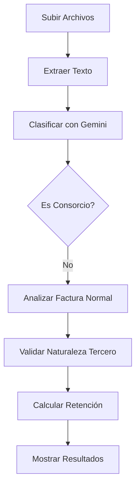
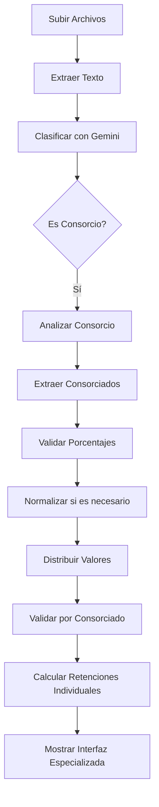

# 🇨🇴 Preliquidador de Retefuente - Colombia v2.1.0

Sistema automatizado para procesar facturas y calcular retención en la fuente usando Inteligencia Artificial (Google Gemini) y FastAPI. **AHORA CON SOPORTE COMPLETO PARA CONSORCIOS.**

##  Características Principales

-  **Procesamiento Inteligente**: Análisis automático de facturas con IA
-  **Múltiples Formatos**: Soporta PDF, Excel, Word, Imágenes (JPG, PNG)
-  **OCR Integrado**: Extracción de texto de imágenes con Google Vision
-  **Clasificación Automática**: Identifica FACTURA, RUT, COTIZACIÓN, ANEXO
-  **Cálculo Preciso**: Liquidación de retefuente según normativa colombiana
-  **Validaciones Completas**: Verifica naturaleza del tercero y régimen tributario
-  **Interfaz Web**: Dashboard moderno y responsivo
-  **API REST**: Integración fácil con otros sistemas

##  Instalación Rápida

### 1. **Prerrequisitos**
```bash
Python 3.8+
pip (administrador de paquetes de Python)
```

### 2. **Clonar o Descargar**
```bash
# Si usas git
git clone [URL_DEL_REPOSITORIO]

# O descarga los archivos en:
C:\Users\USUSARIO\Proyectos\PRELIQUIDADOR\
```

### 3. **Crear Entorno Virtual**
```bash
cd C:\Users\USUSARIO\Proyectos\PRELIQUIDADOR
python -m venv venv

# Activar entorno virtual
# Windows:
venv\Scripts\activate
# Linux/Mac:
source venv/bin/activate
```

### 4. **Instalar Dependencias**
```bash
pip install -r requirements.txt
```

### 5. **Configurar API Keys**
Edita el archivo `.env` y configura tu API key de Gemini:
```bash
GEMINI_API_KEY=tu_api_key_gemini_aqui
```

**Para obtener API Key de Gemini:**
1. Ve a [Google AI Studio](https://makersuite.google.com/app/apikey)
2. Crea una nueva API key
3. Cópiala al archivo `.env`

### 6. **Ejecutar el Sistema**
```bash
python main.py
```

El sistema estará disponible en: http://127.0.0.1:8000

## 🏢 NUEVA FUNCIONALIDAD: CONSORCIOS v2.1.0

### 🎆 ¿Qué son los Consorcios?
Un consorcio es una asociación de empresas que se unen para ejecutar un proyecto específico. El sistema ahora procesa automáticamente estas facturas complejas.

### 🤖 Procesamiento Automático
- **Detección inteligente**: Identifica automáticamente si la factura es de un consorcio
- **Extracción de miembros**: Obtiene nombre, NIT y porcentaje de cada consorciado
- **Análisis individual**: Determina la naturaleza tributaria de cada miembro
- **Cálculos distribuidos**: Aplica retención solo a quienes corresponde

### 📁 Documentos Soportados para Consorcios
- **Factura principal**: Con o sin detalle de porcentajes
- **Anexos**: Documentos con porcentajes de participación detallados
- **RUTs individuales**: Para validar naturaleza de cada consorciado
- **Contratos**: Para entender el objeto del consorcio

### 📊 Validaciones Específicas
- **Base mínima individual**: Cada consorciado debe superar la base por sí solo
- **Naturaleza del tercero**: Persona natural vs jurídica por miembro
- **Régimen tributario**: Simple/Ordinario/Especial por consorciado
- **Responsabilidad IVA**: Verificación individual
- **Autorretenedores**: Detección por cada miembro

### 🔢 Normalización Automática
Si los porcentajes no suman exactamente 100%, el sistema los normaliza automáticamente:
```
Ejemplo:
Porcentajes originales: 59.67% + 21.76% + 18.55% = 99.98%
Porcentajes normalizados: 59.67% + 21.76% + 18.57% = 100.00%
```

### 🎨 Interfaz Visual Especializada
- **Tarjetas por consorciado**: Información clara y organizada
- **Indicadores visuales**: Verde (aplica retención) vs Rojo (no aplica)
- **Resumen ejecutivo**: Totales y estadísticas del consorcio
- **Detalles completos**: Porcentajes, valores y razones de aplicación

## 📋 Uso del Sistema

### **Interfaz Web**
1. Abre http://127.0.0.1:8000 en tu navegador
2. Arrastra o selecciona hasta 6 archivos (facturas, RUT, anexos)
3. Haz clic en "Procesar Facturas"
4. **NUEVO**: Si es un consorcio, verás una interfaz especializada con:
   - 🏢 Sección principal del consorcio
   - 👥 Detalle individual por consorciado
   - 📈 Resumen de retenciones distribuidas
   - 📋 Conceptos identificados

### **Ejemplos de Facturas Soportadas**

#### 📄 Facturas Normales
```
✅ Facturas de empresas individuales
✅ Honorarios profesionales
✅ Servicios generales
✅ Arrendamientos
✅ Compras de bienes
```

#### 🏢 Consorcios (NUEVO)
```
✅ Consorcio Autopistas del Café (13 consorciados)
✅ Consorcio 911-SM (2 consorciados)
✅ Consorcios de construcción
✅ Consorcios de servicios
✅ Cualquier cantidad de miembros
```

### **API REST**
```bash
# Verificar estado
GET /health

# Procesar facturas (normales y consorcios)
POST /api/procesar-facturas
Content-Type: multipart/form-data
Files: archivos[]

# Obtener conceptos
GET /api/conceptos

# Estadísticas de extracción
GET /api/extracciones

# Estructura del sistema
GET /api/estructura
```

## ✨ Arquitectura del Sistema v2.1.0

### 🏠 Estructura Modular Expandida
```
 PRELIQUIDADOR/
├── 📄 main.py                    # API FastAPI principal + Flujo de consorcios
├── 🎨 Static/
│   └── index.html                # Interfaz web + UI para consorcios
├── 🧠 Clasificador/              # Módulo de análisis con IA
│   ├── clasificador.py           # Procesador Gemini principal
│   ├── prompt_clasificador.py    # Prompts para facturas y consorcios
│   ├── consorcio_processor.py    # 🏢 NUEVO - Lógica de consorcios
│   └── __init__.py
├── 💰 Liquidador/               # Cálculos de retención
│   └── liquidador.py             # LiquidadorRetencion
├── 📁 Extraccion/               # Procesamiento de archivos
│   └── extractor.py              # ProcesadorArchivos
├── 📄 config.py                 # Configuración y conceptos
├── 🔒 .env                      # Variables de entorno
├── 📊 RETEFUENTE_CONCEPTOS.xlsx  # Base de datos de conceptos
├── 📈 Results/                  # Respuestas JSON organizadas
│   ├── 2025-07-25/               # Respuestas de Gemini por fecha
│   │   ├── clasificacion_documentos.json
│   │   ├── analisis_factura.json
│   │   └── analisis_consorcio.json   # 🏢 NUEVO
│   └── Extracciones/             # Textos extraídos guardados
└── 📄 requirements.txt          # Dependencias Python
```

##  Flujo de Procesamiento v2.1.0

### 📄 Para Facturas Normales:


### 🏢 Para Consorcios (NUEVO):


### **Paso 1: Extracción de Texto**
- PDF: PyPDF2 + OCR si es necesario
- Imágenes: Google Vision OCR
- Excel: pandas
- Word: python-docx

### **Paso 2: Clasificación (Gemini)**
Clasifica cada documento en:
- **FACTURA**: Documento principal de facturación
- **RUT**: Registro Único Tributario
- **COTIZACION**: Propuesta comercial
- **ANEXO**: Documento de soporte general
- **🏢 NUEVO**: Detecta automáticamente si es un consorcio

### **Paso 3a: Análisis de Factura Normal (Gemini)**
Extrae de la factura:
- Conceptos facturados (44 conceptos configurados)
- Naturaleza del tercero (persona natural/jurídica)
- Régimen tributario
- Si es autorretenedor
- Valores monetarios

### **Paso 3b: Análisis de Consorcio (Gemini) - NUEVO**
Para consorcios, extrae:
- 🏢 Información del consorcio (nombre, NIT)
- 👥 Lista completa de consorciados
- 📈 Porcentajes de participación exactos
- 🏷️ Naturaleza individual de cada miembro
- 💰 Valores totales del contrato
- 🗒️ Conceptos de servicios prestados

### **Paso 4: Validaciones**

#### 📄 Para Facturas Normales:
- Facturación exterior → No aplica
- Régimen Simple → No aplica retención
- Autorretenedor → No se retiene
- Conceptos no identificados → No se puede liquidar
- Sin RUT → Solicitar naturaleza del tercero

#### 🏢 Para Consorcios (NUEVO):
- **Validación de porcentajes**: Deben sumar ~100%
- **Normalización automática**: Si no suman 100%
- **Base mínima individual**: Por cada consorciado
- **Naturaleza por miembro**: Persona natural/jurídica
- **Régimen individual**: Simple/Ordinario/Especial
- **Responsabilidad IVA**: Por cada consorciado
- **Autorretenedores**: Detección individual

### **Paso 5: Liquidación**

#### 📄 Facturas Normales:
Calcula retención basada en:
- Concepto identificado
- Tarifa correspondiente
- Base gravable
- Naturaleza del tercero

#### 🏢 Consorcios (NUEVO):
Calcula retención distribuida:
- 📈 Distribuye valor según porcentajes
- 🔍 Valida cada consorciado individualmente
- 💰 Aplica tarifa solo a quienes califican
- 📋 Consolida total de retenciones
- 📄 Genera razón por cada exclusión

##  Conceptos Soportados

El sistema identifica 44+ conceptos de retefuente, incluyendo:

| Concepto | Tarifa | Descripción |
|----------|--------|-------------|
| Honorarios profesionales | 11% | Asesorías, consultorías |
| Servicios generales | 4% | Mantenimiento, soporte |
| Arrendamiento inmuebles | 3.5% | Alquiler de propiedades |
| Transporte carga | 1% | Servicios de transporte |
| Servicios vigilancia | 6% | Seguridad privada |
| Contratos obra | 2% | Construcción |
| ... | ... | Ver excel completo |

## 📊 Ejemplos de Respuestas JSON

### 📄 Factura Normal:
```json
{
  "success": true,
  "tipo_procesamiento": "FACTURA_NORMAL",
  "resultados": {
    "liquidacion": {
      "puede_liquidar": true,
      "valor_retencion": 240000,
      "concepto_aplicado": "Servicios generales (declarantes)"
    }
  }
}
```

### 🏢 Consorcio:
```json
{
  "success": true,
  "tipo_procesamiento": "CONSORCIO",
  "resultados": {
    "consorcio": {
      "consorcio_info": {
        "nombre_consorcio": "CONSORCIO AUTOPISTAS DEL CAFÉ",
        "total_consorciados": 13
      },
      "consorciados": [
        {
          "nombre": "Fondo Capital Privado Odinsa",
          "porcentaje_participacion": 59.67136,
          "valor_proporcional": 97834156,
          "aplica_retencion": true,
          "valor_retencion": 3913366
        }
      ],
      "resumen_retencion": {
        "total_retenciones": 15734652,
        "consorciados_con_retencion": 8,
        "consorciados_sin_retencion": 5
      }
    }
  }
}
```

##  Configuración Avanzada

### **Variables de Entorno (.env)**
```bash
# Obligatorio
GEMINI_API_KEY=tu_api_key

# Opcional - para OCR avanzado
GOOGLE_APPLICATION_CREDENTIALS=path/credentials.json

# Servidor
HOST=127.0.0.1
PORT=8000
DEBUG=True

# Límites
MAX_FILE_SIZE_MB=50
SUPPORTED_EXTENSIONS=.pdf,.xlsx,.xls,.jpg,.jpeg,.png,.docx,.doc
```

### **Google Vision API (Opcional)**
Para OCR avanzado de imágenes:
1. Crear proyecto en Google Cloud Console
2. Habilitar Vision API
3. Crear Service Account
4. Descargar credenciales JSON
5. Configurar ruta en `GOOGLE_APPLICATION_CREDENTIALS`

##  Desarrollo y Personalización

### **Agregar Nuevos Conceptos**
1. Editar `RETEFUENTE_CONCEPTOS.xlsx`
2. Actualizar `CONCEPTOS_RETEFUENTE` en `main.py`
3. Ajustar `TARIFAS_RETEFUENTE` si es necesario

### **Modificar Prompts de Gemini**
Los prompts están en la clase `ProcesadorGemini`:
- `clasificar_documentos()`: Para clasificación
- `analizar_factura()`: Para extracción de datos

### **Personalizar Validaciones**
La lógica de validación está en `LiquidadorRetencion.calcular_retencion()`

## 🔍 Solución de Problemas

### **Error: No se puede conectar a Gemini**
- Verificar API key en `.env`
- Comprobar conexión a internet
- Revisar límites de cuota de Gemini

### **Error: OCR no funciona**
- Verificar configuración de Google Vision
- Usar solo extracción de PDF si no se requiere OCR

### **Error: No se procesan archivos**
- Verificar formato de archivo soportado
- Comprobar tamaño máximo (50MB)
- Revisar logs en consola

### **Conceptos no identificados**
- Verificar que el concepto esté en la lista
- Mejorar el prompt de Gemini
- Revisar calidad del texto extraído

##  Métricas y Monitoreo

El sistema genera automáticamente:
- Archivos JSON con respuestas de Gemini
- Logs detallados de procesamiento
- Métricas de tiempo de respuesta
- Errores y warnings

##  Próximas Funcionalidades v2.1.0

### 🏢 Mejoras para Consorcios (v2.2.0):
- [ ] **Exportación a Excel** con detalle por consorciado
- [ ] **Validación cruzada** con RUTs individuales
- [ ] **Alertas automáticas** por inconsistencias en porcentajes
- [ ] **Histórico de consorcios** procesados
- [ ] **Dashboard ejecutivo** para consorcios
- [ ] **Reportes consolidados** por proyecto

### 🔎 Funcionalidades Generales:
- [ ] Retención en el extranjero
- [ ] ReteIVA y ReteICA
- [ ] Base de datos para histórico
- [ ] Dashboard de administración
- [ ] API de consulta de liquidaciones
- [ ] Integración con sistemas contables
- [ ] Tests automatizados
- [ ] Docker deployment

##  Soporte

Para reportar bugs o solicitar funcionalidades:
1. Revisar los logs en consola
2. Verificar archivos JSON generados
3. Documentar pasos para reproducir el problema

### 🏢 Soporte Específico para Consorcios:
Ver la **[Guía Completa de Consorcios](GUIA_CONSORCIOS.md)** para:
- Ejemplos detallados de uso
- Solución de problemas específicos
- Mejores prácticas
- Casos de prueba validados

##  Licencia

Este proyecto está desarrollado para uso interno.

---


